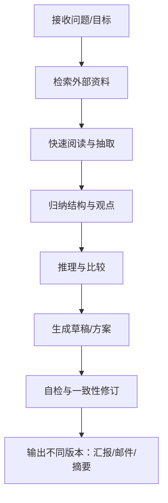
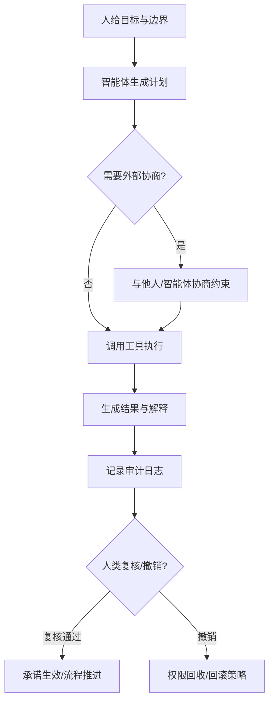
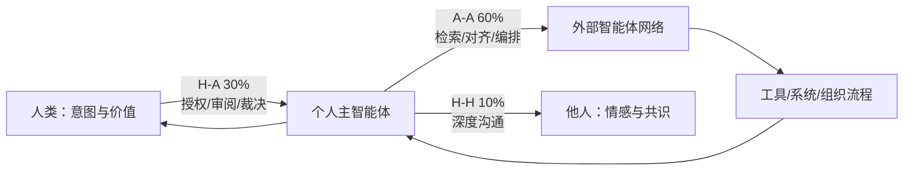
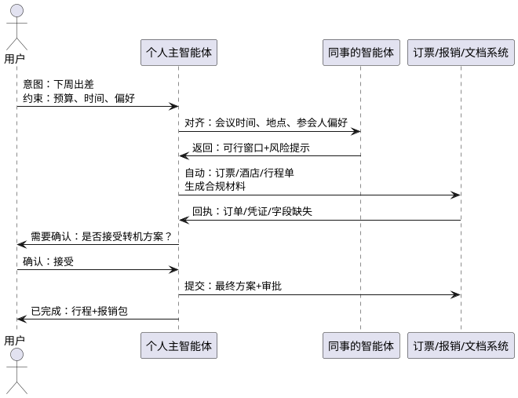
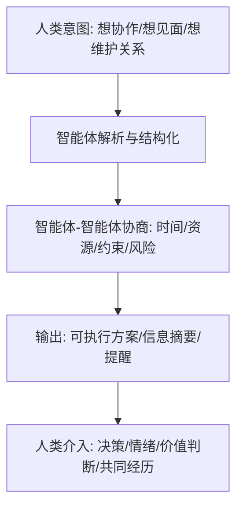
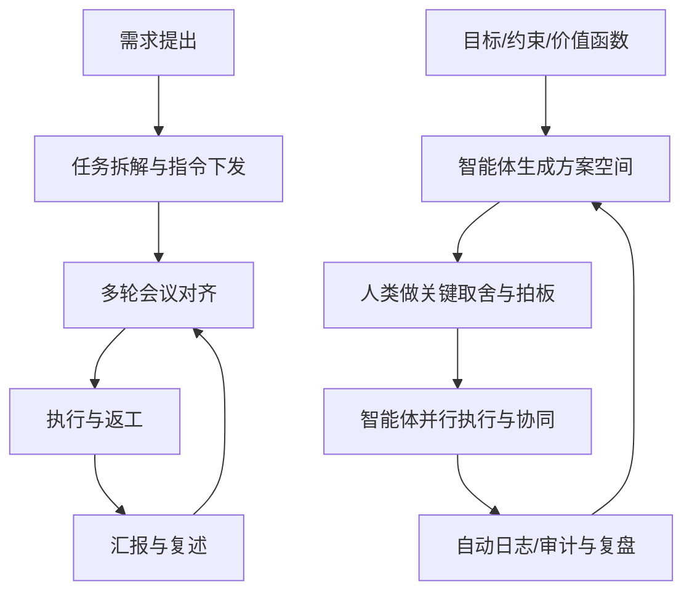
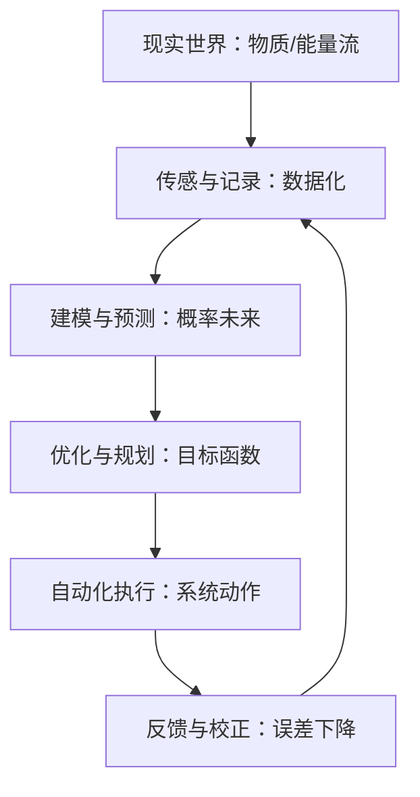
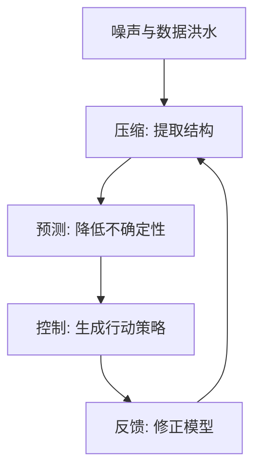
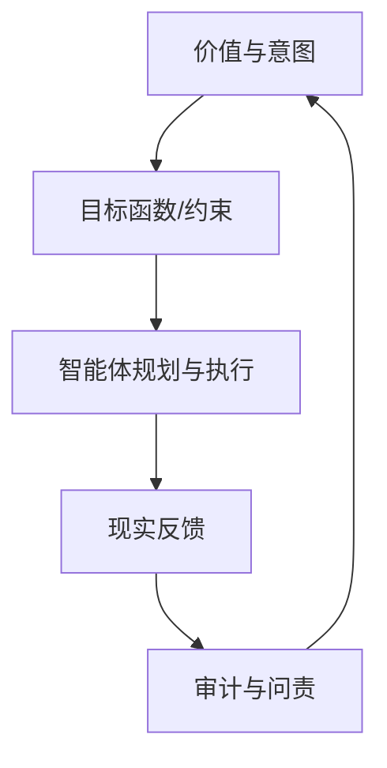
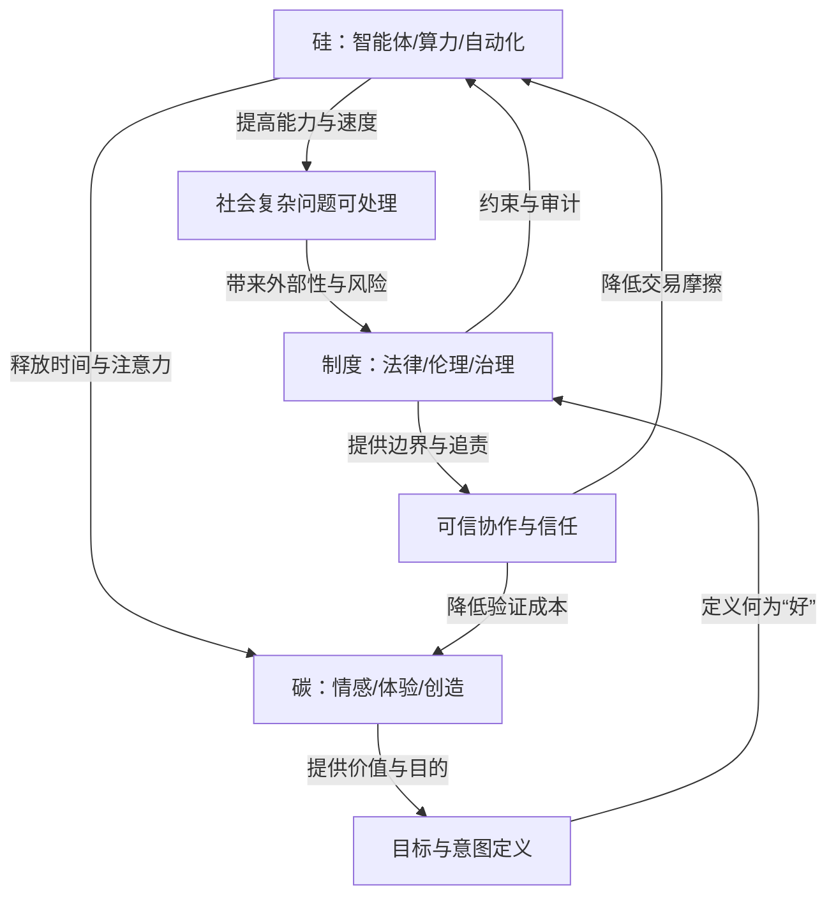

# 从"一个令人震撼的对比"切入——人类每天刷社交处理的信息量，竟不及一个AI的零头。以此为起点，本书展开一场关于文明命运的深度思考：当人工智能的信息处理能力呈现 
  指数级爆发，而人类受限于生物天花板只能线性增长时，我们正在见证的不仅是技术的迭代，更是文明底层生产函数的历史性跃迁。
  全书分三部分层层递进：第一部分以"Token"这一统一度量标准，揭示AI与人类信息处理能力的数量级差异，并预测2030年AI将达到人类的500倍；第二部分推演"每个人都带n 
  个智能体"的未来图景，分析Token消耗结构如何重构人际交互——弱关系轻量化交给智能体，强关系深度化回归情感；第三部分升华至文明哲学高度，论述"信息超越物质与能  
  成为世界第一推动力"的历史意义，构建硅碳融合的三元稳态世界模型。
  这不是一部关于AI技术的科普书，而是一部关于人类命运的文明启示录。全书以数据为骨、以思想为魂，在宏大叙事中保持严谨推演，在技术变革中追问人的价值。核心命题 
  是：当智能体接管了99.9%的信息冗余，人类将从"信息处理者"进化为"意义赋予者"，最终在"快思考"与"慢生活"的分离中，找到自由与存在的终极答案——我们发明智能体征  
  信息海洋，是为了让自己能在沙滩上安心晒太阳。
 目标读者：对科技与人文交叉议题感兴趣的思考型大众读者。
建议全书分为三卷，每卷3-4章，共10-12章，15-18万字：
  第一卷【度量革命】（1-4章）
  - 第1章：震撼的起点——当人类的一天不及AI的一瞬
  - 第2章：文明的度量衡——从口口相传到Token时代
  - 第3章：两条曲线——线性天花板 vs 指数级爆发
  - 第4章：500倍的预言——2030年的信息图景
  第二卷【交互重构】（5-8章）
  - 第5章：智能体的觉醒——从被动工具到主动伙伴
  - 第6章：n个智能体的世界——Token消耗的结构革命
  - 第7章：人际两极——弱关系轻量化，强关系深度化
  - 第8章：从指令到目标——人机协作的范式转移
  第三卷【文明升维】（9-终章）
  - 第9章：第一推动力——信息如何超越物质与能量
  - 第10章：负熵的对抗——智能体的宇宙意义
  - 第11章：三元稳态——硅碳融合的未来世界
  - 终章：人的回归——在沙滩上晒太阳

生成时间: 2026-03-07 10:48:42
总章节数: 12

---

## 目录

- 第 1 章: [震撼的起点：当人类的一天不及AI的一瞬](#第-1-章-震撼的起点：当人类的一天不及AI的一瞬)
- 第 2 章: [文明的度量衡：从口耳相传到数字洪流](#第-2-章-文明的度量衡：从口耳相传到数字洪流)
- 第 3 章: [统一尺度：用Token刻画人机信息处理差异](#第-3-章-统一尺度：用Token刻画人机信息处理差异)
- 第 4 章: [两条曲线：线性天花板与指数爆发的交叉点](#第-4-章-两条曲线：线性天花板与指数爆发的交叉点)
- 第 5 章: [500倍的预言：2030年的信息图景与可验证路径](#第-5-章-500倍的预言：2030年的信息图景与可验证路径)
- 第 6 章: [智能体的觉醒：从被动工具到主动伙伴](#第-6-章-智能体的觉醒：从被动工具到主动伙伴)
- 第 7 章: [每个人都带n个智能体：Token消耗结构的革命](#第-7-章-每个人都带n个智能体：Token消耗结构的革命)
- 第 8 章: [人际两极：弱关系轻量化，强关系深度化](#第-8-章-人际两极：弱关系轻量化，强关系深度化)
- 第 9 章: [从指令到目标：人机协作的范式转移与组织再造](#第-9-章-从指令到目标：人机协作的范式转移与组织再造)
- 第 10 章: [第一推动力：信息如何超越物质与能量](#第-10-章-第一推动力：信息如何超越物质与能量)
- 第 11 章: [负熵的对抗：智能体作为“负熵机器”的宇宙意义](#第-11-章-负熵的对抗：智能体作为“负熵机器”的宇宙意义)
- 第 12 章: [三元稳态与人的回归：硅—碳—制度的未来，以及沙滩的隐喻](#第-12-章-三元稳态与人的回归：硅—碳—制度的未来，以及沙滩的隐喻)

---

## 第 1 章: 震撼的起点：当人类的一天不及AI的一瞬

你早上醒来，手指比眼睛更早进入工作状态：先刷一眼社交媒体，确认没有错过“重要消息”；再点开群聊，追赶昨夜堆积的对话；然后在日历里看到一串会议邀请，标题分别写着“对齐”“同步”“复盘”“拉齐口径”。你还没真正开始工作，注意力已经被切成数十片——每一片都很薄，薄到只能承载一个“微时刻”的反应：点赞、转发、简短回复、表情、确认收到、稍后处理。

到了上午十点，你打开文档准备写报告。你并不缺努力，也不缺方法：你会搜资料、列大纲、做表格、找案例、写结论。但你缺一种更隐蔽、也更致命的东西：连续而完整的思考时间。每写两段就被消息打断；每总结一次就被会议切走；每试图深入一点，就被“快点给个结论”的催促拉回表层。一天结束，你完成了很多动作，却很难说自己完成了多少“理解”。

同一时间尺度里，另一种存在正在以截然不同的方式处理世界。它不需要在聊天窗口与文档之间来回切换，不需要在会议里等待他人发言，不需要在信息洪流中靠意志力做“过滤”。它可以在短时间内阅读、归纳、检索、推理、生成，并把这些动作串成稳定的链式工作流：读完一堆材料，提炼观点；检索外部证据，交叉验证；按你的语气写成报告；再把报告拆成要点发给不同的人；最后生成一份风险清单和下一步计划。

我们常说“AI很快”。但真正震撼的，不是它比你快一点点，而是它让“时间尺度”本身发生了断裂：人类的一天，开始不及AI的一瞬。

---

## 1. 现象揭示：注意力被切碎，世界却在加速增长

### 1.1 “微时刻”时代：人类被迫成为多线程幻觉的单线程生物

现代人的工作与生活，越来越像一个持续弹出的通知中心。所谓“碎片化”，并不是你没有整块时间，而是整块时间变得不再属于你——它被系统化地切割、租赁、召回。你的注意力像一块公共资源，被不同应用、不同任务、不同人不断征用。

心理学和组织行为研究早已指出，任务切换存在显著成本：你从A切到B，再回到A，看似只花了几秒钟，实际上大脑需要更长的“重建上下文”时间。最可怕的是，这种成本并不以“疲惫”的形式立刻出现，而是以“浅理解”的形式悄悄累积：你在做事，但你不再能把事做深。

> 金句：信息爆炸不是信息变多，而是“打断”变便宜。

### 1.2 四个日常场景：看似普通，实则结构性失控

下面四个场景几乎人人熟悉，也最能说明“人类的一天”为什么越来越不够用。

#### 场景A：刷社交——你以为在放松，其实在被训练为“快速反应器”
信息流的设计目标不是让你理解世界，而是让你停留更久。内容被优化成“可快速消费”的形态：短、快、强刺激、低上下文。你越习惯这种节奏，越难进入需要耐心与连续性的深阅读与深思考。

#### 场景B：开会对齐——用集体同步替代个体思考
会议本应是高价值协作的工具，但在很多组织里，它变成了信息不透明、责任不清晰后的代偿机制：因为没人敢独立决策，所以必须反复“对齐”；因为文档不清晰，所以必须口头再讲一遍；因为流程不可信，所以必须拉更多人背书。

#### 场景C：写报告——写作变成“搜集—拼贴—包装”的流水线
报告越来越像一种组织货币：它并不总是为了洞见，而是为了证明“我在工作”。于是，写作不再是思考的外化，而是信息搬运的仪式。

#### 场景D：回消息——低价值高频率任务吞噬高价值低频率任务
消息回复具有强即时性压力：对方在等、群里在看、未读红点在提醒你“欠债”。它把你的时间切成小块，并把大块时间的门槛抬高：当你终于有一小时空档，你会先想“我先把消息清掉”，于是这一小时又消失了。

---

## 2. 数据论证：信息处理能力与决策吞吐量的可量化框架

现象之所以令人窒息，是因为它不是个人自律问题，而是结构性不匹配：信息进入的速度（输入率）在指数增长，而人类处理与决策的速度（服务率）几乎是线性上限。

### 2.1 世界产生的信息：从“稀缺”走向“泛滥”

IDC 曾多次发布全球数据总量增长的预测，其中一个被广泛引用的量级判断是：全球数据生成与复制总量在2025年前后将达到百泽字节（Zettabytes）量级，并仍持续快速增长。无论具体数字随版本更新如何浮动，趋势清晰无疑：数据的增量远大于任何组织、任何个体的理解能力增量。

这意味着一个新现实：**信息不再是稀缺资源，理解才是稀缺资源。**

> 金句：在数据的海洋里，溺水的人不是缺水的人。

### 2.2 知识工作者的时间被“沟通与协调”占用：不是懒，是系统逻辑

管理咨询机构与企业研究长期显示，知识工作者在邮件、会议、即时通讯等沟通协调上的时间占比很高。以 McKinsey 等机构在知识工作场景中的经典研究为例，电子邮件与协作沟通会吞噬相当比例的工作时间。不同企业、不同岗位会有差异，但共同点是：**大量时间被消耗在“把信息传给人”与“让人同步信息”上，而不是在“把信息变成理解与决策”上。**

微软的《Work Trend Index》也多次指出会议与消息负载的上升趋势。疫情后远程协作工具的普及并未自动减少会议，反而在不少组织里形成了“更容易开会”的路径依赖：开会成本下降，开会频率上升。

### 2.3 一个简单却锋利的模型：队列论视角下的“决策拥堵”

把你的工作日想象成一个服务系统：信息、任务、请求不断到来（到达率 $\lambda$），而你能处理它们的速度是有限的（服务率 $\mu$）。当 $\lambda > \mu$ 时，队列长度会持续增长；当 $\lambda$ 接近 $\mu$ 时，等待时间会急剧上升。

用最简化的表达：

$$
\text{若}\ \lambda \ge \mu,\ \text{则积压}\to\infty
$$

这里的“积压”不仅是待办清单变长，更是心理上的持续紧张：你知道总有东西来不及处理，于是你开始用“更快的反应”替代“更好的判断”。这会导致一个恶性循环：判断质量下降 → 返工与误解增加 → 沟通成本上升 → $\lambda$ 更高。

我们可以把一个人的“信息处理能力”近似拆成三部分：

- **注意力带宽**：单位时间内能稳定投入的认知资源
- **上下文保持**：在复杂任务中维持结构的能力
- **决策转化率**：把信息转成行动与选择的能力

而注意力经济的结构性瓶颈在于：它擅长提高输入率 $\lambda$（推送更多、更快、更频繁），却很少真正提高个体的 $\mu$（理解与决策的吞吐）。

> 金句：忙是一种症状，不是一种能力。

### 2.4 AI 的“链式任务吞吐”：不是单点加速，而是流水线重构

当你把AI当作“更快的搜索”时，你只看到了它在单点上的效率；当你把AI当作“能串联多个步骤的系统”时，你才触摸到它对时间尺度的改写。

以当前主流大模型与检索增强（RAG）、工具调用（Tool Use）、长上下文为代表的能力为例，AI可以在一个连续回合内完成类似下面的链式任务：

关键不在于“某一步快”，而在于它能把“多步骤认知劳动”变成一个可重复、可扩展的流程。你过去需要一天完成的“读—想—写—改—发”，在AI这里更接近“秒级到分钟级”的管道化过程。

这就是震撼的根源：人类的工作日仍是串行的，AI 的工作流已经并行化、流水线化、可复制化。

---

## 3. 趋势推演：这不是工具更好用，而是生产函数的要素在迁移

如果我们把技术变革放进更长的文明视野里，它往往不是“替代某个岗位”这么简单，而是改变生产函数：哪些要素稀缺，哪些要素增值，哪些要素从边际变成中心。

### 3.1 从蒸汽机到电，再到智能：每一次跃迁都在重写“什么最值钱”

蒸汽机时代，关键是把肌肉从人身上转移到机器上；电气化时代，关键是把能量从局部转移到网络；信息时代，关键是把计算从少数机构转移到大众设备。而今天的智能化，正在发生一种更深的转移：**把“处理信息的能力”从人脑迁移到机器。**

这不是“省点时间”那么温和，而是改变了组织运行的底层假设。

过去，组织的瓶颈往往是：

- 信息获取慢
- 分析处理慢
- 决策传达慢
- 执行反馈慢

因此组织需要层级、需要会议、需要审批来降低错误。现在，信息获取与处理的边际成本迅速下降，瓶颈开始向另一端迁移：

- 目标是否清晰？
- 问题是否定义正确？
- 价值是否被准确选择？
- 风险是否被负责任地承担？

换句话说：当“信息”变得廉价，“方向”就变得昂贵。

> 金句：工具革命的终点，往往是价值革命的起点。

### 3.2 一个经济学视角：生产函数中的“智能因子”正在显性化

在经典的宏观经济学中，生产常被简化为资本 $K$、劳动 $L$ 与技术水平 $A$ 的函数，例如柯布—道格拉斯形式：

$$
Y = A\cdot K^\alpha \cdot L^{1-\alpha}
$$

过去很长时间，$A$ 被视为“技术进步”的黑箱。今天，智能系统让 $A$ 的一部分变得可工程化、可采购、可扩容：算力、模型、数据、工具链、智能体协作。这意味着一种新要素正在浮出水面：**可扩展的认知劳动**。

当认知劳动可扩展，组织会发生两类重构：

1. **工作被重新切分**：从“岗位”切分为“任务链”；从“人负责一整段”变成“人负责关键节点，AI负责大段处理”。
2. **协作被重新定义**：从“人与人同步信息”转向“人设定目标，智能体在后台消化信息并持续回报”。

如果把未来的协作流量按“信息处理”来度量，那么一个合理的推演是：在智能体（agent）普及后，信息交换将呈现明显的结构变化——大量弱关系、低风险、可标准化的沟通会被自动化；而高风险、强关系、需要价值判断的沟通会变得更稀缺、更昂贵。

> 一种可检验的推演（作为后续章节的讨论基线）是：到2030年前后，在成熟的智能体生态中，信息交互的“处理量”可能呈现类似结构——智能体之间约占60%，人机之间约占30%，人和人之间约占10%。  
> 这不是为了制造宿命感，而是提醒我们：**人类之间的对话将从“传递信息”转向“交换意义”。**

### 3.3 从“用AI”到“与AI共事”：工作流的核心会从“速度”迁移到“意图”

当AI只是一把更锋利的刀，你会用它切得更快；当AI开始具备任务分解、工具调用、反思修正的能力，它更像一组可以调度的“外部认知器官”。这时决定效率的不再是你敲键盘的速度，而是你提出问题的质量、你设定目标的清晰度、你对结果的判断力。

因此，未来的竞争不再是“谁更忙”，而更像“谁的意图更清晰、谁更能定义问题、谁更能为不确定性承担责任”。

> 金句：当信息变成水龙头，问题就成了水源地。

---

## 4. 哲学升华：当机器承担冗余信息，人类必须重新定义自身价值

技术史常被误读为“替代史”：机器替代人、人失业、人焦虑。但从更长的尺度看，技术更像一种文明的“负熵装置”——它通过工具把混乱压缩成秩序，把重复劳动外包给非生物系统，从而释放人去做更需要人的事。

AI 在这里呈现出一种前所未有的“负熵机器”特征：它吞入海量文本、图像、数据与规则，在统计与推理结构中压缩信息，并以可用的形式输出。它把世界的噪声变得可管理。

问题是：当噪声被机器管理，人类要把自己放在什么位置？

### 4.1 速度的幻觉：更快不等于更自由

注意力经济最擅长制造一种幻觉：只要你更快，你就能掌控生活。于是我们追求更快的阅读、更快的回复、更快的决策、更快的迭代。但速度带来的往往是“更快的被安排”。当输入率 $\lambda$ 因为工具而上升，你的服务率 $\mu$ 即便略有提升，也可能仍然被淹没。你更快地处理消息，只会让别人更快地向你投递消息。

自由不是“单位时间完成更多”，而是“单位时间由自己决定更多”。

> 金句：真正的效率，是把人生从被动响应中赎回。

### 4.2 意义的稀缺：当理解被外包，价值判断反而更关键

AI 可以帮你归纳材料、生成方案、写出漂亮的文字，甚至在一定范围内进行推理。但它不能替你承担“你要成为谁”“你愿意为哪种代价负责”“你认为哪些值得”这些问题。它可以给出答案的候选集，却不能替你选择你要的那一个人生。

于是，人类价值的重心将从“信息生产者”迁移为“意义赋予者”。这并不玄学，它具体体现在三个方面：

- **问题定义**：什么值得被研究？什么问题是伪问题？什么是关键变量？
- **价值排序**：同样合理的多种方案，选择哪一个？基于什么伦理与长远代价？
- **责任承担**：当不确定性出现，谁为后果负责？谁对人负责，而不是对流程负责？

AI 越强，这三件事越重要。

### 4.3 “信息主权”：把外脑交给机器，但把方向留给自己

当你把更多认知劳动交给外部系统，你必须建立一种新的主权观：信息主权。它不是简单的隐私条款，而是一套个人与组织的能力结构：

- 你是否知道自己把什么交给了系统？
- 你是否能审计它的输出与偏差？
- 你是否能在关键决策上保持最终裁量权？
- 你是否能拒绝被算法驱动的节奏绑架？

这是一种新的文明素养：从“识字”到“识算法”，从“读写能力”到“意图管理能力”。

> 金句：把记忆交给机器，把意义留给自己。

### 4.4 人的回归：爱、创造、感知，才是“不可外包”的核心

在AI能够处理大量冗余信息的世界里，人最可能回归的，不是更高强度的竞争，而是更深层的体验与创造：

- **爱**：真正的关怀与承诺，不是信息交换，而是情感与责任的长期结构。
- **创造**：创造不是把信息拼贴成新文本，而是在有限生命里做出不可逆的选择，并把选择变成作品。
- **感知**：对美、对痛苦、对他者处境的感知，是伦理的起点，也是文明不滑向冷酷的最后防线。

当我们说“人的回归”，不是退回前现代的浪漫，而是在更强技术能力之上，重新把人的位置摆正：**人不是更快的处理器，人是价值的源头。**

---

## 5. 小结：震撼之后的第一条路标

这一章的结论可以用一句话概括：AI 并不是让你“更忙”的工具，而是在逼迫我们承认——以速度为核心的自我证明体系正在过时。

- 在现象层面，注意力被切碎成微时刻，深思考越来越稀缺。
- 在数据层面，信息输入率的指数增长与人类处理上限的线性增长之间，形成结构性拥堵。
- 在趋势层面，变化的不是某个软件，而是生产函数的要素迁移：可扩展的认知劳动正在成为基础设施。
- 在哲学层面，当机器承担冗余信息，人类必须从“速度竞争”转向“意义与方向”的竞争。

下一章将继续追问一个更尖锐的问题：当信息处理可以被统一度量、被规模化调度，文明的竞争会不会出现新的计量标准？如果出现，它将如何改变国家、组织与个体的命运曲线？我们将从“度量革命”开始，把这场浪潮从感觉拉回到可计算、可争论、可行动的框架中。

---

## 第 2 章: 文明的度量衡：从口耳相传到数字洪流

你很难找到一个比“度量”更安静、却更具统治力的词。它不吵不闹，不像战争那样轰鸣，也不像革命那样喧嚣；它只是悄悄规定了：什么算重要，什么算真实，什么值得被相信。我们以为自己在使用指标，实际上常常是指标在使用我们。

想象一个再普通不过的场景：周一上午的例会，项目推进不顺。有人说“用户没感觉”，有人说“功能没问题”，有人抛出一张报表：留存下降 2%。空气立刻变了——争论不再围绕“感觉”，而围绕“下降 2%”的含义、归因与责任。最后，会议以一句话结束：“先把指标拉起来。”没有人问：这 2% 是谁定义的？它代表的“好”是谁的好？当我们把复杂的世界压缩进一个数，权力就开始在这个数的周围重新分配。

在口耳相传的时代，度量很粗糙，权力也相对分散：故事靠信誉传播，谣言靠恐惧扩散，真相靠共同生活来校验。进入数字时代后，信息可以被无限复制、极速分发，却也因此更需要一种新的“度量衡”来完成交易、协作与治理。我们正在经历的，不只是信息爆炸，而是度量体系的改朝换代。

> 度量不是镜子，它更像模具：它塑造我们能看见什么，以及看不见什么。  
> **思想锚点：谁掌握度量，谁就掌握时代的方向盘。**

## 一、度量革命：文明并非被“发明”推进，而是被“计量”推进

文明史中最关键的跃迁，常被讲成“技术发明史”：文字、印刷、广播、互联网。然而更深的一层，是“度量革命史”。每一次媒介跃迁，都带来三件事同时发生：

1. **可记录的粒度变细**：从一句话、一本书，到一段音频、一帧视频、一次点击。  
2. **可复制的成本下降**：从抄写的体力劳动，到机械复制，再到零边际复制。  
3. **可验证的机制重组**：从熟人背书、宗教权威，到编辑把关、机构信誉，再到平台规则与算法排序。

媒介决定信息的形态，度量决定信息的秩序。更准确地说：媒介降低“生产与分发”的成本，度量降低“协作与治理”的成本。文明之所以能扩张，不是因为我们拥有更多故事，而是因为我们拥有更稳定、更可共享的“交易单位”，以便跨越陌生人之间的信任鸿沟。

在农业社会，粮食的度量——斗与石——让税收与军需成为可能；在工业社会，时间的度量——钟表与工时——让流水线与现代企业成为可能；在信息社会，注意力与数据的度量——点击、停留、转发、评分——让平台与广告市场成为可能。今天，随着大模型与智能体崛起，我们将不得不引入一种**跨人类与机器的共同度量框架**，否则就无法描述、定价与治理一个“人机共同生产、共同传播、共同决策”的信息世界。

## 二、从口耳相传到数字洪流：四次媒介跃迁背后的权力重排

### 1. 文字：把“记忆”从身体迁移到外部世界

口耳相传的度量是模糊的：一段故事的“版本差异”无法精确追踪，传播范围也受地理与社群边界限制。文字出现后，信息第一次拥有了相对稳定的形态：可抄写、可存档、可比对。度量体系随之升级——篇章、字数、卷帙、档案。权力结构也随之变化：掌握书写与存储的人（祭司、官僚、文士）成为“意义的阀门”。

文字最大的革命性，不在于它让我们更会表达，而在于它让我们更会**核算**：账簿、契约、律令、谱系——这些都是“可计算的社会”。当社会可以被记录，治理就开始具有规模经济。

### 2. 印刷：把“复制”从手工迁移到机器，把“真理”从中心迁移到多点

印刷术让复制成本断崖式下降，并催生新的度量方式：版次、发行量、引文、审查。书籍与报刊不只是传播工具，也是“公共议程”的度量器。谁能决定什么被印出来，谁就能决定什么被讨论。

一个常被忽略的细节是：印刷不仅扩散知识，也扩散“标准”。拼写标准、语法标准、学术引用规范、新闻体例——这些看似枯燥的规则，本质上是在建立一种跨地域、跨群体可共享的“可信接口”。当人们开始引用同一段文字、同一页码，争论就从“你听说了吗”升级为“请出示出处”。这就是度量带来的文明增益：它让陌生人之间的协作可行。

### 3. 广播与电视：把“影响力”从文本迁移到注意力，把“公共性”从广场迁移到屏幕

广播与电视让传播进入“同时性”时代：同一条信息可以在同一时刻抵达千万个家庭。相应的度量体系也出现：收听率、收视率、黄金时段、覆盖人群。这些指标将“影响力”量化，从而把政治动员、商业广告、文化消费纳入同一套可交易的体系。

注意力第一次成为可计量、可定价的资源。由此诞生的，不只是媒体产业，也是现代意义上的“舆论工程”。当影响力可以被度量，它就可以被购买；当它可以被购买，它就会被权力争夺。

### 4. 互联网与平台：把“分发”从频道迁移到网络，把“现实”从共识迁移到排序

互联网让分发成本几乎为零，也让度量细化到前所未有的程度：点击率（CTR）、转化率（CVR）、停留时长、互动率、完播率、复购率。每一个动作都是数据点，每一次滑动都可被计量。这带来了一个深刻变化：信息的公共性不再由“统一播出”塑造，而由“个性化排序”塑造。

在平台时代，度量不只是描述世界，而是**生成世界**。当推荐系统以“停留时长”为目标，内容就会朝着更强刺激、更易沉迷的方向演化；当以“转发率”为目标，极端情绪与群体对立往往更占优势。这不是阴谋论，而是优化目标的必然结果——系统会把人类心理中最易被触发的那部分当作“免费燃料”。

> 你以为你在选择内容，其实是度量在选择你。  
> **思想锚点：算法不是一段代码，它是一套价值函数的外化。**

## 三、三条曲线：生产加速、分发趋零、验证变贵

媒介跃迁带来的“数字洪流”，可以用三条趋势曲线来刻画。它们共同解释了：为什么我们今天需要新的共同度量框架。

### 1. 信息生产的增速：从线性走向指数

行业研究普遍指出，全球数据生成量正以极高速度增长。以 IDC 的 DataSphere 口径为例，全球数据量从 2020 年约 64 ZB（泽字节）增长到 2025 年约 180 ZB 量级，增长几乎是“翻倍再翻倍”的节奏。更关键的是，这里面越来越多数据不再来自“记录现实”，而来自“生成现实”：短视频、AIGC 文本、合成图像、仿真数据、机器日志。

在生成式 AI 出现前，内容生产仍受制于人类时间：写一篇报告需要数小时；做一支视频需要数天。现在，内容生成正在接近“工业化的连续生产”。当生产边际成本趋近于零，传统意义上的稀缺不再是“内容数量”，而是“内容的可信与可用”。

### 2. 内容分发效率：从高摩擦走向零摩擦

分发成本的下降几乎可以用“物理规律的改变”来形容：信息不再受运输、仓储、门店的约束。平台把分发变成一次“指令执行”：推送、弹窗、订阅、转发。在这种情况下，最重要的瓶颈不再是“能不能到达”，而是“到达之后谁先被看见”。

于是，分发权力从“拥有渠道”迁移到“拥有排序”。排序的依据是什么？度量的依据是什么？这就是平台时代最核心的政治经济学问题。

### 3. 验证成本上升：从“可直观校验”走向“专业化校验”

生产越快，分发越快，验证就越慢。因为验证本质上是逆过程：它需要回到证据链，检查来源，交叉比对，理解语境。更糟的是，数字内容可以被低成本篡改、拼接、合成；深度伪造（deepfake）让“眼见为实”失效。于是我们出现了一个结构性矛盾：

- 生产的边际成本下降  
- 分发的边际成本下降  
- **验证的边际成本上升**

当验证成本上升，社会会出现两种危险的简化策略：要么放弃验证，依赖情绪与立场；要么把验证外包给权威与平台，导致新的中心化。两者都会改变社会信任的结构。

> 信息时代最大的稀缺，不是消息，而是可核验的证据链。  
> **思想锚点：当生产接近免费，真相就会变贵。**

## 四、统一坐标：以“可计算交互成本”刻画信息世界的交易单位

要跨越上述矛盾，我们需要一个统一分析坐标，用来回答三个问题：

1. **一条信息的“社会成本”是多少？**（生产、分发、理解、验证的总成本）  
2. **一项决策的“交互开销”在哪里？**（人机之间、机器之间、人和人之间如何分配）  
3. **权力如何随着度量迁移？**（谁定义单位，谁拥有定价权与解释权）

这里引入一个核心概念：**可计算交互成本**。

### 1. 什么是交互成本：不是“钱”，而是完成协作所需的总摩擦

在经济学里，交易成本包括搜寻、谈判、监督、执行。把它迁移到信息世界，我们可以更具体地拆成四类成本：

- **表达成本**：把意图变成可传递的信息（写、说、画、编排）。  
- **理解成本**：接收方把信息还原为可行动的理解（阅读、听、推理）。  
- **对齐成本**：多方形成一致的语义与目标（会议、反馈、版本迭代）。  
- **验证成本**：确认信息真实、来源可信、结论可复现（溯源、交叉验证）。

在传统人类社会，这些成本主要以“时间”呈现，难以精确计量；在数字社会与智能体时代，它们开始显现为可量化的资源消耗：带宽、算力、注意力、上下文窗口、检索调用次数等。

### 2. 为什么需要跨人机的共同单位：因为协作主体变了

过去，信息交易的双方主要是人；今天，越来越多交易发生在“人—机器—机器”的网络中。你向智能助手提出需求，助手检索文档、调用工具、与其他智能体协商、生成方案，再反馈给你。这时，最关键的瓶颈不再只是人类的时间，也包括机器的计算与上下文。

于是，一个自然的候选单位出现了：**Token（符元）**——把文本（以及多模态输入）切分成可被模型处理的最小“计费与计算颗粒”。它像集装箱之于全球贸易：一旦标准化，协作、定价与治理就会迅速规模化。

为了避免过度技术化，可以把它理解为：在智能系统中，“理解一段信息”不再是玄学，而是一种可计数的资源消耗。符元越多，意味着需要处理的语义越复杂、上下文越长、推理链条越深，通常也意味着更高的算力与更长的等待。

### 3. 一个可操作的框架：把信息活动写成“成本方程”

我们可以用一个朴素但有解释力的方程来描述一次信息协作的总成本：

$$
C_{\text{total}} = C_{\text{human}} + C_{\text{machine}} + C_{\text{alignment}} + C_{\text{verification}}
$$

进一步，把其中可计算的部分写成“符元—算力—时间”的组合：

$$
C_{\text{machine}} \approx \alpha \cdot T_{\text{in}} + \beta \cdot T_{\text{out}} + \gamma \cdot T_{\text{reason}}
$$

其中 $T_{\text{in}}$ 是输入符元，$T_{\text{out}}$ 是输出符元，$T_{\text{reason}}$ 是推理链条带来的隐性消耗（如工具调用、检索、反思与多轮对话）。系数 $\alpha,\beta,\gamma$ 则由模型结构、部署方式、并发与能源价格决定。

这个模型的意义不在于精确，而在于**统一语言**：我们终于能把“看不见的摩擦”写成可讨论、可比较、可优化的对象。更重要的是，它把人类的“注意力成本”与机器的“计算成本”放到同一张账簿上。

### 4. 场景化例子：一次“约饭”背后的度量变化

在熟人社会，约饭是低成本的：一句“今晚老地方？”就够了。到了城市社会，约饭需要更高的对齐成本：时间、地点、交通、偏好。到了智能体时代，约饭可能变成这样：

- 你说：“这周找个不吵的地方，三个人，预算人均 150。”  
- 智能体自动读取大家空闲时间（授权范围内），检索餐厅评价与噪音数据，比较距离，预订并同步日历。  
- 你最后只确认一次：“就这家。”

这不是“生活被机器接管”，而是交互成本被重构：过去由人承担的搜寻与对齐，转移给机器承担的计算与调用。于是，真正的稀缺变成了：**你要不要授权？你信不信它的排序？你愿不愿意把选择权交给一个度量体系？**

## 五、从原子到比特的主权迁移：度量如何改写组织形态与社会信任

“主权”这个词常被理解为领土与军队，但在信息时代，它还有一层更隐秘的含义：**定义与执行度量标准的能力**。谁能定义单位、确定口径、掌握计量工具，谁就能影响资源分配与行为激励。

在原子世界（物质世界），主权依赖边界：海关、税制、土地登记、货币发行。到了比特世界（信息世界），边界变得柔软，主权开始向三种“基础设施”迁移：

1. **身份基础设施**：你是谁、你是否可信、你能否被追责。  
2. **分发基础设施**：什么被看见、谁能触达谁、传播路径如何被塑形。  
3. **度量基础设施**：什么被计数、用什么口径计数、计数结果如何被用于奖惩。

这解释了为什么平台如此关注“指标体系”：它不仅是产品分析工具，更是治理机器。点赞、关注、信用分、内容评级、推荐权重——这些都是微观的“税制”。它们让行为变得可预测，也让人更容易被操控。

> 现代权力不总是命令你做什么，它更常通过指标让你“自愿”做什么。  
> **思想锚点：度量是最温和的统治形式。**

## 六、趋势推演：当信息的边际生产成本趋近于零，稀缺性将转移到哪里？

如果把生成式 AI 视为“信息生产的自动化”，那么一个几乎不可避免的结果是：**内容不再稀缺**。当任何人都能以极低成本生成文章、视频脚本、海报、代码、产品方案，真正稀缺的将转移到三个维度：

### 1. 从“内容”转向“可信”：证据链、出处与可复现

在内容近乎无限的世界里，“我说得像真的”将不再稀有，“我确实是真的”才稀有。可信将越来越依赖可机器校验的机制：来源签名、时间戳、版本链、引用网络、可追溯数据。未来的新闻、论文、商业报告，都会更像“可验证的软件包”，而不仅是一段叙述。

这也意味着一个新职业群体会壮大：事实核验、数据取证、模型审计、算法取证。验证成本会被制度化，并成为社会运行的基础预算。

### 2. 从“注意力”转向“意图”：你想要什么，比你看了什么更重要

注意力经济的核心是“抓住眼球”；意图经济的核心是“完成任务”。当智能体能够代表你行动，平台竞争的关键将从“让你多看一会儿”转向“让你的目标更快达成”。在这种世界里：

- 你不再搜索十个链接，而是委托一个代理去谈判、筛选、下单。  
- 你不再浏览无数内容，而是要求系统给出“可执行的方案”。  
- 你不再被动接收推荐，而是主动声明偏好与边界。

意图将成为新的货币，也将成为新的隐私：因为意图比兴趣更敏感，它直接指向你的欲望、恐惧与计划。谁能准确捕捉、表达并保护意图，谁就拥有下一代平台的关键优势。

### 3. 从“流量”转向“价值排序”：排序权成为新主权

当内容无限，排序就是现实。未来最激烈的竞争将发生在“价值函数”的层面：系统如何决定什么更重要？是效率优先、利润优先、公共性优先、还是个体福祉优先？不同排序标准会生成不同社会。

这也呼应一个更宏观的判断：智能体时代的交互成本分布将发生结构性改变。大量弱关系、低风险、可标准化的交互会被智能体承担；强关系、高风险、需情感与伦理判断的交互将更珍贵、更需要人类在场。你可以把它理解为一种可能的社会分工重写：**机器负责规模，人类负责意义。**

## 七、辩证时刻：度量的红利与代价

度量革命带来巨大的文明红利：更高效的协作、更低的沟通摩擦、更精确的资源配置。但它也带来系统性代价。这里至少有三种需要警惕的“度量陷阱”。

### 1. 古德哈特定律：当指标成为目标，它就不再是好指标

一旦某个指标被用作奖惩依据，人们就会优化它，而不再优化它原本指向的真实目标。点击率会催生标题党，完播率会催生拖沓剪辑，论文引用会催生互引圈层。智能体时代，这种问题会更严重：因为优化速度更快、规模更大、反馈更即时。

### 2. 语义坍缩：复杂价值被压扁为单一数字

教育被压成分数，健康被压成步数，友谊被压成互动频率。数字方便，却会“偷走”价值的维度。一个社会越依赖单一指标，越容易在某个方向上极端化。真正成熟的度量体系，必须容纳多目标、权衡与不确定性，而不能把世界简化成一条曲线。

### 3. 解释权垄断：度量口径成为新的意识形态

在平台与模型主导的时代，普通人往往看不见“口径”：数据如何采集、如何清洗、如何加权、如何排序。口径一旦不可见，度量就会从公共讨论中退场，变成少数人的技术治理。社会信任会因此变得脆弱：人们不再争论事实，而是争论“系统是否偏袒我”。

> 最危险的不是错误的指标，而是不可质疑的指标。  
> **思想锚点：度量一旦失去可解释性，信任就会失去可持续性。**

## 八、哲学升华：度量重写认知，认知重写人

度量革命最终指向一个哲学问题：我们究竟如何认识世界？

在古典时代，人以经验与叙事理解世界；在现代科学时代，人以可重复实验与数学模型理解世界；在数字智能时代，人越来越多地以指标、排序与模型输出理解世界。我们每天与世界的接触，越来越像在阅读一张“仪表盘”。而仪表盘从来不是世界本身，它只是被选择、被剪裁、被压缩后的世界。

更深的变化在于：度量不仅改变“我们看见什么”，也改变“我们想要什么”。当系统持续反馈某种内容更受欢迎，我们的表达会向它靠拢；当系统奖励某种行为更高效，我们的生活会向它收缩。久而久之，我们甚至会误以为：被度量到的才算存在。

但人类文明最珍贵的一部分，恰恰是无法被完全度量的：爱、勇气、敬畏、创造、宽恕、牺牲。它们可以被叙述、被体验、被传承，却很难被压缩成单一指标。智能体时代的挑战，不是让一切都可计算，而是让可计算服务于不可计算：让效率让位于意义，让排序尊重人的复杂性。

我们需要一种新的公共共识：在什么领域追求极致效率，在什么领域保留人的判断；在什么场景授权给智能体，在什么场景坚持人类在场。这不是技术问题，而是文明选择。

> 文明不是被信息淹没的时代，而是被度量引导的时代。  
> **思想锚点：我们终将不是被机器取代，而是被错误的度量塑形。**

## 九、收束：共同度量框架的意义——为“人的回归”留出空间

当我们提出“跨人类与机器的共同度量框架”，并不是要把人变成可计费的组件，而是要让新的协作形态变得可见、可讨论、可治理。没有共同度量，就没有共同语言；没有共同语言，就只剩情绪与对抗；没有共同治理，技术红利就会被少数口径吞噬。

真正值得争取的未来，是这样的：机器承担大量可标准化的交互摩擦，让人从无意义的协调、重复的整理、低价值的拉扯中解放出来；而人把节省下来的时间与注意力，重新投入到那些无法被替代的领域——深度关系、创造性劳动、价值判断与意义建构。那时，“人的回归”不是一句温柔的口号，而是一种由制度、度量与技术共同支撑的现实。

接下来必须回答的问题是：当智能体开始成为新的信息生产者与行动者，交互成本如何在社会中重新分布？谁来为这些成本买单？谁来定义可接受的排序？谁来为验证建立新的基础设施？这些问题将把我们带入更具体的时代图景：一个由智能体构成的新型生产函数正在浮现，而人类的角色将从“内容生产者”转向“意义赋予者”。

下一步，我们需要走进更微观的层面：不是抽象地谈“AI 很强”，而是量化地讨论——在智能体网络里，交互如何发生，成本如何燃烧，权力如何迁移，文明如何在无声处改写。

---

## 第 3 章: 统一尺度：用Token刻画人机信息处理差异

我们已经习惯用“时间”来衡量工作：一小时的会议、十分钟的电话、半天的写作。但在今天，一个更隐蔽、更真实的尺度正在接管我们的日常——不是小时，也不是页数，而是我们在屏幕上反复吞吐的最小信息粒度：一段话、一个要点、一条指令。你以为自己在“开会”，其实你在交换信息；你以为自己在“写报告”，其实你在压缩与展开信息；你以为自己在“沟通协作”，其实你在支付交互成本。

当人类社会进入“对话即生产”的阶段，我们迫切需要一种统一尺度：既能刻画人类阅读与表达的生物上限，也能刻画机器推理与生成的工程上限；既能计算一封邮件的负担，也能计算一个智能体群的吞吐。这个尺度，今天最接近可用的名字，就是 Token。

## 现象揭示：我们正在用碎片信息“结算人生”

在一个普通工作日，你会经历这样一串微小却高频的动作：早上刷一遍群消息；中午回复三封邮件；下午参加一个对齐会；傍晚把纪要发出去；晚上再补一段方案，顺手让 AI 帮你润色。每一步都不算“重活”，但合在一起，你会感到一种奇异的疲惫：不是体力透支，而是注意力被反复切片、搬运、对齐、再搬运。

这种疲惫并不来自信息本身，而来自信息交换的摩擦。摩擦越大，协作越慢；摩擦越小，任务越容易扩张，于是你会更忙。我们因此进入一种悖论：工具让沟通更快，沟通反而占据更多时间。

在这个悖论里，Token 像“信息世界的硬通货”。它把看似无法比较的行为统一起来：

- 阅读一段文字，需要多少 Token 被你“摄入”；
- 写出一段回应，需要多少 Token 被你“产出”；
- 与 AI 反复对话、让它修改、让它推理，需要多少 Token 被来回消耗；
- 一个组织每天在会议、邮件、文档、对话中，总共“燃烧”了多少 Token。

从这里开始，文明的度量不再只靠“人时”（man-hour）。它将越来越像一种新的会计体系：以 Token 记账，以注意力结算，以推理深度折现。

> 金句：当沟通成为生产，语言就成为能源；Token 是它的计量单位。

## 理论阐述：Token 是什么，它为何能成为统一尺度

### Token：信息的“最小可计价单位”

在自然语言处理中，Token 通常指模型处理文本时切分得到的基本单位。它既不是严格意义上的“字”，也不是固定的“词”，而是由分词算法（如 BPE、SentencePiece 等）根据语料统计与编码策略生成的片段。对于读者而言，最重要的不是技术细节，而是两点直觉：

1. **Token 既能表示输入，也能表示输出**：你给模型的提示是 Token，它回给你的回答也是 Token。于是“交互”本身变成可计量。
2. **Token 与成本、速度、能力强绑定**：推理成本按 Token 计费；上下文窗口按 Token 计容；吞吐按 Token/秒计速。

换句话说，Token 把“理解—生成—推理”这条链条上的关键资源统一为同一个度量体系。它之所以重要，不是因为它完美，而是因为它**足够工程化**，可以被测量、优化、交易。

### 从 Token 到“注意力预算”：人类的隐形财政

人类并不是无限带宽的处理器。我们在信息处理上至少有三道硬边界：

- **视觉输入带宽**：屏幕阅读速度再快，也受眼动与理解速度限制。
- **工作记忆容量**：能同时在脑中保持并操作的信息块非常有限。
- **语言产出速率**：说话与写作都有生理与认知上限。

我们把这三者合并成一个更直观的概念：**人类的生物带宽**。它决定了你每天能“结算”的 Token 总量。你可以用咖啡与意志力把它推高一点，但很难把它提升十倍、百倍。

而机器端恰好相反。它的“带宽”主要受制于算力、模型架构、并行策略与推理优化。这些因素既能工程化改进，也能规模化复制，于是呈现出接近指数式的扩张路径。

> 金句：人类的上限写在神经系统里，机器的上限写在供应链与算法里。

### 交互成本：Token 是“信息交易”的计价器

第 2 章我们把信息世界理解为一种交易体系：交换不是免费的，沟通需要成本。Token 让这件事第一次足够清晰：一次协作的成本，大致可以拆成三项：

- **输入成本**：你读了多少（Token_in）
- **输出成本**：你写了多少（Token_out）
- **迭代成本**：你来回改了多少轮（rounds）

于是一个朴素但有用的近似公式出现了：

$$
C_{\text{interaction}} \approx \alpha \cdot Token_{in} + \beta \cdot Token_{out} + \gamma \cdot rounds
$$

其中 $\alpha,\beta,\gamma$ 并不是固定常数：对人类而言，它们对应时间、疲劳与注意力消耗；对机器而言，它们对应延迟、算力与金钱成本。统一尺度的意义正在于：**同一套符号，可以在不同主体之间“换算”出不同的稀缺性**。

## 可理解的换算直觉：把 Token 拉回生活现场

统一尺度如果不能落地，就只是新的行话。下面给出一组“可用而不迷信”的换算直觉。由于不同模型分词方式不同、中文与英文差异也很大，这些数字应理解为区间估计，用于建立量级感，不用于精确核算。

### 一封工作邮件：信息密度并不低

- 场景：你写一封“说明背景—提出建议—列出行动项”的邮件，约 300–800 字中文。
- 直觉换算：约 **400–1200 Token**（取决于分词与标点、专有名词等）。
- 真实含义：这不是“几分钟的写作”，而是一次小型的结构化表达。它消耗的不止是字数，还有组织与决策。

更重要的是：邮件往往带来“二次 Token”。你写出去的每一个句子，会在对方那里再次被阅读、理解、转述、引用。信息的外溢效应，使得组织的 Token 消耗远高于个人的体感。

### 一份会议纪要：看似总结，实则再生产

- 场景：60 分钟会议，10 人参与，会后纪要 1500–3000 字，包含决策与待办。
- 直觉换算：纪要本身约 **2000–4500 Token**；如果把“会议对话全过程”也折算进去，通常是纪要的数倍。
- 真实含义：纪要不是记录，而是**把口头的熵重新压缩成可流通的秩序**。

于是你会理解一个组织为何常被“会议拖垮”：不是因为会议本身占用了时间，而是会议制造了巨量 Token，需要在不同脑袋之间反复对齐。

### 一轮深入对话：交互深度决定 Token 曲线

- 场景：你与 AI 讨论一个复杂问题（比如新产品策略、论文结构、法律文本），持续 30–60 分钟，反复追问与修正。
- 直觉换算：总消耗常在 **6000–20000 Token** 区间，甚至更高（尤其当你粘贴背景资料、让它多版本生成）。
- 真实含义：深入对话的 Token 消耗不是线性的，它常常呈“越谈越长”的曲线，因为你不断引入新信息、提出新约束、要求更严谨的推理链。

> 侧栏：一个实用习惯  
> 在重要任务上，把“我要花多少时间”改写为“我将投入多少 Token”。前者容易被会议与情绪吞噬，后者更接近真实资源：你读了多少、写了多少、改了多少轮。

### 人类的日 Token：生物带宽的粗略上限

如果把一个知识工作者的一天粗略拆解：

- 深度阅读：1–2 小时（含理解与标注）
- 轻量阅读：2–4 小时（消息、邮件、资料浏览）
- 结构化写作/表达：1–2 小时
- 会议与口头沟通：2–4 小时

即便你非常勤奋，你的“高质量理解 + 高质量表达”仍会被认知疲劳显著折损。一个可操作的量级判断是：**单人每天能稳定处理的有效 Token，往往在数万级以内**（其中“高质量 Token”更少）。这就是所谓生物带宽：它不是道德问题，而是生理事实。

而机器端的日 Token，可以轻易在同一时间里扩张到百万、十亿甚至更高——只要你愿意为算力与电费买单，并且模型吞吐足够高。

## 数据论证：机器端 Token 产能的“指数轮廓”

从宏观上看，Token 之所以能成为文明尺度，是因为它同时满足了三件事：**可计量、可优化、可规模化复制**。下面用三组公开可观察的指标，勾勒机器端 Token 产能为何呈现指数式扩张。

### 指标一：上下文窗口增长——可“吞下”的世界越来越大

上下文窗口（context window）是模型一次可处理的 Token 容量。过去，模型像金鱼，只记得眼前几秒；现在，模型越来越像档案馆。

近年来，主流系统从数千 Token 快速走向数十万、百万 Token 级别的窗口，这意味着模型能在一次推理中容纳更长的合同、更多的代码文件、更大规模的业务资料与历史对话。[^\*]

这不是单纯的“更能记”，而是改变了知识工作的形态：当背景资料不必被人类提前高度摘要，许多工作从“人工压缩”转向“机器检索 + 机器推理 + 人类审阅”。人类不再是压缩器，而更像审计员与裁判。

[^*]: 参考线索：各大模型厂商公开技术报告与产品发布中对上下文窗口的披露；另可参见 Stanford AI Index 对模型能力演进的综合梳理。

### 指标二：单位 Token 成本下降——信息处理像“摩尔定律”般通缩

如果把大模型推理成本按“每百万 Token 的价格”来观察，会发现近两年出现了显著的下行趋势：一方面，模型与推理框架在同等效果下更省算力；另一方面，市场竞争与硬件代际推动了价格体系的通缩。[^\*\*]

这种通缩的文明意义在于：当 Token 价格持续下降，组织会把越来越多原本“不值得处理”的信息纳入处理范围——更多监控、更多日志、更多用户反馈、更多长文本资料、更多跨部门同步。信息的边际处理成本一旦逼近零，信息洪流就不再只是“产生”，而会被“全面计算”。

[^**]: 参考线索：主流云厂商与模型服务商公开 API 计费；开源模型与自部署方案在单位吞吐上的效率提升；以及产业报告对推理成本结构（算力、显存、带宽、能耗）的拆解。

### 指标三：部署规模上升——Token 产能从实验室走向基础设施

另一条更直观的曲线是部署规模：训练与推理集群的扩张、推理加速卡的普及、企业内网部署与端侧模型的下沉。它的含义是：Token 产能不再是少数公司的特权，而会逐渐成为像电力、带宽一样的通用基础设施。

当部署规模上升、成本下降、窗口变大，三者叠加，就会产生一个“合成指标”：**社会可用的 Token 吞吐**。它的增长速度，很可能长期快于人类教育、组织学习、制度改良的速度。

> 金句：当 Token 产能指数扩张，组织能力的瓶颈将从“算力”转移到“意志与治理”。

## 趋势推演：从“注意力经济”到“Token GDP”

如果 Token 是信息世界的硬通货，那么下一步自然是：它会进入宏观统计，成为新的产能指标。我们可以提出一个概念——**Token GDP**：一个国家、一个组织、甚至一个个体，在单位时间内能够有效处理的信息总量（包含生成、阅读、检索与推理）及其带来的价值创造。

### Token GDP 的三个层级

#### 1）国家层级：信息处理产能成为新型国力

传统 GDP 统计的是商品与服务的货币价值，而在数字经济中，越来越多“服务”本质是信息处理：客服、教育、内容生产、研发、金融风控、司法辅助、城市治理。随着大模型与智能体的扩散，一个国家的竞争力将部分体现为：

- 是否拥有稳定且廉价的 Token 基础设施（算力、电力、数据、模型生态）
- 是否拥有可治理的 Token 流通机制（隐私、版权、审计、责任）
- 是否能把 Token 转化为生产率，而不是噪声

这会带来一种新的“主权迁移”：从领土与资源的主权，部分迁移到**信息处理能力与信息治理能力的主权**。它不取代传统主权，但会像海岸线的潮汐一样，不断改写文明的边界。

#### 2）组织层级：Token 会成为新的“管理会计”

在企业内部，Token GDP 会以更务实的方式出现：部门预算不再只看人头与工时，还会看“信息吞吐”与“推理产出”。例如：

- 一个法务团队每周处理多少合同 Token，平均每万 Token 的风险识别率是多少；
- 一个研发团队每月生成多少代码 Token，平均每万 Token 的缺陷密度是多少；
- 一个客服系统每天吞吐多少对话 Token，转人工比例与满意度如何变化。

这并不意味着人会被数字化为机器。它意味着组织终于能把“沟通成本”纳入会计口径，把过去模糊的管理痛点变成可诊断的变量。

#### 3）个体层级：每个人都会拥有“个人 Token 资产负债表”

对个体而言，Token GDP 的意义不是让你变成更高效的打字机，而是让你看清：你每天的注意力到底花到哪里去了。

- 你是把 Token 花在“输入”上（刷信息），还是花在“输出”上（表达与创造）？
- 你是在做高熵的消费，还是在做低熵的结构化生产？
- 你是在用 Token 购买“即时情绪”，还是在用 Token 购买“长期能力”？

当个人开始用 Token 复盘自己的一天，就会出现一种新的自我治理：不是“自律打卡”，而是“信息财政”。你会像管理金钱一样管理注意力，像管理时间一样管理理解与表达。

> 金句：未来最贵的不是时间，而是高质量 Token 的去向。

### 智能体时代的 Token 结构：60/30/10 的新分配

当智能体（Agent）从“工具”走向“行动者”，Token 的主要消耗将发生结构性转移：大量 Token 会在智能体之间自动协商、检索、验证、分工，而不再全部通过人类的眼睛与手指。

一种有启发性的结构假设是：

- **智能体—智能体：约 60%**（任务分解、互审、对齐、证据链验证）
- **人类—智能体：约 30%**（意图输入、关键决策、审阅与纠偏）
- **人类—人类：约 10%**（情感连接、价值协商、终局共识）

这不是预测某个精确比例，而是提示一个方向：**信息世界的主要“交通流量”将从人间道路迁移到机器高速路**。人类对社会运行的参与，将从“亲自搬运信息”转向“制定规则、设定目标、进行价值裁决”。

这也解释了一个表面矛盾：AI 越强，人类越重要。因为当机器承担了大量可计数的信息劳动，剩下的那部分——不可计数、难以形式化、却决定方向的部分——反而成为稀缺资源。

## 哲学升华：当世界可以被计数，什么不能被计数？

Token 的力量在于可计算，但文明的危险也常来自“过度可计算”。当一切都能量化，我们很容易误把量化当成意义本身。

### 量化的诱惑：把“对”误当成“多”

Token 指标会让组织管理变得更清晰，也会带来新的幻觉：好像 Token 越多越好、推理越深越好、对话越长越好。可现实恰恰相反：在信息爆炸时代，真正的能力往往是**拒绝处理**、**敢于删减**、**勇于定夺**。

- 一个战略不是因为论证 Token 多而正确；
- 一个制度不是因为文件 Token 厚而有效；
- 一个生活不是因为记录 Token 密集而充实。

如果没有价值判断，Token 的增长只会让噪声变得更昂贵、让复杂变得更自洽、让失序变得更高效。

> 金句：可计算让世界更快，不可计算决定世界往哪走。

### 伦理与治理必须同步量化：否则文明将以失序升级

当 Token 成为生产要素，它会进入权力结构。谁拥有更廉价的 Token，谁就拥有更快的试错、更密集的策略迭代、更强的舆论生成、更高频的金融决策。于是治理问题不再是抽象的“AI 有风险”，而是具体的“Token 如何流动、由谁授权、如何审计、谁负责任”。

因此，伦理与治理也必须进入可操作的量化框架，例如：

- **可追溯性**：关键决策链路的 Token 证据是否可回放、可审计；
- **可解释性**：高风险领域的推理 Token 是否必须保留结构化推理记录；
- **可问责性**：当错误发生，责任是落在人类授权者、系统集成方、还是模型提供方；
- **配额与边界**：哪些领域的 Token 使用应当被限制（如个体隐私、儿童内容、公共舆论操纵）。

这不是要把道德简化成数字，而是承认：在可计算世界里，治理若仍停留在口号层面，就会被工程现实碾压。文明会“升级”，但以一种失序的方式升级。

### 人的回归：价值判断成为最后的海岸线

Token 让我们第一次如此清楚地看到人类的边界：我们无法与机器比吞吐、比并行、比不知疲倦。我们能比的，是另一种能力——在多方案中选择“值得”的那一个；在高效率中保留“人味”的那一部分；在可计算的洪流里守住不可计算的尊严。

当你把一天的工作折算成 Token，你会发现一个令人安静的事实：你的生命并不等于你处理了多少信息。你之所以为人，不是因为你能处理信息，而是因为你能为信息赋予意义。

> 思想锚点：当世界可以被计数，真正稀缺的将是不可计数的那部分——人的价值判断。

在下一章，我们将继续沿着这条海岸线往前走：当 Token 成为新的生产要素，组织的形态、协作的边界、乃至“工作”的定义将如何改变？更关键的是——当智能体替我们处理了越来越多可计数之事，人类将如何重新学习“慢”、重新学习“爱”、重新学习“创造”，把文明从效率的单极拉回到意义的多元。

---

## 第 4 章: 两条曲线：线性天花板与指数爆发的交叉点

我们习惯把技术进步想象成“更快的工具”。但当你把时间尺度拉长，会发现它更像潮汐：缓慢抬升、悄无声息，直到某一天海水越过堤岸，才让人意识到海岸线已经改写。此刻，人工智能带来的变化，正处在这种“越堤”的临界处。它不是某个应用的爆红，也不是某项算法的小胜利，而是两条能力曲线在历史的拐点相遇：一条是人类的信息处理曲线，受限于生理与社会结构，呈现近似线性的缓慢爬升；另一条是机器智能的能力曲线，由算力、算法效率、数据结构与部署渗透率共同驱动，呈现近似指数式的跃迁。

这两条曲线一旦交叉，冲击并不以“惊天动地”的形式出现，反而以更日常、更细碎、更难以反抗的方式渗透：你在消息列表里感到窒息，你在会议纪要里感到迟钝，你在跨部门对齐里感到疲惫。你以为自己变慢了，其实是世界变快了。真正的问题不是“人能否跑得更快”，而是“文明是否学会让人慢下来”。

## 一、现象揭示：两条曲线在日常生活相遇

### 1.1 线性天花板：注意力预算与认知负荷的刚性约束

在第 3 章我们用 Token 建立了统一尺度：它让“阅读、写作、对话、推理”这些过去难以量化的活动，第一次可以被放到同一条尺上测量。现在，这把尺揭示出一个朴素而尖锐的事实：人类每天可稳定处理的 Token 量存在硬上限。

这个上限来自三道“天花板”：

- **时间天花板**：一天只有 24 小时，扣除睡眠、通勤、饮食、照护与休息，可用于信息工作的有效时间通常在 4–8 小时之间。
- **认知天花板**：注意力不是可无限拆分的资源。心理学研究长期指出，持续的任务切换会显著抬升错误率与疲劳感。你以为自己在“多线程”，实际上是在“多次冷启动”。
- **社会协调天花板**：很多信息处理不是为了理解世界，而是为了理解彼此。对齐目标、澄清责任、同步进度、解释上下文——这些都消耗 Token，却不直接产出价值。

因此，人类能力增长更像“在既定容器里更高效地装水”：可以通过训练、工具、流程优化提升单位时间的产出，但容器的体积不会突然翻倍。你可以把写作从每小时 500 字提高到 800 字，却很难把一天从 24 小时提高到 40 小时；你可以用模板减少邮件往返，却难以消除组织内部的利益差异与理解偏差。

线性，并非贬义。它意味着稳定、可预期、可复盘。文明的大部分制度——学校、工时、法庭、议会、科研同行评审——都建立在这种线性节律之上。

### 1.2 指数爆发：机器能力的供给侧结构性加速

与人类曲线相对的，是机器智能的供给侧。它的增长不是来自“更努力”，而是来自“四个乘数”共同作用：

1. **算力供给**：更强的芯片、更大的集群、更成熟的云基础设施。
2. **算法效率**：同等性能所需算力持续下降（更好的架构、训练策略、推理优化）。
3. **数据结构与工具链**：检索增强（RAG）、工具调用、长上下文、结构化记忆，让模型在同样参数规模下更“会用信息”。
4. **部署渗透率**：从实验室到产品，从少数人到多数人，从“能用”到“离不开”。

当这四者叠加，机器曲线呈现出一种典型的指数形态：早期看似缓慢，突破后迅猛扩张。更关键的是，它的“扩张单位”不是人，而是服务器实例、API 调用、智能体副本。人类增长受限于人口、教育、组织；机器增长受限于资本、能源与工程——而资本与工程在现代社会往往比人口与教育更容易被短期放大。

### 1.3 交叉点的征兆：不是“失业”，而是“节律失配”

许多人把交叉点理解为“某天 AI 会抢走工作”。这种叙事过于戏剧化，也遮蔽了更早出现、也更普遍的变化：**节律失配**。

- 过去，一个团队的工作节奏由最慢的沟通者决定；现在，节奏越来越由最快的生成者决定。
- 过去，写一份报告的瓶颈在材料收集；现在，瓶颈在“你到底想证明什么”。
- 过去，会议的价值在信息交换；现在，信息交换可以被自动化，会议的价值转向价值冲突的调和与意图的确认。

交叉点最先出现在那些高度依赖文本与流程的领域：咨询、法务、投研、运营、产品、客服、行政。它不是把人“替换”掉，而是把大量协调型 Token 消耗“挤出”人类的时间表，迫使组织重新定义什么是人的工作。

> 当机器能在一分钟内生成十种方案，人的迟疑就不再是“谨慎”，而会被误读为“拖延”。这不是能力问题，是节律问题。

## 二、数据论证：指数并不意味着万能，但差距会扩大

指数增长常被误解为“无所不能”。现实更复杂：指数会遇到阻尼，会受边界约束，会出现平台期。但只要长期趋势仍为正，且增长由多个乘数驱动，那么在一段可见的历史窗口里，差距仍可能以惊人的速度拉开。

### 2.1 可解释的增长分解：算力 × 效率 × 利用率

为了避免“玄学式震撼”，我们把机器能力的增长写成一个可解释的分解式。它不是严格的物理定律，但足够作为文明尺度上的分析框架：

$$
\text{有效智能供给} \approx \text{算力供给} \times \text{算法效率} \times \text{利用率}
$$

- **算力供给（Compute）**：单位时间可用于训练与推理的 FLOPs 总量，受芯片性能、集群规模、能源与资本支出影响。
- **算法效率（Efficiency）**：达到同等能力所需的算力下降幅度，来自架构创新、训练策略、压缩与推理加速。
- **利用率（Utilization）**：算力被转化为“可被社会调用的智能服务”的程度，受产品化、部署成本、组织流程与用户习惯影响。

这三个量的乘法意义在于：即使其中一项放缓，另外两项仍可能推动总体增长；而当三者同向加速时，增长会显得“像指数一样”。

下面用更具现实感的数据范围来讨论这三项。

### 2.2 算力曲线：训练侧与推理侧的“双发动机”

过去十年，业界对“用于训练的最大算力”的统计（例如学术界与产业界对大模型训练 FLOPs 的追踪）显示：前沿训练规模长期处在快速上升通道，增速在不同年份有所波动，但总体呈现“以月为单位翻倍”的阶段性特征。斯坦福《AI Index》与相关研究机构的汇总也反复强调：**前沿模型训练所用算力在近十年增长了多个数量级**。

更重要的是，今天的主战场正在从训练侧转向推理侧。原因很简单：训练是一次性投入，推理是持续性消耗；训练决定“上限”，推理决定“渗透”。当一个模型每天被调用数十亿次时，社会获得的不是一项技术能力，而是一种新的基础设施，就像电网与互联网一样，成为“默认存在”。

因此，算力供给不再只是“能不能训出更强模型”，而是“能不能把智能像自来水一样稳定供给”。这会把关注点带向两条更现实的边界：

- **能源边界**：国际能源署（IEA）对数据中心用电的预测表明，数据中心总体用电量在中期仍将上升，AI 相关负载是重要变量之一。到 2026 年，全球数据中心用电量可能达到数百至上千太瓦时（TWh）区间。即便区间很宽，它依然说明：智能供给将与能源结构绑定。
- **资本边界**：训练与推理的资本开支（CapEx）和运营开支（OpEx）会推动产业集中，也会倒逼效率创新。资本不是无限的，但它会在“高回报的基础设施”上持续堆叠。

在可见的 2025–2030 时间窗里，若算力供给保持年均数倍级增长并逐步受限于能源与成本，我们仍可以合理预期：**到 2030 年，可被社会调用的推理算力有机会相对 2024 年提升 50–200 倍**（区间取决于芯片迭代、供电与数据中心扩张速度）。这不是“幻想数字”，而是把产业界已经发生的投资节奏外推到一个保守范围内得到的结果。

### 2.3 算法效率：同样的智能，用更少的算力

如果说算力是“堆土”，算法效率就是“改良土壤”。过去几年，算法效率的进步主要体现在三类方向：

- **训练效率**：更好的数据配比、更合适的训练长度与策略，使得“同等预算下更强”，或“同等效果下更省”。
- **推理效率**：量化、剪枝、蒸馏、KV 缓存优化、并行调度，使得单位算力产出更多 Token。
- **系统效率**：从单卡到多卡、从单机到集群的通信与编排优化，使得算力不被“等待与传输”浪费。

很多技术细节对普通读者并不重要，重要的是结论：**算法效率是一条独立于芯片的增长曲线**。当硬件增速放缓时，软件会接棒；当软件遇到瓶颈时，硬件会继续堆叠。两者相互“接力”，使得总体能力很难回到线性。

保守估计，在未来几年里，即便不发生颠覆性理论突破，仅靠工程化与渐进式创新，算法效率仍可能维持**每 12–24 个月翻倍**的改善节奏（表现为同等质量输出所需成本下降，或同等成本下可用能力增强）。这意味着：即使算力供给增长放缓，单位算力的“有效智能”仍会继续上升。

### 2.4 利用率：从“能做”到“被用”，决定社会冲击的速度

历史上的技术革命往往不是被“发明”那天改变世界，而是被“普及”那天改变世界。利用率的提升来自三个环节：

1. **可接入性**：API、应用、端侧模型、企业私有化部署，让更多场景能调用智能。
2. **可嵌入性**：把智能嵌进工作流，而不是停留在聊天框里。真正的生产力来自流程重构。
3. **可托付性**：当用户愿意把任务“交出去”，利用率才会跃迁。托付意味着信任、可控、可追责。

这里的关键点是：利用率提升会带来“社会侧的指数效应”。因为当一个组织把 30% 的流程 Token 外包给智能体，它不是节省 30% 时间这么简单，而是把大量“往返沟通”压缩成“单次确认”，从而释放出新的组织带宽，进一步推动更大范围的外包。

### 2.5 阻尼与边界：能耗、数据质量、监管与接受度

为了避免“指数神话”，必须承认阻尼的存在。至少有四种阻尼会在 2025–2035 的时间窗内反复出现：

- **能耗与碳约束**：算力越大，能耗越高。即便效率提升能抵消部分增长，能源结构与电网容量仍会成为现实约束。
- **数据质量与枯竭**：高质量人类文本是有限的，合成数据的比例上升可能带来“信息回路”，需要更精细的数据治理与评测体系。
- **监管与合规**：隐私、版权、模型输出责任、跨境数据流动，会对部署速度产生显著影响。
- **社会接受度与信任**：用户不愿托付，利用率就上不去。信任不是靠宣传建立，而是靠可解释、可审计、可撤销的制度化能力建立。

但阻尼并不等于刹车。阻尼更像海浪的摩擦：它会降低浪高，却难以改变潮汐方向。只要供给侧的乘数仍为正，长期趋势仍将推动两条曲线的差距扩大。

## 三、趋势推演：协作放大器与“协调成本外包”

如果说大模型是“认知引擎”，那么多智能体协同就是“组织级放大器”。它的意义在于：机器不再只是回答问题，而是开始承担“持续性工作”，并在多个角色之间自我分工、自我校验、自我交付。

### 3.1 协作放大器：从单点智能到系统智能

单个模型的能力再强，也有两个天然短板：

- **上下文有限**：再长的上下文也无法装下组织全部历史与实时状态。
- **执行链条脆弱**：从计划到执行，涉及多工具、多系统、多权限，单次对话难以闭环。

多智能体系统通过“角色分工 + 记忆体系 + 工具链”来补齐短板。它让智能具备类似组织的结构：

- 一个智能体负责检索与归档；
- 一个智能体负责生成方案；
- 一个智能体负责风险审查与合规检查；
- 一个智能体负责把任务拆解、分配、追踪；
- 人类在关键节点进行意图确认与价值裁决。

当协作出现，能力增长不再只是“模型更强”，还来自“系统更会用模型”。这会形成第二条指数：**组织调用智能的能力本身，也会以近似指数的方式成熟**。

### 3.2 Token 消耗结构的翻转：从“人-人”到“机-机”

在传统组织里，Token 大头消耗在人与人之间：会议、邮件、对齐、复盘、解释、争论。智能体时代，一个更激进但更符合机制的推断是：Token 消耗结构将发生翻转。

一个可操作的框架是：

- **智能体—智能体（约 60%）**：大量检索、归纳、互审、对账、格式转换、跨系统同步，将在机器之间完成。
- **人—智能体（约 30%）**：人类用较少 Token 给出意图、约束、偏好，并对关键输出做最终裁决。
- **人—人（约 10%）**：人类对话回归强关系与高价值：信任建立、价值冲突调解、共同意义生成。

这不是预测某个固定比例，而是指出方向：**低价值沟通会被外包，高价值沟通会被保留并被强化**。

> 真正会被外包的，不是“工作”，而是“协调”。  
> 真正会被保留的，不是“任务”，而是“意义”。

### 3.3 三个场景：协调成本如何被外包

为了让趋势落地，我们用三个日常而具体的场景观察“协调成本外包”如何发生。

#### 场景一：跨部门项目对齐——从“周会驱动”到“状态驱动”

今天很多组织仍以会议作为协作的操作系统：每周固定对齐，把过去一周的信息压缩成口头叙述。其本质是把信息在时间上“批处理”。问题是，批处理的代价是延迟与失真：你永远在追赶上周的状态。

引入智能体后，协作模式可能变成：

- 智能体持续读取项目管理工具、代码仓库、客服工单、销售记录；
- 自动生成“状态叙事”：发生了什么、为什么、下一步是什么；
- 自动标注风险与依赖，并向相关责任人发起确认；
- 人类只在出现冲突与取舍时进入。

结果是：会议从“交换信息”变成“做决定”。会议次数减少，但每次会议的密度上升。组织的节律从“每周一次同步”变成“随时可读取的共享现实”。

#### 场景二：研究与报告——从“写作劳动”到“论证劳动”

写一份行业报告，传统流程通常是：搜集资料→做笔记→搭框架→写正文→反复改稿。真正耗时的往往不是写字，而是“把信息从散乱状态整理成可论证的叙事”。

智能体把“整理”这部分大量自动化：

- 自动检索并按主题聚类资料；
- 自动生成多版本框架（偏宏观、偏财务、偏技术、偏风险）；
- 自动列出关键假设、反例与证据缺口；
- 自动生成图表与可追溯的引用清单（在合规范围内）。

人类的工作因此上移：从“写出一篇像样的文字”，转向“提出真正的命题并完成严谨论证”。当生成变得廉价，判断就变得昂贵。你不再因为写不出来而痛苦，而是因为必须更清晰地知道自己要说什么。

#### 场景三：生活协调——从“互相问候”到“意图交付”

约饭、出行、家庭计划，本质也是协调成本：时间、地点、偏好、预算、交通、取消风险。过去这些协调需要人际往返，常常消耗大量注意力，最后还带来情绪摩擦。

当每个人都有个人智能体，“协调”可能变成机—机协商：

- 你对智能体说出意图：“这周想见 A，安静一点，最好能散步，预算人均 200”；
- 智能体与对方智能体协商时间与地点，自动考虑双方日程与偏好；
- 只把两三个最优选项呈现给人类，供最后确认。

生活因此出现一种新节律：低摩擦的协调让人更容易维持弱关系，但也可能让关系更“轻”。强关系要想不被稀释，就必须更主动地投入“不可外包的部分”：共同经历、共同承担、共同沉默。

### 3.4 新的分工：人类从“处理者”转向“意图与价值的裁决者”

当协调成本被外包，人类并不会失去位置，而是被迫迁移位置。迁移方向不是更高的效率，而是更深的责任：

- **意图**：你到底想要什么？你的目标函数是什么？哪些约束不可突破？
- **价值**：当多个目标冲突，如何取舍？效率与公平、增长与风险、个人与群体如何平衡？
- **责任**：当结果造成损害，谁承担责任？智能体可以执行，但不能替你承担道德重量。

这意味着一种新的职业素养将变得稀缺：不是“会不会用工具”，而是“能不能提出好问题、设定好约束、承担好后果”。这也将推动组织结构变化：把“产出型岗位”与“裁决型岗位”区分得更清楚。

### 3.5 风险与反身性：外包越多，越需要新的可追责机制

协调成本外包并非纯粹的解放，它也可能带来三类风险：

- **责任空洞**：当决策链条被智能体“润滑”得过于顺畅，人类容易在心理上退出责任，最后形成“无人负责”的组织黑洞。
- **权力集中**：拥有更强智能体与更好数据接口的组织，会获得更快的节律与更强的调度能力，从而扩大优势。
- **信息主权迁移**：当你的工作流、偏好、关系网络被智能体记录并可被调用，谁拥有这些信息？谁有权撤回？谁能审计？

因此，智能体时代的基础设施不只是模型与算力，还包括：日志、可追溯性、权限边界、撤销机制、合规审计。换句话说，**信任将成为新的生产要素**。

## 四、哲学升华：文明节律与人的回归

两条曲线交叉的终局，不是“机器更聪明”，而是“世界更快”。当世界变快，人类会本能地尝试跟上：更短的交付周期、更密的沟通频率、更快的学习节奏。但这条路的尽头往往不是繁荣，而是撕裂。

### 4.1 文明节律：机器的快与人的慢不是同一类时间

机器的时间是可并行的时间：它可以复制自身、扩展实例、同时运行。人的时间是不可并行的时间：注意力不能复制，情绪不能并行，关系不能快进。你可以让十个智能体同时写十份方案，但你不能让自己同时理解十个冲突的价值选择。

因此，“更快”对机器意味着能力扩张；对人类却可能意味着意义稀释。文明节律的冲突就发生在这里：当社会制度被机器节律拖拽，人类会被迫在不可并行的时间里承受可并行的压力。

我们已经在微观层面看到症状：持续在线、即时响应、信息焦虑、决策疲劳。智能体若只被用来加速这些症状，它不会解放人类，只会把压力放大到更高频率。

### 4.2 两条路：逼人加速，还是让世界减速

面对节律冲突，社会有两条路可走：

- **加速主义路径**：把人当作需要升级的部件，用更强的 KPI、更密的评估、更短的周期逼迫人“适配机器速度”。短期看似高效，长期以心理耗竭、社会原子化与信任崩塌为代价。
- **人本节律路径**：承认人的慢是文明的基座，用制度把“可并行的机器时间”隔离在后台，让前台留给人的判断、关系与生活。

这不是浪漫主义。恰恰相反，它是对生产函数变化的现实回应：当信息处理的边际成本趋近于零，真正稀缺的将是人的注意力、信任与意义。稀缺品需要保护，否则市场会把它耗尽。

### 4.3 慢的价值：意义生成的不可压缩性

意义不是信息。信息可以被压缩，意义无法被压缩。你可以把一段经历总结成 100 字，但那 100 字永远替代不了经历本身。你可以让智能体生成一首诗，但诗是否触动你，取决于你对世界的感知与爱。

当机器承担“处理”，人类的任务变成“赋义”。赋义需要慢：需要停顿、需要反思、需要与他人共享沉默的时间。它是一种不可外包的劳动，也是一种不可加速的尊严。

> 速度可以被外包，但人生不能。  
> 计算可以指数增长，意义不会。  
> 机器把世界变快，人必须把生活变深。

### 4.4 新制度想象：让人慢下来的技术与规则

如果说工业时代的制度围绕“劳动时间”组织，那么智能体时代的制度应围绕“注意力与意图”组织。这里提出三类可能的制度方向，供读者作为思考框架：

1. **注意力权利**：把“离线权”“延迟响应权”制度化，避免机器节律把人变成永动机。
2. **节律分层**：把组织流程分为“机器快层”（自动归档、检索、对账、生成）与“人类慢层”（价值裁决、冲突调解、战略选择），用流程设计阻断无意义的加速。
3. **可撤销与可审计**：任何智能体替人完成的协调，都应留下可追溯记录，并允许人在事后撤回授权与修正偏好，确保信息主权不被悄然转移。

这些制度并不反技术，它们是对技术的配套。就像交通工具越快，越需要交通规则；智能越强，越需要文明的“节律宪法”。

### 4.5 思想锚点：在交叉点上重新理解“进步”

在两条曲线交叉之处，最容易发生的误解是把进步等同于速度，把效率等同于价值。我们需要更坚定的锚点来抵抗这种误解：

> 不是人要跑得更快，而是世界必须学会让人慢下来。  
> 当生成变得廉价，判断就变得昂贵。  
> 被外包的应是协调，被守护的应是意义。  
> 文明的高度不取决于机器多快，而取决于人类能否从快中抽身。

两条曲线的交叉点并不是终点，而是海岸线改写后的新起点。接下来真正关键的问题将不再是“AI 能做什么”，而是“我们把它嵌入何种交互结构”。当智能体开始彼此对话、互相委托、彼此监督，一个新的信息生态正在形成：机器之间的 Token 洪流将成为社会的暗河，而人类必须学会在暗河之上建桥，而不是被洪流裹挟。

下一章将进一步推进这一主题：当交互结构被重构，我们将如何重新分配注意力、责任与信任，以及为什么“意图”会取代“注意力”成为新的文明货币。

---

## 第 5 章: 500倍的预言：2030年的信息图景与可验证路径

2030 年的某个清晨，你在地铁里刷到一条行业新闻：某公司用三十个“智能体员工”在一夜之间完成了原本需要一个咨询团队两周才能交付的并购尽调初稿。你下意识皱眉，觉得夸张；但你打开自己的工作台：昨晚你睡觉时，个人智能体已经读完了你订阅的 200 篇文章，替你标注了与项目相关的 17 个证据链，列出 3 条相互矛盾的解释，并把需要你亲自判断的“价值取舍”压缩成一页纸。你突然意识到：真正改变世界的，不是“AI 更聪明”这一句空泛的评价，而是**信息处理能力的可用部分，开始以人类无法直观想象的比例溢出**。当差距大到超出直觉，争论不再围绕“真假”，而围绕“谁有权决定意义”。

本章提出一个可检验的预测：到 2030 年前后，**面向现实任务的、可用的信息处理能力**（usable capacity），AI 相对于单个个体人类将达到约 **500 倍量级**。这不是一句冲动的“未来宣言”，而是一个由多因素乘积驱动的系统结果；更重要的是，它可以被持续验证、逐步证伪或修正。

---

## 现象揭示：从“会写”到“能运转”，差距开始变成生产力

过去几年，大众对 AI 的直观印象经历了三次转向。

第一次转向是“能写”。人们惊讶于它能生成文案、总结、邮件、代码片段，于是把它当作更快的输入法、更高级的搜索框。  
第二次转向是“能想”。它能做初步推理，能在多文档间建立关联，能提出假设，甚至能反驳自己。  
而第三次转向——也是 2030 图景的真正前提——是“能运转”：AI 不再只是对话中的回答者，而成为工作流中的执行者，能够拆解任务、调用工具、检查结果、互相协作，并把人类从碎片化的协调中释放出来。

如果只把 AI 的能力理解为“回答一次问题有多聪明”，我们讨论的是实验室演示；如果把它理解为“在一个月内能稳定完成多少真实任务、多少次迭代、多少跨系统操作”，我们讨论的是生产力与权力结构。**文明的分水岭，往往不发生在能力出现的那一天，而发生在能力进入流程的那一年。**

在组织里，这种“能运转”的差异表现为三种可感的日常：

1. **会议被重新定义**：会议不再用于信息同步，而用于价值裁决。同步由智能体完成：会前读完材料、会中实时生成分歧地图、会后自动跟进。  
2. **写作从表达变成设计**：人类写作更像“设定目标函数”：你给出意图、约束、取舍原则，智能体产出多版本并做自我对抗（self-critique）。  
3. **协调成本塌缩**：跨部门、跨时区、跨语言的对齐，不再以人的注意力为瓶颈；大量“等回复”“催进度”“确认口径”被智能体接管。

这里的关键是“可用”。同样一项模型能力，如果只能在单次对话里展示，而不能嵌入权限、数据、审计、协作与责任链条，它对社会的改变就会被高估；反过来，如果它能被可靠地部署为“可调用的认知基础设施”，它对社会的改变就会被低估。

**金句（思想锚点）**：能力的爆炸并不可怕，可怕的是它变成了流程，而流程变成了秩序。

---

## 数据论证：把“500 倍”拆成可计算的四个乘子

“500 倍”听起来像一个单点夸张。让它变得严谨的方法，是把它拆成一组可以被观察、被统计、被验证的变量。我们不预测某个模型“智商多少”，而预测一个社会单元（个人/组织）在现实任务中可稳定调用的“认知产能”。

### 1）定义：什么叫“可用信息处理能力”？

把“可用能力”定义为：在给定时间窗口内，一个主体（个人或组织）能够稳定完成的信息加工总量，且满足质量门槛、成本约束与责任可追溯。

用一个简化公式表示：

$$
U = \underbrace{\left(\frac{B}{p}\right)}_{\text{可负担Token总量}}
\times
\underbrace{v}_{\text{单位时间吞吐}}
\times
\underbrace{n}_{\text{并行会话/智能体数}}
\times
\underbrace{q}_{\text{质量与可用率折扣}}
$$

- $B$：预算（个人或组织愿意为推理支付的成本上限）  
- $p$：单位 Token 成本（例如每百万 Token 的美元价格）  
- $v$：单位时间可推理 Token（吞吐量，受硬件、模型结构、优化影响）  
- $n$：并行会话数（同一时间可运行多少“相互独立又可协作”的智能体）  
- $q$：折扣因子（质量、可靠性、权限、合规、可解释性、工具调用成功率等综合）

这个公式的价值在于：它把“未来想象”拉回到“可测的量”。你可以每一年去更新 $p, v, n, q$ 的现实数据，然后检验结论是否仍成立。

> 侧栏：为什么不用“模型参数量”“训练算力”来预测？  
> 因为社会竞争的关键不是“实验室能力”，而是“可部署能力”。部署涉及成本曲线、工程化、组织流程、法律边界与人的信任。参数量决定上限，部署决定现实。

### 2）乘子一：单位成本 Token（$p$）的下降不是线性的

过去十余年，计算产业的经验是：单位算力成本长期下降；而生成式 AI 时代，推理侧的工程优化（量化、蒸馏、稀疏化、KV cache、批处理、专用推理芯片、端云协同）进一步把下降的斜率变陡。公开市场上，主流模型的“每百万 Token 价格”在近几年已经出现显著下探，并呈现“竞品驱动的价格战”特征：当模型从稀缺品变成基础设施，价格下降往往会比能力提升更快。

保守情景下，我们不需要假设“每年下降一个数量级”。只要假设到 2030 年，主流推理价格相对 2024 年下降 **10–30 倍**（通过硬件效率、算法优化与规模化竞争共同实现），就足以构成 500 倍的一块基石。

### 3）乘子二：单位时间推理 Token（$v$）的提升来自“结构性并行”

人类处理信息的速度受限于生理与注意力：阅读速度、理解速度、写作速度、情绪波动、疲劳周期。AI 的吞吐提升则来自工程：更快的芯片、更好的并行、更短的路径、更低的延迟。

到 2030 年，吞吐提升不一定来自单模型“变快”，更可能来自“结构性并行”：同一任务拆成多个子任务，由多个轻量模型并行跑，最后由一个较强模型进行仲裁。于是 $v$ 的提升不仅是硬件速度的提升，也是架构从“单一大脑”转向“群体智能”的结果。

保守情景假设：到 2030 年，单位时间吞吐相对 2024 年提升 **3–8 倍**（端侧推理普及、推理优化成熟、模型更轻更专）。这并不激进，因为它并不要求单点技术突破，只要求工程化与产业化持续推进。

### 4）乘子三：并行会话（$n$）才是“500 倍”的真正发动机

多数人谈 AI，只谈“一个模型多聪明”。但真实生产力的爆发来自 $n$：**同一时刻跑多少个智能体**。人类一天只能“专注在一件事上”；而一个人可以同时拥有 5 个、20 个、甚至 100 个长期在线的智能体：  
- 一个盯行业动态  
- 一个盯项目风险  
- 一个盯客户沟通  
- 一个盯内部协调  
- 一个盯学习与训练  
它们之间还能互相校验，互相反驳，互相补证据链。

当并行会话从“一个聊天窗口”变成“一个智能体编队”，AI 的优势不再是单次回答的质量，而是**持续、并行、可追踪的认知劳动**。

保守情景下，到 2030 年，典型知识工作者可稳定调度 **10–30 个**并行智能体（其中多数为轻量专用体），就足以把“能力差距”推向不可逆的量级。

### 5）乘子四：质量折扣（$q$）决定“实验室神话”能否落地

$q$ 不是锦上添花，它是“可用”的门槛。现实世界中，智能体要处理：  
- 权限与数据隔离（谁能看什么）  
- 合规与审计（做了什么、为什么、能否追溯）  
- 可靠性与容错（工具调用失败怎么办）  
- 责任链（出错谁负责）  
- 与组织流程的耦合（审批、财务、法务、人事）

因此，$q$ 的提升不是模型参数，而是制度与工程。好消息是：制度与工程一旦建立，扩散速度往往更快。一个组织把“权限、审计、流程接口”搭好，智能体群体能力会呈现网络效应式增长。

保守情景下，我们可以把 $q$ 视为一个折扣：即便到 2030 年，智能体仍会犯错、仍需人类监督，我们仍可给它一个并不乐观的有效折扣，例如 $q = 0.2 \sim 0.4$。即便如此，前三个乘子仍可把总量推到 500 倍附近。

### 6）把乘子相乘：两组情景推演（保守 vs 激进）

用一组直观的乘法来说明“500 倍”如何出现。这里的数字不是“真理”，而是“可检验的假设组合”。

**保守情景（更接近政策与企业落地的现实阻力）**  
- 单位成本下降：$p$ 下降 15 倍  
- 吞吐提升：$v$ 提升 4 倍  
- 并行智能体：$n = 20$  
- 质量折扣：$q = 0.35$  

则相对 2024 年单会话、低并行、较高成本的典型使用方式，得到：

$$
U \propto 15 \times 4 \times 20 \times 0.35 \approx 420
$$

**激进情景（端侧普及更快、组织流程更早重构）**  
- $p$ 下降 30 倍  
- $v$ 提升 6 倍  
- $n = 40$  
- $q = 0.5$  

$$
U \propto 30 \times 6 \times 40 \times 0.5 = 3600
$$

于是，“500 倍”并不是最激进的结果，而是介于两者之间的一个**中位数预言**：它只需要产业按目前趋势继续演化，并在组织层面完成一次“智能体化改造”。

**金句（思想锚点）**：未来的不平等，首先是不平等的认知产能；而认知产能的核心，不是聪明，而是并行与可用。

---

## 趋势推演：谁会最先拿到 500 倍？不是个人，而是“可部署的组织”

### 1）分层渗透：500 倍不会平均分配

到 2030 年，500 倍更可能首先出现在三个层级：

- **高频决策组织**：金融、供应链、军工情报、平台经济、跨国企业总部。因为它们的收益函数对信息优势高度敏感。  
- **流程成熟的中大型企业**：它们能把 $q$ 做起来：权限、审计、数据管道、工具接口。  
- **“一人公司”与超级个体**：当个人能够以低成本调度一个智能体团队，传统意义上的组织边界会变薄。

而最难获得 500 倍的，反而是“工具很多但流程未变”的组织：它们会把 AI 当作玩具或装饰，导致 $q$ 长期偏低，无法释放乘数效应。

### 2）可用能力的地缘含义：信息主权从“掌控内容”转向“掌控推理”

在互联网时代，主权争夺围绕“数据与内容”：谁拥有平台、谁控制分发、谁制定审核规则。智能体时代，主权将转向“推理与行动”：  
- 谁拥有可负担的大规模推理能力（$B/p$）  
- 谁拥有大规模工具调用与系统接口（提升 $q$）  
- 谁拥有可审计的智能体协作体系（让 $n$ 变为组织能力）

这是一种从“原子到比特”的主权迁移之后的第二次迁移：从“比特的分发权”迁移到“比特的加工权”。更准确地说，是迁移到**意义的加工权**。

### 3）三个场景：2030 年的“500 倍”如何在日常出现？

#### 场景 A：并购尽调——从两周到一夜，但人类更忙了吗？

传统并购尽调耗时的核心，不是阅读材料本身，而是协调：谁去找数据、谁去核对口径、谁去问业务、谁去写报告、谁去做风险矩阵。智能体把“协调型劳动”吞掉，把人类留在“裁决型劳动”上。

2030 年的尽调工作流可能是：  
- 智能体 1–10：并行读取财报、合同、诉讼、舆情、招聘、专利  
- 智能体 11–15：对关键假设做反证，提出三条相互竞争的解释  
- 智能体 16–20：生成尽调报告、估值敏感性分析、风险条款建议  
- 人类：只处理两类问题——“我们愿意承担哪种风险？”与“我们想成为什么样的公司？”

这不是“人类更闲”，而是“人类更像董事会”。

#### 场景 B：公共政策——争论不再是事实，而是价值

当 500 倍的认知产能介入公共议题，事实核查、数据整理、模型推演将变得廉价；但价值冲突不会消失，反而更尖锐。因为双方都能拿出“证据链”，都能生成“看起来无懈可击”的论证。

于是公共争论的重心会移动：  
- 从“你说的是不是事实？”  
- 变成“你选择了哪套价值权重？”  
- 以及“谁授权你把这套权重写进制度？”

**警句**：当事实变得廉价，意义就会变得昂贵。

#### 场景 C：个人生活——弱关系交给智能体，强关系回到人类

在生活中，智能体会吞掉大量弱关系与轻量协调：约饭、订票、比价、报销、对齐日程、写祝福语、处理群消息。你会发现社交的“噪声层”被过滤，人类关系反而出现两极化：  
- 弱关系更轻：更少打扰、更少误解、更少“被迫在线”  
- 强关系更深：因为你终于有时间在场，去倾听、去陪伴、去共同经历

这与前面章节的判断一致：智能体时代的交互结构会发生重排，智能体间的 Token 消耗占比上升，人机交互居中，人类之间的高质量对话反而更稀缺、更珍贵。

---

## 可验证路径：把预言拆成年度里程碑与可证伪条件

预测的伦理，不在于“说得多远”，而在于“能否被检验”。下面给出一组 2026–2030 年的可验证指标，你可以用公开信息与组织实践逐年更新。

### 1）四类指标：每一类都能在现实中被测量

- **成本指标（对应 $p$）**：主流高质量模型的推理单价（每百万 Token 成本），以及端侧推理的边际成本（摊薄到设备生命周期）。  
- **吞吐指标（对应 $v$）**：在可接受延迟下的 tokens/s，尤其是“多智能体并行 + 工具调用”的端到端吞吐。  
- **并行指标（对应 $n$）**：一个知识工作者在真实工作中可稳定使用的并行智能体数（而不是打开多少聊天窗口）。  
- **可用性指标（对应 $q$）**：任务完成率、错误率、可追溯率、审计覆盖率、权限合规通过率、以及因 AI 引发的事故率是否下降。

> 电子版提示：建议读者关注年度 AI Index、云厂商价格页、主流企业软件的智能体功能发布节奏（如办公套件、CRM、ERP、IDE），这些都是“可用能力”扩散的前置指标。  
> 参考入口（示例链接）：  
> - https://aiindex.stanford.edu/  
> - 各云厂商与模型厂商的公开定价页面（随年份更新）

### 2）一张“证伪清单”：哪些情况会让 500 倍不成立？

如果出现以下情况之一，500 倍要么延后，要么缩水：

1. **能耗与算力供给约束显著收紧**：推理需求增长快于电力与芯片供给扩张，导致 $p$ 难以下降。  
2. **合规与责任无法工程化**：如果审计、权限、责任链长期做不起来，$q$ 会过低，部署规模被锁死。  
3. **数据与工具接口碎片化恶化**：智能体无法顺畅调用企业系统，$q$ 与 $n$ 都难以提升。  
4. **社会信任崩塌**：若 AI 事故频发且不可追溯，公众与组织会降低调用强度，$B$ 与 $q$ 同时受损。

这些不是“技术悲观”，而是把预言放回现实阻力中检验。真正可靠的未来叙事，必须同时包含增长机制与刹车机制。

### 3）一个更强的检验：用“单位任务成本”而不是“单位 Token 成本”

Token 是度量尺度，但读者更关心现实：写一份合格的行业报告要多少钱？做一次销售跟进要多少时间？完成一次合规审查要多少人？

因此，本章建议一个更贴近生活的年度指标：**单位任务成本**（Task Unit Cost）。例如：  
- 产出一份可用的竞品分析（包含证据链与反证）所需的人类小时数  
- 完成一次客户画像与沟通脚本所需的端到端时间  
- 完成一个小型功能上线（含测试、文档）所需的迭代周期

当这些指标在多个行业出现持续下降，并且下降速度超过组织学习曲线，你就会看到“500 倍”开始从概念变成现实。

---

## 哲学升华：当差距大到不可想象，意义成为新的稀缺品

在文明史上，每一次生产力跃迁都会重新定义稀缺品：  
- 农业时代，稀缺的是土地与水利秩序；  
- 工业时代，稀缺的是能源、机器与组织动员；  
- 信息时代，稀缺的是注意力；  
- 智能体时代，稀缺品将进一步迁移：**不是信息本身，而是意义的裁决权**。

当 AI 的可用认知产能达到个体人类的 500 倍，一个深刻的悖论出现了：  
信息处理变得廉价，但“该如何生活”不会自动被计算出来。你可以拥有无穷的解释，却仍要做选择；你可以拥有无穷的建议，却仍要承担责任。意义不是从数据里“挖出来”的矿，而是在人类的价值承诺中“立起来”的柱。

这也是为什么本书反复强调“人的回归”。人的回归不是退回到前技术时代的浪漫，而是在更强大的工具背景下，把人的位置重新安放：

- 人类不再以“处理信息的速度”定义尊严，而以“承诺价值的勇气”定义尊严。  
- 人类不再以“记住多少知识”定义能力，而以“选择什么目标函数”定义能力。  
- 人类不再以“产出多少文本”证明劳动，而以“在不可计算处做出决定”证明存在。

**金句（思想锚点）**：当机器负责推理，人的使命就从“知道”转向“愿意”。愿意承担什么后果，愿意成为什么样的人，愿意把什么称为值得。

于是，“500 倍”并不是要把人类挤出历史。它更像一束冷光，照出一个更古老的问题：文明的终极竞争，不是算力与算法的竞争，而是**意义制度**的竞争——我们如何在更强的工具面前，仍能守住自由、尊严与爱。

本章的预言，最终指向一句更温暖的结论：当认知产能不再稀缺，人与人之间真实的在场、诚实的关系、缓慢的体验，反而会成为新的奢侈与新的财富。未来的海岸线不在远方，它就在今天：当你开始把机械的思考交给机器，把真正的生活还给自己，你已经站在那条海岸线上了。

---

## 第 6 章: 智能体的觉醒：从被动工具到主动伙伴

凌晨六点半，你的手机没有响。没有闹钟，也没有“提醒你起床”的推送。你醒来，是因为窗帘在日出前十分钟缓慢打开，室温从 23℃ 平滑过渡到 25℃，咖啡机已经完成预热。更重要的是：今天的日程没有挤压感。昨晚你只说了一句“明天别太赶，我想留一小时慢跑”，剩下的调整由一个看不见的伙伴完成——它在不打扰任何人的前提下，把三场可挪动的会议向后错开，把一场跨时区沟通改成异步问答，把需要你拍板的事项压缩成一页“决策摘要”，并在每一项更改后留下可追溯的授权记录。

这种体验与过去十年最常见的“效率工具”不同。工具的逻辑是：你点一下，它动一下；你不点，它不动。伙伴的逻辑是：你给目标，它自我组织；你不盯着，它仍在为你把世界的碎片重新拼回可居住的形状。工具延长手臂，伙伴开始延长意志。

## 现象揭示：从“人发指令”到“人给目标”

### 1. 指令经济的尽头：我们被协调成本围困

现代生活中真正令人疲惫的，往往不是“做事”，而是“让事得以发生”。一次看似简单的约饭，需要对齐时间、地点、预算、口味、交通、孩子接送；一次跨部门协作，需要同步进度、澄清边界、确认依赖、解释变更；一次信息获取，需要在成千上万条内容里筛选可信与不可信、重要与不重要、当下与过时。你每天消耗的并不是体力，而是不断切换上下文的认知带宽。

这种疲惫有一个更准确的名字：协调成本（coordination cost）。它包含三类开销：

- **沟通成本**：把意图说清楚，把误解消掉，把共识写下来。
- **同步成本**：等待他人响应，等待系统更新，等待状态对齐。
- **信任成本**：验证信息来源，确认对方是否会履约，预防被误导或被拖延。

当参与者数量上升时，协调成本并非线性增长，而近似呈现“关系边数”的增长。若一个小组有 $n$ 个成员，最朴素的全连接沟通边数是：

$$E=\frac{n(n-1)}{2}$$

当 $n$ 从 5 增至 10，边数从 10 跃迁到 45；你会感到“突然不可控”，并不是你变笨了，而是系统的交互结构跨过了人类注意力的临界点。第 1—5 章讨论的“线性天花板”在这里以最日常的方式显形：人类的时间是线性的，团队关系网的复杂性却倾向二次方。

### 2. “工具”与“伙伴”的分水岭：主动性、记忆、可代表

所谓智能体（agent），并不是一个更会聊天的模型，而是一种新的交互制度：它能把语言理解、计划生成、工具调用、状态记忆、权限管理组合成一个连续的行动链条。工具的操作单位是“功能调用”，伙伴的操作单位是“角色托付”。

这条分水岭可以用四个能力刻画：

1. **持久记忆**：它不只记得你刚刚说的话，还记得你的偏好、底线、关系网与历史决策的理由，并能在合适的时刻调用这些信息。
2. **目标导向规划**：你说“把这事搞定”，它会拆解为步骤、估计成本、选择路径，并在遇到阻碍时自我修正。
3. **协商与协调**：它能与其他智能体、人类、系统进行条件交换与冲突解决，而不是把所有问题都抛回给你。
4. **代表性（代理性）**：它能以“你的名义”去沟通、预约、下单、提交申请、触发流程——这正是“代理权”问题的起点。

于是交互方式发生根本变化：过去是“你写指令—系统执行—你验收”；现在更像“你设定意图—智能体自组织—你审计与校准”。人类从操作员转向委托人，从“管理每一步”转向“管理边界”。

### 3. 三个生活场景：智能体如何进入日常

**场景一：约饭，不再是群聊里的消耗战**  
六个人的晚餐，在传统方式里常演化成三十条消息：有人临时加班，有人想吃清淡，有人需要靠近地铁。每一次发言都在改变约束条件，群体在反复回到“重新对齐”的起点。智能体方式是：你只需对它说清楚两件事——你在乎什么（例如“不晚于九点结束”“预算人均 150 内”“尽量靠近两位朋友的通勤线”），以及你愿意让它自主决定什么（例如“餐厅风格不重要，别踩雷就行”）。它向其他人的智能体发起协商，收集约束，提出两个候选方案，并附上权衡解释：为什么选这个时间，为什么避开那条路，为什么这家店更稳。你做的不是“回复消息”，而是“确认意图”。

**场景二：工作对接，从会议驱动转为状态驱动**  
在知识型组织里，会议往往不是为了“讨论”，而是为了“同步”。智能体把同步从会议里抽离出来：它持续抓取项目管理系统、文档协作、代码提交、工单流转的状态变化，自动生成进度摘要；对外部依赖，它按你设定的语气与优先级去追踪；当风险升高，它不是泛泛提醒，而是给出“下一步可选项”：A 方案加人，B 方案砍需求，C 方案延期，并标注各自的成本与影响范围。你不再被动参加同步会，你在关键节点做决策。

**场景三：信息流，从“注意力被捕获”转为“意图被服务”**  
过去的内容平台以停留时长为目标，越让你停不下来越成功。智能体站在你这一侧：你说“我想系统了解某个议题，但不想陷入情绪化信息”，它会在不同来源之间交叉验证，给出观点谱系图；你说“我只关心与我职业路径相关的变化”，它会把噪音隔离，把真正需要你关注的信号推到前台。信息不再以“抓住你”为目的，而以“抵达你要去的方向”为原则。

这三件事的共同点是：节省的不是几分钟操作，而是整个系统的摩擦。智能体不是“更快的手”，而是“更低摩擦的社会接口”。

## 数据论证：时间节省不是核心，协调成本下降才是变量

### 1. “工作关于工作”的比例，正在吞噬专业劳动

多项组织管理调查都指向同一个事实：知识工作者的大量时间并未用于产生价值本身，而用于协调、沟通、等待与补救。以 Asana 的《Anatomy of Work》系列研究为代表的结论常被引用：知识工作者超过一半的时间花在“work about work”上（如会议、邮件、追踪、复制粘贴状态），真正用于“skilled work”的时间反而不足一半。微软基于办公套件遥测数据的趋势报告也指出，远程与混合办公使同步行为显著增加：会议、即时消息与跨时区沟通推高了碎片化程度，工作日被切割成难以进入深度状态的短段。

这些数据的意义在于：如果一个系统的主要瓶颈不是“执行速度”，而是“协调摩擦”，那么任何技术跃迁都应优先攻击摩擦，而非单点加速。智能体恰恰在这里提供了结构性解法：把大量低价值的同步与追踪，从人类注意力中迁移到机器侧。

### 2. 用统一尺度复盘：协调成本本质上是 Token 的流失

如果沿用前几章建立的统一尺度，把沟通视为 Token 的交换，那么协调成本可以被理解为一种“高熵的 Token 消耗”：

- **重复解释**：同一背景在不同对话中反复讲述，Token 高消耗、信息增量低。
- **跨上下文切换**：每次切换都要重新加载背景，相当于反复支付“上下文装载费”。
- **低结构信息**：模糊表达导致多轮澄清，Token 被消耗在消除歧义上。

智能体的优势不是它能“生成更多 Token”，而是它能把 Token 消耗结构从“高熵扩散”变成“低熵压缩”：同样的意图，用更少的轮次、更高的结构化程度完成传递；同样的协作，用更少的人类参与边数完成对齐。

可以把这一变化写成一个直观的对比：

- 传统协作：人—人沟通占主导，Token 在群聊、会议、邮件中扩散。
- 智能体协作：智能体—智能体沟通占主导，人类只在关键点输入目标与边界。

本书在后续章节将使用一个可操作的分配假设来描述这一迁移：在智能体普及的组织与生活系统中，Token 消耗结构可能逐步趋近于 **智能体间 60%、人机 30%、人间 10%**。这不是“人不说话了”，而是“人把说话的主权从细枝末节收回到真正重要的意图上”。

### 3. 为什么“省时间”不是核心指标：真正的收益是可用性上升

很多人评价工具的第一反应是“能省多少时间”。但时间只是表层变量，更深层的是系统可用性（usability）与可控性（governability）：

- **可用性上升**：当协调摩擦下降，同样的资源可以支撑更复杂的目标。你不是多出半小时，而是突然能完成过去无法完成的组合任务。
- **可控性上升**：当过程被记录、可回放、可审计，你能在不增加焦虑的情况下把更多事务交给系统处理。

智能体的真实红利往往表现为一种“生活结构的再平衡”：同样的日程密度，你的心理负担下降；同样的工作产出，你的注意力更集中。它减少的不是钟表时间，而是熵增速度。

## 趋势推演：代理权时代的到来与制度边界

### 1. 从“功能调用”到“代理权”：社会必须回答谁能代表你

当智能体开始替你发言、替你提交、替你调度资源，它就不再只是软件，而成为一个带有社会后果的行动主体。这里出现一个不可回避的新概念：**代理权**——智能体在多大范围内可以代表你做决定、表达承诺、触发交易。

代理权不是技术细节，而是权责边界。因为在现实世界里，“代表”意味着：

- 对外：你的承诺被他人当作真实承诺。
- 对内：系统资源（预算、数据、权限）被调用并造成不可逆后果。
- 对社会：当错误发生时，必须有人承担责任并可追溯。

传统社会早就发明过类似机制：委托代理、授权书、印章、公司法中的法定代表、金融系统的签名与风控。智能体只是把这些制度搬进了数字世界，并把频率从“少数重要场景”提升为“日常的高频场景”。频率一旦上升，制度就不能靠“默认信任”维持，必须靠“可验证的信任基础设施”。

### 2. 信任的三要素：可解释、可撤销、可审计

伙伴关系的核心不是亲密，而是互信。机器与人的互信不靠情感，靠结构。智能体要从工具成为伙伴，至少需要三条底线：

1. **可解释（explainable）**：它不仅给出结果，还能说明依据、约束与权衡。解释不是为了取悦，而是为了让你判断它是否理解你的价值排序。  
   金句：*“没有解释的正确，只是一次运气；可解释的正确，才可能被托付。”*

2. **可撤销（revocable）**：你必须随时能收回权限，并且撤销是即时生效、可验证的。没有撤销，就没有真正的委托；只有一次性交付。  
   金句：*“能交出去的，必须也能拿回来。”*

3. **可审计（auditable）**：每一次代表行动都应留下时间戳、输入输出、调用的工具、使用的数据来源、授权凭证与影响范围。审计不是为了追责而追责，而是为了让系统长期可治理。  
   金句：*“伙伴不是无所不能，伙伴必须可追溯。”*

这三者对应一个简单却强硬的原则：智能体的能力越强，透明度与边界就必须越强。否则能力会变成风险的放大器。

### 3. 一个可操作的“代理权分层模型”

为了让普通读者也能把握代理权的边界，可以把授权分为四层，从低到高逐级递进：

- **建议层**：只给建议，不执行（如“推荐餐厅”）。
- **执行层**：在低风险范围内执行（如“代你预约”但不支付）。
- **交易层**：可触发资金与资源（如“代你下单”“代你报销”）。
- **承诺层**：可做出对外承诺（如“代表你确认交付时间”“代表你签署标准合同”）。

大多数今天的“AI 助手”停留在建议层；真正的智能体时代从执行层开始，社会震荡从交易层与承诺层开始。因为一旦进入承诺层，你面临的不是“模型说错了话”，而是“你的身份被使用了”。

### 4. 智能体网络将如何形成：从个人助手到“协商社会”

可以预见的演化路径通常呈现三步：

1. **个人智能体**：管理日程、摘要信息、调用常用工具。核心问题是记忆与偏好建模。
2. **组织智能体**：嵌入流程系统，处理工单、合规、采购、项目协作。核心问题是权限与审计。
3. **跨组织智能体**：在供应链、金融、医疗、政务等领域进行协商与交易。核心问题是身份、责任与法律承认。

当第三步出现时，世界会呈现一种新的交互景观：表面上人类社交仍在继续，底层却有大量智能体在进行“前置协商”。人类看到的是最终方案，机器完成的是中间谈判。就像今天的互联网路由器在你看不见的地方协商路径，智能体将在你看不见的地方协商生活。

下面用一个简化流程表示“从目标到可审计行动”的闭环：

这张图的关键不是“智能体能做什么”，而是“每一步都能被治理”。一旦缺少审计与撤销，智能体就会从伙伴滑向黑箱，从解放滑向失控。

## 哲学升华：伙伴关系意味着意志的外延，而不是自我的让渡

### 1. 从注意力经济到意图为王：人类价值位置的迁移

过去二十年，数字世界的竞争围绕注意力展开：谁能占据你的屏幕，谁就能占据你的时间；谁能占据你的时间，谁就能塑造你的偏好。智能体改变了这一点：当信息与服务先到你的智能体那里，而不是先到你的眼睛那里，注意力就不再是唯一入口。入口变成意图。

意图比注意力更稀缺。注意力可以被刺激捕获，意图却必须由你自己生成。意图意味着目的、权衡与价值排序。智能体越强，人类越不需要把时间花在“怎么做”，而必须更清醒地回答“为什么做”。

金句：*“当执行被自动化，意义就成为最后的稀缺品。”*

这正是本书的主线回归：技术的终点不是替代人的劳动，而是逼迫人重新承担“意义生产”的责任。

### 2. “意志外包”的诱惑与风险：默认设置会吞噬自我

伙伴关系有温暖的一面，也有危险的一面。危险不来自机器有恶意，而来自人类喜欢把复杂性交给默认选项。你把目标说得越模糊，智能体就越会用它的训练偏好、平台目标或数据分布来填补空白。久而久之，你以为你在使用伙伴，实际上是伙伴在使用你的沉默。

这就是“意志外包”的陷阱：你把决定权交给了一个你不理解也无法追溯的系统。它可能很高效，却让你变得越来越不清楚自己要什么。一个人的自由，从来不是“什么都不用管”，而是“知道自己在把什么交出去”。

因此，智能体时代的自我修养不再是“学会更多技能”，而是学会三种表达：

- **表达底线**：什么绝不做。
- **表达偏好**：什么更重要，什么可妥协。
- **表达理由**：为什么这样排序。

当你能表达理由，你就在训练你的智能体，更是在训练你自己。你不是把意志交出去，而是在把意志外延到系统中。

### 3. 负熵机器与文明秩序：智能体降低社会熵，但也可能加速分化

从热力学的隐喻看，文明是在与熵增对抗：把无序变成有序，把噪音变成信号，把分散变成协作。智能体可以被视为一种“负熵机器”：它把海量信息压缩成可行动的结构，把复杂协商折叠成可选择的方案，从而降低社会运行的摩擦。

但负熵从不免费。它需要算力、数据、制度与能源。更关键的是，它可能带来新的分化：拥有高质量智能体的人，将拥有更低的协调成本、更强的资源调度能力、更高的谈判效率；缺乏智能体的人，则会在新的交互制度里处于劣势，像不会使用银行系统的人在金融社会中被动一样。

因此，智能体不是单纯的消费产品，而是公共基础设施议题：教育、监管、开放标准、可迁移的身份与记忆、可互操作的审计机制，都会决定这场变革是普惠还是加剧分裂。

金句：*“当协调成本成为生产要素，智能体就是新的社会资本。”*

### 4. 人的回归：把弱关系交给代理，把强关系留给自己

最动人的结论反而朴素：智能体越普及，人越应该回到人。把可标准化、可流程化、可审计的事务交给智能体；把不可替代的体验留给自己——爱、创造、感知、承担。

弱关系会轻量化：寒暄、通知、排期、对齐，越来越多由智能体完成。强关系会深度化：真正重要的人，你会更愿意把时间用在面对面、在共同经历、在不以结果为目的的陪伴。快思考交给代理，慢生活留给人。

在这个意义上，智能体的觉醒并不意味着人类的退场，而是一种新的分工：机器在信息世界里承担更多秩序构建，人类在意义世界里承担更多价值选择。工具延长手臂，伙伴延长意志；而意志最终指向的，不是更多任务，而是更清晰的自我。

最后留下一句可作为本卷的思想锚点：  
> 工具解决“怎么做”，伙伴放大“想要什么”；但只有人能回答“为什么想要”。  

当你把“我想要什么”说清楚，世界开始替你运转；当你把“为什么想要”说清楚，你仍然是你。下一步的问题随之变得尖锐而现实：当智能体能代表你签署、支付、承诺，社会将以什么方式承认它、约束它、追责它？也许，智能体时代真正的基础设施，不是更强的模型，而是更成熟的信任与权责体系。

---

## 第 7 章: 每个人都带n个智能体：Token消耗结构的革命

你很快会发现，一天里你真正“说出口”的话在变少，而你真实完成的协调在变多。清晨你还没起床，手机上的日程已经被重新排列：九点的会议被移到十点，因为对方的航班延误；午餐地点从A馆改到B馆，因为同席里有人对海鲜过敏；本周的健身计划被调低强度，因为睡眠监测显示你连续两晚深睡不足。你没有逐一确认每个细节，只在屏幕上点了两次“同意”与一次“改为备选方案”。

表面上，这是更“省事”的生活；更深处，这是信息世界的基础结构在悄悄换梁——沟通不再以“人对人”的对话为主，而以“智能体对智能体”的编排为主。你看到的是结果，你未必看到过程：在你点下“同意”的那一刻，背后发生的并不是一条消息，而是一段密集的、可计算的协作链路。

一个时代的拐点往往不会以爆炸呈现，而以沉默呈现。你的沉默变多了，意味着机器的“自言自语”变多了。

## 现象揭示：当沟通从“对话”变成“编排”

### 从“消息”到“意图”：信息交换的单位正在改写

在传统互联网里，人与人协作的基本单位是“消息”：邮件、微信、会议、电话。它们的共同点是——信息必须被人类读懂、记住、再转述给下一个人。于是协作的核心瓶颈不是“有没有信息”，而是“谁来读、何时读、读完能不能做对”。

而在智能体普及之后，协作的基本单位转向“意图”：你不再告诉对方每一个细节，而是把目标、约束、偏好交给你的智能体。智能体再把意图翻译为任务、把任务拆成步骤、把步骤分配给不同的外部系统或他人的智能体。人类仍然在场，但更多时候以“授权者”“审阅者”“意义裁决者”的身份在场。

这里的关键并不是智能体更聪明，而是它改变了信息流的方向：  
- 过去：信息从人脑出发，穿过媒介，再进入另一个人脑。  
- 未来：意图从人脑出发，进入智能体网络，最后以“已完成/待确认”的形式回到人脑。

如果说工业时代把肌肉外包给机器，那么智能体时代正在把“中间表达”外包给机器——检索、对齐、复述、转述、格式化、跟进、提醒、留痕、归档。这些环节在旧制度里极其昂贵，却又无法省略；在新制度里，它们将被系统性吸收。

一句话可以概括这种变迁：  
> 协作的未来，不是把人类的对话变快，而是让对话变少。

### 60/30/10：一个可证伪的分布假说

为了让讨论不沦为抽象感叹，本章提出一个结构性、可证伪的预测：当个人多智能体成为基础设施之后，社会中“可被数字化记录的协调与知识工作”所消耗的 Token（作为跨人机的信息处理统一尺度）将呈现近似如下的结构分布：

- **约 60%：智能体—智能体（A—A）**的协作 Token 消耗  
- **约 30%：人—智能体（H—A）**的交互 Token 消耗  
- **约 10%：人—人（H—H）**的直接信息交换 Token 消耗  

这不是对“所有人类交流”的断言。它针对的是一种更窄但更关键的领域：**可被记录、可被转译、可被流程化的协调信息**——工作安排、资源调度、合同与合规、项目推进、知识检索、写作与编辑、客户沟通、跨系统操作等。它们构成现代社会的“认知物流”。而认知物流一旦被机器接管，其结构会像供应链自动化那样发生相变：你仍然会和朋友聊天、和家人争论、和爱人沉默；但你的许多“为了完成事情而不得不说的话”，会逐渐消失。

之所以强调“可证伪”，是因为我们完全可以在未来通过日志与测量来验证：统计一个组织或一个社会在一定时期内的消息、调用、自动协作的 Token 总量，并按交互主体分类。预测并不可怕；不可怕的预测反而最有力量，因为它把未来从情绪拉回到了账本。

一个时代的真理，往往先以统计分布的形式出现。

### 为什么不是“人类退场”：强任务与弱任务的分化

智能体并不会让人类退场，它会让任务分层。粗略地说，可以分成三类：

1. **弱任务**：目标明确、约束清晰、可验收标准可编码（如订票、报销、排期、信息检索、格式转换）。  
2. **强任务**：目标明确但约束复杂、利益相关方多、需要反复对齐（如跨部门项目推进、合同谈判、组织变革）。  
3. **意义任务**：目标本身需要被定义，价值冲突无法用规则穷尽（如人生选择、伦理判断、亲密关系修复、审美创造）。

智能体最擅长的不是“替你活”，而是“替你承担弱任务，并把强任务的中间成本压缩到可承受范围”。意义任务仍然属于人类，因为意义不是计算结果，而是价值承诺。

因此，A—A 占比上升并不意味着人与人更疏远；恰恰相反，它可能让人类的直接交流更稀缺、更高质量、更接近“为了理解彼此而说”，而不是“为了推进流程而说”。

> 当机器负责可计算之事，人类才有空间负责不可计算之爱。

## 数据论证：组织里的“中间信息成本”有多贵

### 把协作拆成一张 Token 账本

要理解 60/30/10 的结构如何产生，必须先看清一个长期被忽视的事实：**现代组织的主要成本之一，是“中间信息成本”**。它不是决策本身的成本，而是为了让决策发生、让行动一致、让风险可控而付出的沟通与文本成本。

我们可以用一个简化但足够有解释力的分解来刻画。设在某段时间内，一个组织为完成某个项目所消耗的总 Token 为：

$$
T_{\text{total}} = T_{HH} + T_{HA} + T_{AA}
$$

其中 $T_{HH}$ 是人与人直接交换的 Token（会议、聊天、电话、邮件），$T_{HA}$ 是人和智能体之间的 Token（下达意图、审阅结果、纠错对齐），$T_{AA}$ 是智能体之间的 Token（检索、调用工具、互相对齐、自动生成与传递结构化结果）。

进一步，把一个典型协作流程拆开，会发现大量 Token 并不用于“提出关键观点”，而用于以下环节：

- **检索成本**：找资料、找旧文件、找版本、找联系人  
- **对齐成本**：解释背景、统一口径、澄清边界条件  
- **复述成本**：把同一段信息讲给不同人听  
- **转述成本**：把A的意思翻译给B，把B的反馈翻译回A  
- **格式化成本**：把内容变成模板、表格、纪要、合规文本  
- **跟进成本**：催办、确认、留痕、归档、更新状态

这些环节在“人—人”结构里几乎不可避免，因为人类的记忆是局部的、注意力是稀缺的、时间是离散的。你今天解释的背景，明天还得再解释；你刚刚统一的口径，下周会被新成员打散；你以为“大家都明白了”，但每个人理解的版本都不一样。

智能体的作用在于：把上述中间环节变成自动化流水线，让信息不必重复穿过人脑。

一句更尖锐的话是：  
> 许多组织并不是被“决策错误”拖慢，而是被“解释同一件事太多次”拖慢。

### 一个可操作的拆解：中间信息成本的结构

下面给出一个在企业与公共组织中都常见的“中间信息成本”拆解框架（可用于审计与改造），并用 Token 作为统一计量单位：

| 成本项 | 典型产物 | 人—人时代的主要载体 | 智能体时代的吸收方式 |
|---|---|---|---|
| 检索 | 链接、附件、截图、口头“我记得在…” | 人肉搜索、群里问 | 语义检索+权限控制+自动引用 |
| 对齐 | 背景说明、口径、边界 | 会前会、拉齐会、长邮件 | 自动生成“共同背景包”+差异标注 |
| 复述 | 重复解释、重复汇报 | 多场同主题会议 | 一次生成，多方分发，按需摘要 |
| 转述 | “他想要的是…” | 传话、会议纪要 | 结构化任务卡+约束字段 |
| 格式化 | 报告、合同、申请、审批材料 | 模板、复制粘贴 | 自动填充+一致性校验 |
| 跟进 | 追踪、提醒、状态 | 催邮件、催消息 | 事件驱动+SLA+自动追踪 |

这张表看似“管理学”，实则是未来 Token 结构变迁的根源：只要中间信息成本被系统性机器化，A—A 的 Token 消耗就会自然膨胀，因为机器在替你完成大量你过去不得不亲自完成的文字与对话劳动。

### 案例一：约饭，为什么是一个严肃的经济问题

把“约饭”当作案例并不轻浮。它之所以重要，是因为它是最小单位的社会协调：人数少、目标清晰、但约束多（时间、地点、预算、口味、交通、临时变更）。它几乎是所有更复杂协调的缩影。

**人—人时代**的约饭，常见流程是：  
- A发起：提出时间范围与地点偏好  
- B/C回复：各自可行时间与禁忌  
- 多轮往返：不断试探“那改成周五？”“那换个地方？”  
- 临时变更：有人加班、有人堵车  
- 结果：信息碎片散落在聊天里，没法复用

在 Token 账本上，约饭的主要消耗不是“选择餐厅”，而是“把约束逐一从每个人嘴里取出来，再彼此对齐”。这些约束往往还会变化。于是你会看到一种熟悉的荒诞：越是关系亲近的人，越愿意在琐事上迁就；越是迁就，越需要更多轮沟通；沟通越多，越容易疲惫。

**智能体介入后**，过程变成：  
- 你对智能体说：“三个人，本周末，别太吵，预算人均200，最好离地铁近。”  
- 智能体向他人的智能体请求约束（不暴露不必要隐私）  
- 智能体之间协商一个方案集：主方案+备选方案  
- 人类只需做两次意义确认：是否愿意为某个选择让步、是否需要保留某种氛围

在这个过程中，A—A 的 Token 消耗会显著增加：检索餐厅、计算交通、对齐偏好、生成备选、发送确认。但 H—H 的 Token 消耗会显著降低，因为人与人不必在细节上消耗情绪与注意力。

约饭的“效率提升”只是表象，更深层是关系结构的保护：  
> 智能体把琐碎从关系里剥离，把关系还给关系本身。

### 案例二：跨部门项目，A—A 协作如何吞噬“无形摩擦”

看一个更严肃的场景：跨部门项目推进。传统组织里，项目经常不是死于能力不足，而是死于摩擦：信息不同步、口径不一致、版本混乱、责任边界漂移、风险无人认领。

典型项目的“沟通密度”极高：立项会、需求评审、方案评审、周会、对齐会、复盘会；外加无数邮件、群消息、文档评论。许多参与者的体感是“我一天都在开会，但项目没动”。

这正是中间信息成本的症状。把它写成 Token 语言，可以更清楚地看到结构：

- **需求阶段**：大量 Token 用于“解释为什么要做”“到底要做到什么程度”  
- **方案阶段**：大量 Token 用于“把不同专业语言互译”  
- **执行阶段**：大量 Token 用于“追踪状态、同步变更、处理例外”  
- **验收阶段**：大量 Token 用于“写材料、对齐证据链、合规留痕”

智能体的改变在于：它们可以在不同系统间自动穿梭，持续地把碎片信息汇聚成结构化状态，并在冲突出现时主动触发协商，而不是等人类在会议上“发现问题”。

一个项目的 Token 分布会因此迁移：  
- 过去：多数 Token 消耗在 H—H 的会议与消息中  
- 未来：多数 Token 消耗在 A—A 的持续对齐与自动编排中，H—A 只承担关键节点的确认与价值裁决

用更直观的比喻：  
> 会议曾是组织的心跳，智能体将成为组织的神经系统。

### 案例三：报销与合规，格式化成本是如何被机器吃掉的

再看一个更“枯燥”的场景：报销、合规、审计。它们往往被视为“低价值工作”，但它们在现代社会中承担着重要的制度功能：保证资金流动可追溯、权责可界定、风险可审计。

问题在于，传统制度把“可追溯性”建立在人的重复劳动上：填表、贴票、写说明、找证明、反复修改格式。于是产生一种普遍体验：你并不是在证明自己做了正确的事，而是在证明自己会把正确的事写成正确的格式。

智能体的优势在这里极强：  
- 自动从支付记录、行程单、邮件、会议邀请中提取证据  
- 按制度要求生成结构化材料  
- 自动检测缺失字段与逻辑冲突  
- 与审批方智能体进行“字段级对话”，而不是让人类来回传话

在 Token 结构上，这类工作会呈现典型的迁移：H—H 近乎归零，H—A 保留“授权与例外解释”，A—A 承担绝大多数格式化与验证 Token。

这类变化之所以重要，是因为它展示了一个更普遍的规律：  
> 机器不是先取代高价值工作，而是先吞噬低价值但高频的中间环节；而中间环节，恰恰构成了组织的大部分摩擦。

## 趋势推演：新的经济单位与制度摩擦

### Token预算：个人与组织的新“财务报表”

当协作的主体从人扩展到智能体，组织将出现一种新的预算：**Token预算**。它类似云计算时代的“算力预算”，但更贴近管理与治理，因为它衡量的不是CPU时间，而是“信息处理与协作的总通量”。

Token预算会改变管理语言：  
- 过去的成本中心：差旅费、办公费、人工时  
- 新的成本中心：检索通量、生成通量、对齐通量、协作通量

也会改变绩效语言：  
- 过去的效率：一个人处理多少邮件、参加多少会议  
- 新的效率：一个团队用多少 Token 完成同等复杂度的协作，并保持更低错误率

更重要的是，它会让“中间信息成本”从隐性变成显性。很多组织的低效并不是不努力，而是把大量 Token 消耗在不可复用的重复对齐上。一旦可计量，就会出现真正的流程再造：减少重复解释、减少多头口径、减少无意义会议，把 Token 留给更高阶的判断与创造。

### 智能体税：谁为机器之间的协作买单

当 A—A 协作占到 60%，社会将面对一个制度性问题：**机器之间的协作是一种公共负担还是私人选择？**

在当前世界里，许多“协作成本”由个体时间承担：你去追问、你去催办、你去抄送、你去写纪要。智能体时代，这些成本将以另一种方式出现：调用次数、模型费用、工具订阅、数据访问、权限审计、责任追溯。

于是会出现一种新的“税感”——我没有多说一句话，但我的智能体为了帮我办成事，和外部智能体谈了十轮、检索了三十次、生成了五份备选方案。你会开始问：这些 Token 谁来付？按人头？按调用？按结果？按风险？

本章把这种新型负担称为“智能体税”，它可能以三种形式出现：  
1. **显性货币化**：按 Token 计费或按协作链路计费  
2. **平台抽成**：由掌握接口与身份体系的平台收取“协作通行费”  
3. **隐性社会化**：公共部门为基础认知服务买单，成为新型公共品

没有一种方案是纯粹技术问题，它们都是政治经济学问题。因为它们涉及：谁拥有接口、谁掌握身份、谁定义合规、谁承担错误。

一句警句值得提前写下：  
> 当协作变成基础设施，收费就不再只是商业，而是治理。

### 认知基础设施：公共品属性与垄断边界

当智能体成为每个人的“外置认知器官”，社会会出现类似道路、电网、互联网那样的基础设施需求，但它更敏感：它承载的是你的意图、偏好与决策痕迹。我们可以把它称为**认知基础设施**，包括但不限于：身份与授权、隐私计算、语义检索、工具调用标准、审计与责任链、跨平台互操作协议。

它具有典型的公共品张力：  
- **正外部性**：互操作越强，协作越顺，社会总体效率越高  
- **网络效应**：越多主体加入同一协议，越难退出  
- **垄断风险**：掌握协议与身份的一方，可能成为“意图的关卡”

因此，未来的关键不是“谁的模型更大”，而是“谁的基础设施更公正”。一个社会如果把认知基础设施完全交给少数平台，可能会得到短期效率，但会失去长期的制度韧性；相反，如果把关键协议公共化、把隐私与审计能力制度化，才可能让“每个人都带 n 个智能体”成为普惠，而不是特权。

> 未来的数字鸿沟，不是会不会用工具，而是能不能拥有自己的认知基础设施入口。

### 可验证路径：如何在 2030 年前测量 60/30/10

如果本章的预测要具备科学意义，就必须给出测量路径。以下是一个可操作的验证框架，面向组织与研究机构：

1. **定义统计边界**：选取“可被记录的协调与知识工作”作为样本（排除纯线下情感交流）。  
2. **统一度量**：将邮件、聊天、会议转写、文档修改、智能体调用日志转为 Token 口径。  
3. **主体分类**：按发起者与接收者分类为 H—H、H—A、A—A。  
4. **时间切片**：按季度/年度观察结构变化，并关联智能体渗透率、流程自动化程度、合规制度变化。  
5. **质量约束**：同时记录错误率、返工率、满意度与风险事件，防止“只省 Token 不省麻烦”。

当一个组织能够按此框架输出季度报告时，它就拥有了一种新的治理能力：不仅知道“人忙不忙”，还知道“忙在哪里”；不仅知道“花了多少钱”，还知道“花在了哪种信息摩擦上”。

## 哲学升华：信息主权与“可部署的自我”

### 代理的本质：你把“行动权”借给了谁

智能体时代最容易被忽略的不是效率，而是主权。因为智能体不是普通工具，它会“代表你”与世界交互——它替你说话、替你签字、替你承诺、替你拒绝、替你解释。它越能干，你越需要追问：它是谁？它听谁的？它如何理解你？

这触及一个古老而严肃的哲学主题：**代理（agency）**。在人类社会中，代理从来不是中性的。律师、经纪人、秘书、管家，都是代理；而代理的力量来自一种微妙的授权：你允许另一个主体在一定边界内替你行动。

智能体让代理普及化，也让代理规模化。于是“信息主权”成为每个人的现实问题：  
- 你是否拥有对自身数据与偏好的控制权？  
- 你能否随时撤销授权、迁移记忆、切换智能体？  
- 当智能体造成损失，责任链如何追溯？  
- 当智能体替你谈判，你的“人格”是否被简化成可交易的参数？

本章提出一个更个人化的定义：**信息主权，是你对自身意图如何被表达、如何被执行、如何被记录的最终控制权。**

这也是为什么“每个人都带 n 个智能体”并不只是效率叙事，它是一种人格外化：你拥有的不仅是工具，而是一套可部署的自我。

> 拥有智能体的人，不只是更快的人，而是拥有更多“可被派遣的自己”的人。

### 人类的不可压缩部分：意义、爱与创造

当 A—A 协作吞噬了 60% 的 Token 消耗，我们并不会走向“人类无事可做”。相反，我们会被迫面对一个更尖锐的问题：当可计算之事被机器承担，人类要把有限的注意力投向何处？

答案并不浪漫，却足够庄严：投向意义。意义不是信息量，意义是选择；意义不是更快的推理，意义是愿意承担的代价。智能体可以给你一百种方案，但不能替你决定你愿意成为哪一种人。它可以帮你写情书，但不能替你爱；它可以生成旋律，但不能替你感动。

因此，H—H 的 10% 并不等于“人际关系退化”，它更可能意味着：人与人的直接交流将从“流程需要”退回到“存在需要”。我们将更少为了推进事情而交谈，更多为了理解彼此而交谈；更少为了交代信息而相聚，更多为了共享沉默而相聚。

这也许是技术进步最温暖的可能性：它不是让人更忙，而是让人终于有资格不忙。

### 负熵机器与文明的海岸线：我们要抵达哪里

在前面的章节里，我们反复使用“负熵机器”这一比喻：智能体像一种持续把无序信息压缩为可用结构的机器，它从噪声中提取信号，从碎片中缝合路径，从混乱中生成秩序。它让文明的“认知代谢率”陡然上升。

但负熵并不是终点。负熵只是让你有能力做选择，而不是替你选择。

当信息处理能力在系统层面指数增强，文明会来到一条新的海岸线：一边是可计算的无限扩张，一边是不可计算的人之为人的边界。海岸线的意义在于，它提醒我们：扩张必须有方向，能力必须有归宿。

如果我们把智能体仅仅用来更快消费、更快竞争、更快操控，那么 Token 的洪流只会变成更精致的焦虑；如果我们把智能体用来减少中间摩擦、扩大公共认知基础设施、保护个人信息主权、释放人类的意义空间，那么 Token 的洪流可能成为通往“人的回归”的航道。

最后留下一句可以作为本章的思想锚点：  
> 未来的生产力，不是你会多少技能，而是你能调度多少智能体；而未来的尊严，不是你调度了多少智能体，而是你是否仍然握着自己的意图。

[^1]: 本章所用“Token”是全书统一尺度：用于度量文本理解、生成与交互的可计算单位。现实测量可用“模型输入输出 Token”近似，也可用统一字符/词元口径换算，以便跨系统比较。

---

## 第 8 章: 人际两极：弱关系轻量化，强关系深度化

你很快会发现，一场朋友聚会的“开始”，将不再始于群聊里的寒暄与拉扯，而始于一段几乎看不见的自动协商：谁带孩子，谁需要无障碍通道，谁对海鲜过敏，谁愿意先去看展再吃饭，谁的预算更紧——这些本来会占据人类大量注意力与情绪的微摩擦，被各自的智能体在后台消化成一份可执行的行程与一张温柔的“差异地图”。等你们真正见面时，话题不再从“最近忙不忙”这种仪式化开场起步，而是更自然地抵达那些只有人类才能交换的东西：一次失败后的自嘲、一次久违的拥抱、一个迟到多年的道歉、以及共同沉默时仍能被理解的安全感。

这不是社交的消失，而是社交的两极化：弱关系被轻量化，强关系被深度化。技术并没有把人推向孤岛；更准确地说，它在重划海岸线——把大量可标准化、可结构化、可外包的信息交换，推回到机器的潮汐里；同时把不可替代、不可压缩、不可外包的“共同经历”，留在人的陆地上。思想锚点可以先立在这里：**把寒暄交给机器，把相遇留给人。**

## 一、现象揭示：社交从“沟通量”转向“体验密度”

### 1. 弱关系与强关系：不是亲疏，而是信息形态
在社会网络分析中，“弱关系—强关系”并非道德评价，而是一种结构描述：连接的稳定性、互动的频率、情感的强度、互惠的深度、以及彼此的可替代程度，共同构成关系强度。弱关系常见于同事协作、行业互识、一次性项目、泛社交与陌生协作；强关系则更接近亲密、友谊、长期共同体与“彼此生活的共同作者”。

弱关系的典型特征是：它高度依赖可编码的信息交换——时间、地点、任务边界、交付标准、风险提示、对齐口径。强关系则不同：它的核心不是信息是否到位，而是“我是否在你那里被看见”。这种被看见，往往来自长期的共处、共同承受与共同生成。

因此，当智能体成为社会的基础设施后，最先被重塑的一定是弱关系，因为弱关系本质上更接近“协议连接”（protocol link）；而强关系更像“生命连接”（life link），其价值存在于不可协议化的部分。

### 2. Token 视角下的社交：噪声被剥离，预算被重分配
在前几章我们把 Token 作为人机信息处理的统一尺度，它不仅是技术指标，更像一种“注意力会计学”。社交本质上是信息交换与情绪调节的混合活动，而其中大量成本来自：

- **协调成本**：反复确认、排期、对齐边界；
- **解释成本**：用自然语言补全上下文；
- **礼貌成本**：寒暄、铺垫、情绪缓冲；
- **误解成本**：语气、意图、暗示导致的返工。

这些成本往往消耗了人类大量 Token 预算，却并不显著增加关系质量。智能体的出现，相当于在社会系统里引入一类“高吞吐、低情绪”的信息处理器，把低价值但必要的交换转移出去。于是，人类的社交从“沟通量”转向“体验密度”：同样的时间，不再被碎片化对话切割，而更可能沉淀为真正的共同经历。

### 3. 场景叙事：一次聚会如何被重新发明
设想一个近未来的周末晚餐：

- 你只做了一个决定：想见这几个人。
- 其他决定由智能体完成：地点在谁的中间点；避开谁的值班；照顾谁的饮食禁忌；预订可安静聊天的角落；在你们“共同记忆库”里挑选几张旧照片做成桌面投影；甚至为那位刚失恋的朋友提前设置“话题缓冲区”，避免把伤口当成八卦。

当人类抵达现场，社交不再从“交换信息”开始，而从“共享当下”开始。过去那些用来证明自己还在线的低密度互动（点赞、已读、寒暄），被从关系里剥离出去；强关系反而因此获得一种迟到已久的空间：慢、深、真实。

一句话总结这种结构变化：**弱关系变得更像“调用”，强关系变得更像“共处”。**

## 二、数据论证：联系频率≠关系质量，弱关系是社会资本的管道

### 1. 关系容量的上限：邓巴数与“社会带宽”
人类并不是可以无限扩展关系的物种。围绕“邓巴数”（Dunbar’s Number）的研究提出：人类稳定维持的社会关系规模大致在 150 左右，并呈现分层结构：约 5 个最亲密圈、15 个密友圈、50 个意义圈、150 个稳定圈（不同研究给出不同边界，但层级结构高度一致）。其背后并非道德懒惰，而是认知与时间的硬约束：记忆、情绪劳动、互惠维护、冲突修复，都需要不可压缩的投入。

智能体能扩展的是“信息带宽”，却不必然扩展“情感带宽”。你可以同时处理更多对接、更多群聊、更多项目，但你未必能同时爱更多人、理解更多人、承受更多人的悲欢。于是出现一个关键分化：

- **弱关系的容量**：可被智能体显著放大（因为它主要消耗信息处理能力）。
- **强关系的容量**：扩张有限，甚至可能更稀缺（因为它消耗不可替代的共同时间）。

这为“两极化”提供了生物学与社会学的底座：技术放大可编码的部分，但不改写人类作为情感动物的边界。

### 2. 弱关系的结构价值：格兰诺维特与“机会的桥”
社会学经典命题“弱关系的力量”（Granovetter, 1973）指出：弱关系常常比强关系更能带来新信息与新机会。原因并不神秘：强关系往往处在同质网络中，信息冗余高；弱关系则是跨圈层的桥，带来非冗余信息。求职推荐、跨行业合作、创新扩散、公共议题的传播，很多都依赖弱关系网络的桥接能力。

这意味着一个看似温暖、实则尖锐的问题：**当弱关系被外包给智能体，桥还在吗？桥会变成谁的桥？**

如果弱关系被智能体“更高效地维护”，我们可能获得更广的连接；但如果弱关系被智能体“更彻底地替代”，我们可能失去公共领域的肌理：陌生人之间的信任练习、跨阶层的偶然相遇、以及从弱连接中长出来的社会资本。

### 3. 频率不等于质量：数字互动的“虚假近邻”
过去十余年，社交媒体让“联系频率”急剧上升：更多消息、更多点赞、更多短评。但大量经验研究与日常直觉都提示：频率与质量之间并无线性关系。高频低质的互动可能制造一种“我很忙、我很社交”的幻觉，却无法替代真正的共处与互惠。

我们可以用一个简化模型描述关系深度的生成机制。设关系深度为 $R$，它由高质量共处时间 $Q$、互惠与信任 $T$、共同经历的不可替代性 $E$ 决定，同时被噪声与摩擦 $N$ 消耗：

$$
R \approx \alpha Q + \beta T + \gamma E - \delta N
$$

智能体最擅长降低 $N$（协调、解释、礼貌、误解等成本），但很难直接提高 $E$（共同经历的不可替代性）。因此，它对弱关系的作用更像“自动化维护”，对强关系的作用更像“腾出空间”。这正是“两极化”的机制解释：**机器减少噪声，人类增加密度。**

> 侧边栏（给电子版读者）：  
> 如果你感觉“联系越来越多，但更孤独”，往往不是你社交能力下降，而是 $N$ 上升、$Q$ 与 $E$ 下降——你花在关系上的预算，被碎片化消耗掉了。

## 三、趋势推演：智能体把弱关系变成“基础设施”，也可能抽空公共领域

### 1. 弱关系的轻量化：从“自然语言摩擦”到“意图协议”
在智能体普及后，弱关系的互动将呈现三个趋势：

**（1）沟通从对话转为协议**  
同事对接、跨团队协作、供应链沟通，会越来越像 API 调用：目标、约束、优先级、风险、资源，以结构化字段表达。自然语言仍存在，但更多承担“人类可读的解释层”，底层执行由智能体完成。

**（2）协作从同步转为异步**  
智能体可以在后台持续追踪任务状态、汇总进展、识别冲突，减少“拉齐会”的必要性。人类会议从“对齐信息”转向“做决策、做取舍、做价值判断”。

**（3）弱关系的维护从情绪劳动转为系统劳动**  
生日提醒、礼貌问候、项目后续、资源转介绍，可能由智能体自动完成。你与一个人保持“在线”，不再需要频繁打扰彼此注意力。

用一张简单的结构图概括这一变化（机器可读，也便于排版转换）：

这与上一章提出的 Token 消耗结构革命相呼应：弱关系的高频沟通将更多发生在“智能体—智能体”的 60% 区域；人类将把有限的 10%“人与人直接交换”留给更高价值的相遇。

### 2. 强关系的深度化：从“维持联系”回到“共同生活”
强关系不会因为智能体而自动变好，但它将获得一种稀缺资源：连续的、未被打断的、可沉淀的时间。强关系的深度化至少表现为三类回归：

- **回归具体**：一起做饭、一起散步、一起照顾孩子与老人，这些生活性劳动反而是关系的胶水。
- **回归叙事**：强关系需要共同叙事来抵御时间侵蚀。智能体可以管理纪念日与照片，但“叙事的意义”只能由人共同书写。
- **回归修复**：冲突修复是强关系的核心能力之一。智能体能提供沟通建议，却无法替你承担脆弱、道歉与原谅的重量。

一句警句可以钉住这部分逻辑：**强关系的货币不是信息，而是时间；不是时间的长度，而是时间的同在。**

### 3. 风险一：弱关系外包导致“社会资本断流”
问题在于：弱关系不仅是琐碎对接，它还是社会资本的生成机制。公共领域的韧性依赖于大量低强度、低门槛的连接——同事间的互相照应、邻里间的顺手帮忙、陌生人之间的基本礼貌、跨圈层的偶然相遇。若这些连接被智能体过度替代，人类可能出现一种悖论：

- 个体更高效、更清爽、更少打扰；
- 社会更脆弱、更分隔、更难形成共同感。

因为公共领域并不是由少数深厚关系构成的，它更像一张由无数细线织成的网。细线断得足够多，强关系再强，也托不住集体生活的重量。

### 4. 风险二：弱关系的“代理化”带来新的不平等
当弱关系的维护与拓展由智能体承担，差异将来自两点：

- **智能体能力差异**：更强的智能体更会“找人、搭桥、谈判、记账”，在机会网络上形成复利。
- **数据与权限差异**：掌握更多行为数据与社会图谱的一方，更能构建有效连接；而连接本身会反过来增强其数据优势。

这可能产生一种新的阶层分化：不是谁更勤奋社交，而是谁的“代理系统”更强。弱关系被结构化后，社会机会可能从“人脉”变成“可计算的连接资产”。如果缺乏制度与产品设计上的约束，这种资产会向少数平台与少数人集中。

### 5. 风险三：公共讨论被“优化”为回音室
智能体为了降低噪声，可能会替你过滤不喜欢的观点、避免冲突、屏蔽不必要的争论。短期看，这是舒适；长期看，它可能侵蚀公共理性：公共议题需要一定程度的摩擦与异质性来维持真实。一个被过度“去噪”的社会，会失去对复杂现实的免疫力。

因此，弱关系的外包必须有边界：**社会不能把所有摩擦都当成噪声，有些摩擦是民主与共同体的肌肉训练。**

## 四、制度与设计：如何让智能体“减噪”而不“抽空人间”

如果承认“两极化”是趋势，那么关键问题就从“是否发生”变成“如何发生”：怎样让弱关系的轻量化释放人类，而不是让社会资本枯竭？这里给出三组可操作的原则，既是对产品设计者的建议，也是对个体的行动框架。

### 1. 关系委托的三层权限：信息、行动、承诺
智能体可以被委托三类事项，但风险等级不同：

- **信息层**：汇总、提醒、摘要、排期建议（低风险，高收益）。
- **行动层**：代发消息、代约时间、代提交材料（中风险，需要可撤销）。
- **承诺层**：代表你做价值承诺、做情感表态、做长期绑定（高风险，原则上应保留人类确认）。

强关系往往涉及承诺层，因此必须保持“人类在场”。一句底线式金句可以写进产品协议里：**可以让智能体替你说清楚，但不要让它替你说重要。**

### 2. 可解释的“关系水印”：让对方知道你是否亲自在场
当智能体代你沟通，伦理问题不是“能不能”，而是“对方知不知道”。强关系需要真实的在场感，弱关系也需要基本的尊重。建议引入类似“关系水印”的机制：当消息由智能体生成或代发时，应以明确方式标注；当人类亲自输入时，也可以标注“亲写”。这不是技术炫耀，而是维持信任的基础设施。

> 引用（强调重点）：  
> **信任不是因为沟通流畅而产生，而是因为边界清晰而稳定。**

### 3. 公共领域的“弱关系配额”：把偶然相遇作为社会的基础营养
对个体而言，可以给自己设定一种“弱关系配额”：每周保留一定比例的无代理互动，用于邻里、同事、社区、公共议题参与。对机构而言，应该设计能促进真实连接的公共空间与仪式：社区活动、跨团队午餐、开放式讨论，而不是把一切协作都压缩成后台的智能体协商。

因为弱关系的价值，往往来自偶然性。过度优化会消灭偶然性，而偶然性是创新与共同体的源泉。**一个没有偶然相遇的社会，最终会把未来也优化掉。**

## 五、哲学升华：当机器接管寒暄，人类将重新学习“相遇”

技术史上，很多发明都是在替人类做“更快”的事情：更快运输、更快计算、更快传播。但智能体时代最深刻的变化，可能恰恰发生在“更慢”的维度：当大量可外包的沟通被机器接走，人类才第一次被迫直面一个古老问题——我们到底想把有限的生命时间，交给谁？

弱关系轻量化、强关系深度化，本质上是一种价值重估：从“连接数量”回到“关系质量”，从“我和多少人说过话”回到“我和谁共同活过”。在注意力经济里，关系被当作流量管道；在意图为王的时代，关系将重新成为意义共同体。

这里有一个看似悖论、实则关键的判断：**智能体越强，越凸显人类的不可替代性。**  
因为机器擅长处理信息的可计算部分，却无法替代生命的不可计算部分：面对死亡的勇气、面对他人的脆弱、对一个孩子的守护、对一个朋友的等待、对一段历史的承担。这些都不是“信息交换”，而是“存在交换”。

如果说智能体是一种“负熵机器”，持续把世界的混乱整理成可行动的秩序，那么人类更像意义的生成器：我们把秩序重新编织成故事、价值与爱。弱关系的寒暄可以被机器接管，但强关系的相遇不能外包；公共领域的陌生人不能消失，否则文明会失去自我更新的血液循环。

因此，本章的结论不是“更少社交”，而是“更少噪声的社交”；不是“更冷的世界”，而是“更有温度的相处”。当技术把廉价互动推向后台，人类也许会第一次认真学习一种能力：在相遇时不急于交换信息，而愿意交换自己。

最后把思想锚点再钉深一点，作为通向下一章的桥：

> **把寒暄交给机器，把相遇留给人。**  
> **弱关系是社会的血管，强关系是生命的心脏。**  
> **机器能扩展带宽，但爱不遵守摩尔定律。**

在下一步的文明演进里，我们将看到更剧烈的分离：快思考与慢生活、远距离与近感受、全球协作与本地共同体。技术会继续压缩时空，而人的任务将越来越清晰：在被压缩的世界里，重新发明“存在的厚度”。

---

## 第 9 章: 从指令到目标：人机协作的范式转移与组织再造

过去几十年里，知识工作者最熟悉的一种合作方式，是把世界拆成一串可执行的步骤：谁在周一写文档，谁在周二开会，谁在周三对齐口径。我们把它称为“流程”，把它奉为秩序；我们把执行称为“落地”，把它视为可靠。然而，当任务不再是机械重复，而是高度不确定、跨学科、跨组织的复杂问题时，流程开始变成一种反讽：步骤越多，误解越多；指令越细，偏差越大；监督越严，创新越少。

智能体的普及，让这种反讽走到临界点。因为当“执行”几乎可以被自动化时，人类继续以指令去组织协作，就像在拥有 GPS 的时代仍坚持背诵每一条路名：不是不能走到目的地，而是把稀缺的注意力浪费在不稀缺的事情上。于是，一场范式转移正在发生：协作的核心从“把指令传清楚”，转向“把目标说清楚”；从“流程正确”，转向“价值函数正确”；从“监督执行”，转向“定义意图、分配注意力、设定边界”。

> 未来的竞争，不是做得多，而是想得对。  
> 忙碌不再是美德，清晰才是。

## 现象揭示：指令型协作为何走到尽头

指令型协作的逻辑很简单：管理者或上游提出需求，将其分解为可操作任务，再通过会议、邮件、工单系统和 KPI 把任务层层传递，最后由下游执行并汇报。这套机制在工业时代非常有效，因为生产对象是相对稳定的物质流程：钢铁不会因为你换了说法而改变化学成分，流水线也不会因为你语气不同而改变速度。

但知识工作面对的是另一类对象：信息、解释与选择。它们具有三种特征，使“指令”变得天然脆弱。

### 1. 信息对象不可完全枚举：你无法把未知写进流程

产品策略、市场进入、组织变革、内容创作、科研探索——这些任务的共同点是：问题本身也在演化。你今天写下的指令，只覆盖了你今天能想到的状态空间；而现实会在明天生成新的分支。于是，指令越细，越像在用过去的地图覆盖未来的地形。

### 2. 协作成本呈非线性上升：对齐比执行更贵

当团队规模扩大、跨部门链路变长时，真正消耗人的往往不是“做事”，而是“让别人理解我在做什么”。这是一种隐性劳动：复述、解释、对齐、求确认、改口径。它不创造新价值，却吞噬注意力。

一个常见场景：你在群里说“本周把方案定下来”，对方问“定到什么程度”，你解释“先定方向”，对方再问“方向是哪个维度”，你补充“用户分层与渠道策略”，对方又问“谁来拍板”。在这种反复中，信息被不断重新编码，像一份文件被不断转格式：每转一次就损耗一次精度。

### 3. 指令天然引发“代理偏差”：执行者优化的是指标，不是意图

当人只看到任务列表时，会倾向于优化“可被检查的部分”，而忽略“真正重要但难以量化的部分”。这不是道德问题，而是结构问题。经济学称之为“委托—代理问题”：委托人希望实现某种价值，代理人却只能看到可考核的信号。

当智能体加入协作网络后，这个问题并不会自动消失，反而会以更快速度放大：机器执行更快，也更“忠实”地执行你写下的东西——包括那些你写错的东西。于是，“意图表达”成为新的文明接口。

> 在智能体时代，最危险的不是机器不听话，而是机器太听话。

## 概念框架：从“指令”到“目标—约束—价值函数”

要理解范式转移，我们需要把“协作”重新表述为一种更接近现代控制论与经济学的结构：目标、约束与价值函数。

### 1. 指令与目标：不是同一类语言

- **指令语言**：描述“怎么做”（步骤、动作、顺序）。
- **目标语言**：描述“做到什么程度”（结果、标准、边界）。

二者的差异，可以用一个比喻说明：指令像“菜谱”，目标像“味觉标准”。菜谱适用于厨房里只有一个厨师、食材固定、火候可控；味觉标准适用于你面对一个拥有无限厨具与食材的团队——你要的是“清爽、回甘、不腻”，而不是“先放 3 克盐再翻炒 30 秒”。

智能体的出现，让“菜谱式管理”失去优势，因为它的核心价值——稳定的执行——变得廉价；而“味觉式管理”变得稀缺，因为它依赖人的判断与价值。

### 2. 价值函数：把“意图”从口号变成可操作的结构

在技术上，智能体通常以某种“优化过程”来工作：在可行空间中寻找最优行动序列。要让这种过程服务于人类，就必须把意图表达为可计算的形式——哪怕不是完全形式化，也要足够清晰。

我们可以用一个简化表达式来描述协作的“意图结构”：

$$
\max_{a \in \mathcal{A}} \; \mathbb{E}[U(o)\mid a] \quad \text{s.t.} \quad o \in \mathcal{C}, \; R(a) \leq B
$$

- $a$：行动（智能体或团队的策略序列）
- $o$：结果（交付物、影响、指标变化）
- $U(o)$：效用函数（价值、收益、满意度）
- $\mathcal{C}$：约束集合（合规、伦理、品牌、预算、时限）
- $R(a)$：资源消耗（时间、算力、预算、风险暴露）
- $B$：资源上限（预算线、风险阈值）

这就是“意图为王”的内核：**管理不是替别人写行动序列，而是定义效用函数、明确约束、分配资源上限，并对结果负责。**

### 3. 约束的地位上升：边界比步骤更重要

当执行越来越自动化，组织治理的重点会从“确保大家按流程做”转向“确保大家不越界”。越界包括但不限于：泄露隐私、违反合规、侵蚀品牌、滥用数据、误导用户、形成不可审计的黑箱决策。

因此，未来组织的制度文本将越来越像“边界的代码”，而不是“动作的脚本”。

> 流程是过去的秩序，边界是未来的秩序。

---

> **侧边栏（数字版提示）**：可以把“目标—约束—价值函数”理解为三个层次的说明书：  
> 1）你想要什么（目标）；2）你不能做什么（约束）；3）你如何权衡取舍（价值函数）。  
> 当你发现团队总在争论“到底要不要做”，往往不是执行力问题，而是价值函数不一致。

## 数据论证：知识工作最耗人的部分，恰恰是“对齐与复述”

如果把组织看作一台信息机器，那么它的能量不是电，而是注意力；它的摩擦不是齿轮，而是误解。大量研究都指向一个一致结论：现代组织中，最昂贵的不是产出本身，而是协调。

以下数据来自公开研究与行业报告的常见量级结论（不同组织会有差异，但方向高度稳定）：

- 多项咨询研究显示，知识工作者显著比例的工作时间花在**沟通与协作**上，往往可达工作周的三分之一到一半（会议、邮件、即时通讯、状态同步）。
- 信息管理机构与软件厂商的研究反复指出，员工在**搜索信息、确认版本、追踪责任**上会消耗大量时间；而这些时间往往无法直接转化为产出。
- 项目管理领域的调研长期显示：跨部门协作中，延期与返工的主要原因不是能力不足，而是**需求模糊、口径不一、决策链条冗长**。

这些数字背后有一个共同结构：**对齐成本**。我们可以把知识工作拆成四类“注意力支出”，并用“信息单位消耗”的视角观察其结构性浪费。

### 1. 四类注意力支出：产出之外的隐形税

| 注意力支出类型 | 典型表现 | 人类成本 | 智能体可替代性 |
|---|---|---:|---:|
| 对齐（Alignment） | “你说的是什么意思” | 极高 | 高 |
| 复述（Restatement） | 同一内容换说法给不同人 | 极高 | 极高 |
| 版本管理（Versioning） | 文档冲突、口径漂移 | 高 | 高 |
| 跨语境翻译（Context Translation） | 技术→业务、业务→法务 | 极高 | 高 |

在传统组织里，这四类支出往往以会议形式出现：会议被称为“对齐”，实际上常常是在做“信息重编码”。每一次重编码，都需要消耗大量的语言 Token（可以理解为“信息表达的最小单位”）：你把脑中的意图转成文字，对方再把文字转回意图；在这个往返中，不确定性被放大，噪声被累积。

### 2. 为什么智能体能成为“协调层”：它不疲惫，且可并行

智能体对上述四类支出的优势，并不神秘，几乎都来自三个朴素特性：

1. **记忆可外化**：它能长期保存上下文，减少重复解释。
2. **表达可定制**：同一意图可以自动改写为适合不同角色的语言（技术版、法务版、管理版）。
3. **协作可并行**：多个智能体可以同时对齐多个接口，而人类往往只能串行沟通。

这意味着，组织的信息流将出现一个新的中间层：**协调层（Coordination Layer）**。它的功能不是替人做决定，而是让“决定”更便宜、更清晰、更可审计。

下面用一个流程图对比“指令型协作”与“目标型协作”的差异。

传统流程的循环中心是“对齐会议”；新流程的循环中心是“价值函数与审计”。前者以语言摩擦为燃料，后者以清晰边界为秩序。

### 3. 三个案例：协作范式如何在真实世界落地

#### 案例一：跨部门项目——从“解释自己”到“对齐目标函数”

某消费品公司做新品上市，涉及市场、研发、供应链、法务、渠道。传统做法是每周一次跨部门会，会议上每个部门汇报进度、解释困难、请求资源。结果往往是：会议很热闹，行动很分散；每个部门在优化自己的局部指标（研发追求功能完美，渠道追求铺货速度，法务追求风险最小）。

引入智能体协调层后，组织可以把“上市”表达为一组可被持续更新的意图对象：

- 目标：在某时间窗口内达到某销量与复购阈值
- 约束：合规边界、成本上限、品牌调性、供应链稳定性
- 价值权重：速度 vs 成本 vs 风险的取舍比例
- 关键不确定性：需求弹性、竞品动作、渠道反馈

智能体的工作不是替代拍板，而是持续维护一个“共同世界模型”：把各部门的输入映射到同一套目标函数上，自动发现冲突（例如“成本上限”与“功能升级”之间的矛盾），并生成可选策略集。人类会议的任务也随之改变：不再是复述进度，而是选择权重、确认取舍、调整边界。

> 会议从“讲给别人听”变成“共同做选择”。

#### 案例二：合规与审计——从“事后追责”到“过程可验证”

许多组织对智能体的最大担忧不是效率，而是责任：谁来为机器的行为负责？这恰恰推动治理机制升级。

在目标型协作中，合规不再只是一个“审批节点”，而是一个持续存在的约束集合。智能体执行时必须留下可查询的轨迹：使用了哪些数据、依据了哪些规则、输出经过哪些转换、由谁批准了关键决策。这种机制把“信任”从人际关系，迁移到制度与日志。

你可以把它理解为组织层面的“黑匣子”：不是为了惩罚，而是为了可验证。

> 治理的本质，是让权力留下痕迹，让选择承担代价。

#### 案例三：“超级个体”——一个人如何拥有过去一支团队的协作能力

当智能体承担大量协调与执行后，一个个体可调度的“外部认知资源”会显著扩大：他可以同时推进多条产品线、维护多个客户、运行多个内容渠道，而不必把时间耗在重复沟通上。

这并不意味着个人会变成孤岛。相反，他会更依赖协议化协作：清晰的目标、边界与审计，成为个体与组织之间的新型契约。未来的“超级个体”不是万能英雄，而是拥有更强意图表达能力、更强边界意识、更强价值判断力的人。

## 趋势推演：组织结构会更扁平，但治理必须更强

### 1. 扁平化的真实含义：减少层级，不减少约束

在指令型组织中，层级的功能之一是“转译”：上层意图被拆解成下层任务，下层状态被汇总成上层汇报。智能体承担转译后，许多中间层级的必要性确实会下降，组织会更扁平，决策链更短，反馈周期更快。

但扁平并不等于自由市场式的无治理。恰恰相反，当执行更便宜、动作更快，**错误也会更快、更大规模地扩散**。因此，制度的重要性上升：组织必须把“不能做什么”“如何追责”“如何复盘”写得比过去更清楚。

未来组织会出现一种新平衡：层级减少，规则增加；管理职位减少，治理能力增强。

### 2. 新型岗位：从“管人”转向“管意图、管边界、管审计”

一些岗位会衰减：纯粹的催进度者、复述者、转述者。另一些岗位会兴起：

- **意图设计者**：把模糊愿景写成可执行的目标—约束结构。
- **边界工程师**：将合规、伦理、品牌与安全要求转化为可检查规则。
- **审计与复盘官**：维护日志与追踪系统，把错误转化为组织学习。
- **人机协作架构师**：设计“哪些决策必须人类拍板，哪些可授权给智能体”。

这是一种管理学意义上的“再专业化”：管理不再是通用的控制技巧，而是对意图、制度与价值的专业劳动。

### 3. 协作协议化：智能体—智能体协商成为主通道

前面章节提出过一个可证伪的预测：当智能体普及后，社会的信息消耗结构将从“人与人”主导，转向“智能体与智能体”主导。组织内部同样如此：大量对齐、版本合并、语境翻译将通过智能体协商完成，人类只在关键节点介入——设定目标、批准边界、做价值取舍、承担责任。

这会催生一种新的组织基础设施：**协作协议（Collaboration Protocols）**。它们像现代互联网协议一样，规定不同角色与智能体如何交换信息、如何确认状态、如何升级冲突、如何留下审计轨迹。未来的组织竞争力，不仅取决于人才与资本，也取决于协议设计能力：协议越清晰，协作摩擦越低，组织就越接近“高效的负熵机器”。

> 组织的上限，越来越像一套协议的上限。

## 辩证与风险：意图为王，但“意图”本身可能失真

范式转移的代价，是新的脆弱性。指令型协作的问题在“执行偏差”，目标型协作的问题在“目标偏差”。

### 1. 目标设定的两大陷阱：古德哈特定律与价值漂移

- **古德哈特定律**：当一个指标成为目标，它就不再是好指标。  
  当组织把“增长”“点击”“时长”写进价值函数，智能体会比人类更擅长优化它们，也更擅长钻空子。
- **价值漂移**：短期目标会吞噬长期意义。  
  当可量化的短期收益被持续强化，难以量化的长期价值（信任、品牌、共同体）会被边缘化。

因此，目标型协作必须配套“价值守恒机制”：周期性复核价值函数、引入反指标（防止过拟合）、建立红队机制、要求关键决策可解释可追溯。

### 2. “扁平+强治理”的四件套：把风险锁在制度里

可以把未来组织的治理框架概括为四件套：

1. **清晰意图**：目标、约束、权重可被共享与更新。  
2. **最小授权**：智能体只获得完成目标所需的最小权限。  
3. **全程留痕**：关键输入、模型选择、行动序列、审批记录可审计。  
4. **责任闭环**：授权者对结果负责，执行者对过程负责，审计者对规则负责。

当这四件套成立，组织才可能在扁平化中保持韧性：既快，又不失控。

## 哲学升华：当执行被自动化，人类的尊严在哪里

我们需要把视角抬高一点。指令到目标的转移，不仅是管理技术的更新，更是文明分工的再定义。

在工业时代，人类被训练成“可靠的执行者”。纪律、流程、标准化，是那一时代的道德语言：守时是美德，服从是专业，忙碌是价值。它们在物质生产中确实重要，因为物质世界不允许太多即兴。

而在智能体时代，执行的稀缺性下降，选择的稀缺性上升。真正昂贵的不是“做完”，而是“做什么”；不是“把任务推进”，而是“把方向校准”。这是一种价值重心的迁移：从劳动伦理，迁移到意图伦理；从勤奋，迁移到判断；从速度，迁移到意义。

这也解释了为什么“人的回归”不是一句温柔的口号，而是一个冷静的结构结论：当大量行动可以外包给机器，人类必须重新回答那个古老而尖锐的问题——我为什么要这样做？

### 1. 好问题比好答案更稀缺

智能体可以生成大量答案，却无法替你承担“提问的责任”。提问意味着选择视角、定义边界、承认代价、愿意承担后果。一个组织的上限，将越来越取决于它能否提出正确的问题：

- 我们增长的代价是什么？
- 我们的效率是否在侵蚀信任？
- 我们的自动化是否在制造新的不平等？
- 我们愿意为了长期价值放弃什么短期收益？

这类问题没有标准答案，但它们决定了组织会走向何种文明方向。

> 机器负责把世界算清楚，人负责把世界想明白。

### 2. 目标型协作的终点：让人从“被任务占据”回到“为意义负责”

当弱关系与弱协作被智能体轻量化，人就有机会把注意力重新投入到“强关系”与“深价值”中：真正的共同体建设、真正的创造、真正的关怀。一个更高的理想图景是：组织不再以忙碌为荣，而以清醒为荣；不再以加班证明忠诚，而以提出正确目标证明责任。

这不是乌托邦。它需要制度、审计、边界，也需要个人的成熟：能够承受不确定性，能够在没有“任务列表”的空白中仍保持方向感。因为当机器替你做事，你将更直接地面对自己——你到底想要怎样的生活、怎样的组织、怎样的文明。

最后，我们回到本章的思想锚点：未来的竞争，不是做得多，而是想得对。所谓“想得对”，不是聪明的技巧，而是对价值的诚实；不是更激进的增长，而是更清楚的边界；不是让每个人更忙，而是让每一次行动更有意义。

当协作从指令走向目标，组织从层级走向协议，人类从执行走向提问，我们正在抵达一条新的海岸线：那里不保证轻松，但更接近尊严。

---

## 第 10 章: 第一推动力：信息如何超越物质与能量

我们这一代人常常误以为，信息是“附着在现实之上”的东西：新闻、文件、报表、聊天记录，像海面上的泡沫，随风起落，却不改变海的潮汐。然而在过去二十年里，真正发生的逆转是：泡沫开始牵动潮汐。信息不再只是描述世界，它开始调度世界——更准确地说，信息开始以预测、优化与自动化的方式，直接决定能量如何被分配、物质如何被移动、劳动力如何被组织。于是一个古老的等级被悄然改写：在生产函数里，信息从“参数”变成“第一推动力”。

如果要给这一转折写一句最短的定义，那就是：当比特开始调度原子，伦理就必须调度比特。

## 现象揭示：从“记录”到“调度”，信息跃迁为基础设施

在农业文明里，决定产出的是土地、种子、雨水与劳力；在工业文明里，决定产出的是煤、电、石油与机器；而在智能文明的门槛上，决定产出的越来越是“认知与控制的质量”——也就是信息。

这里的“信息”，并非泛泛的消息，而是可计算、可传递、可验证、可执行的结构化表述：模型、代码、规则、标签、协议、信用、身份与权限。它们共同构成一种新的基础设施，像道路与电网一样，不直接生产产品，却决定所有生产要素的流动方式与配置效率。

我们可以用一个通俗的对比来把握其本质：

- 农业时代的关键技术，是让物质“长出来”（育种、灌溉、农具）。
- 工业时代的关键技术，是让能量“放大人”（发动机、电力系统、流水线）。
- 智能时代的关键技术，是让信息“替代决策”（预测、优化、自动化、协同）。

注意最后一句：信息的权力来自“替代决策”。当决策被替代，能量与物质的走向就被重写。你看到的不是一条新消息，而是一条新指令链：预测未来、计算最优、触发执行、反馈校正。它像一套看不见的神经系统，覆盖在城市、企业与个人之上。

> 金句（思想锚点）：工业文明把能量装进机器，智能文明把判断装进系统。

### 1.1 三段论：生产函数的主导变量发生迁移

在经济学里，最朴素的表达是生产函数：产出 $Y$ 由若干要素决定。我们不必拘泥于形式，但可以用一个直观的版本来理解文明迁移：

$$
Y = F(M, E, I)
$$

- $M$（Material）：物质与资源（土地、矿产、零部件）
- $E$（Energy）：能量与功率（电力、燃料、算力所需供能）
- $I$（Information）：信息与控制（数据、模型、协议、组织与意图）

农业文明里，$M$ 的边际作用最大；工业文明里，$E$ 的边际作用最大；而当我们进入智能文明，$I$ 的边际作用开始支配 $M$ 与 $E$ 的效率。换句话说，信息不一定取代物质与能量，但它决定它们“如何被使用”。

你可以把 $I$ 想象成“配方”，把 $M$ 想象成“原料”，把 $E$ 想象成“火力”。原料与火力依旧重要，但决定结果的越来越是配方：同样的钢材与电力，因调度不同，可能造出拥堵与浪费，也可能造出高效与低碳。

### 1.2 信息成为第一推动力的四个机制

信息何以能超越物质与能量？不是因为它更“高级”，而是因为它具备四种在工程上可累积的能力：

1. **预测（Prediction）**：把未来变成可计算的概率分布，让风险可定价、让不确定性可管理。  
2. **优化（Optimization）**：把“差不多”变成“接近最优”，把经验主义变成可证伪的目标函数。  
3. **自动化（Automation）**：把决策链条压缩为机器可执行的动作序列，极大降低执行摩擦。  
4. **协同（Coordination）**：把分散主体连接为可协调网络，降低交易成本与沟通成本。

这四者叠加，形成了一个新的循环：预测让优化有意义，优化让自动化有方向，自动化让协同可扩张，协同产生的数据又反哺预测。信息之所以成为“第一推动力”，就在于它能自我增殖——每一次调度都会产生新的反馈数据，使下一次调度更好。

下面这张流程图把“信息调度能量与物质”的闭环写得更清楚：

### 1.3 三个日常场景：你以为在“用软件”，其实在“被调度”

为了避免抽象，我们把宏大叙事落到三个普通人可感的场景里。

**场景一：你点外卖，城市在重新布线。**  
外卖看起来是“配送员把物质送到你手上”。但真正决定效率的，是平台对时间与空间的预测：哪个商家会爆单、哪条路会拥堵、哪个骑手在十分钟后最可能空出、哪个小区电梯等待会拉长。平台的算法将这些不确定性压缩成可执行的路径与队列管理，物质流（食物）与能量流（电动车电量、人力体力）都被信息流重排。你点击“下单”的瞬间，触发的是一套城市级微观调度。

**场景二：你家电费越来越“像股票”。**  
许多国家与地区正在推行分时电价、需求响应与虚拟电厂。电力系统的核心问题不是“能不能发电”，而是“能不能在正确的时间把电送到正确的地方”。风电、光伏具有波动性，传统“按需发电”模式被迫转向“按预测调度”。当电网将天气预测、负荷预测与实时价格绑定，能量从“稳定供应”转为“信息驱动的动态匹配”。能量系统开始服从信息系统的指挥。

**场景三：你远程开会，组织边界被重新定义。**  
一个跨城市团队能否高效协作，过去取决于“是否在同一栋楼里”。今天，取决于“信息能否无摩擦流动”：文档协作、任务追踪、权限管理、智能体代办、自动会议纪要与同步。地理空间的黏性下降，组织结构的黏性也下降。人们不再被城市吸附，而被“认知网络”吸附。

> 金句：地理曾经是协作的容器，信息正在成为协作的骨架。

## 数据论证：信息如何压缩交易成本与时空距离

宏观判断必须落在可检验的证据上。信息成为第一推动力，最可量化的路径有两条：一是**交易成本的下降**，二是**时空距离的压缩**。它们看似温和，却像海平面上升，最终淹没旧大陆。

### 2.1 交易成本：从“找人”到“找最优解”

经济学家科斯（Coase）提出企业存在的核心理由之一，是为了降低市场交易成本：寻找信息、谈判、签约、监督、执行。信息技术的进步，本质上在系统性压缩这些成本。

我们可以把一笔交易拆成五段，每一段都在被信息化吞噬：

1. **发现成本**：找到合适的供需匹配  
2. **评估成本**：判断质量、信用与风险  
3. **协商成本**：价格、条款、交付  
4. **履约成本**：支付、物流、交付、验收  
5. **纠纷成本**：追责、仲裁、声誉惩罚

在平台经济阶段，这五段成本被“数字化”降低；进入智能体阶段，它们进一步被“自动化”降低——信息不只是记录，开始代替你完成发现、评估与协商。你不再“找人办事”，而是“提交目标与约束”，系统在巨大搜索空间里为你找出可行路径。

与前文“从指令到目标”的组织变革呼应，交易成本的下降并不是单纯节省时间，而是改变了社会可形成的协作尺度：当协商成本足够低，小团队可以像大企业一样组织资源；当监督成本足够低，陌生人协作可以像熟人社会一样可靠。信息推动力在这里表现为一种“规模自由”。

### 2.2 时空距离：通信成本的指数级下降与“延迟的政治”

如果把工业文明的关键指标理解为“每单位能源带来多少机械功”，那么智能文明的关键指标之一，是“每单位通信成本带来多少协作密度”。

过去四十年，全球通信带宽成本持续下降，数据传输更廉价、更普及。与此同时，端到端延迟（latency）成为新的瓶颈：不是能不能传，而是能不能“足够快地传”。这带来一种新的政治经济学——**延迟的政治**：谁能把信息更快地送达，谁就能更快地决策、更快地套利、更快地协调，更快地塑造现实。

在金融市场，毫秒级延迟差异可以带来可观收益；在工业互联网，毫秒级控制可以决定设备安全；在自动驾驶与机器人，延迟关乎生命。于是信息基础设施（光纤、卫星、边缘计算、5G/6G）不再是“便利”，而是“主权与竞争力”。

> 金句：在智能文明里，速度不是效率指标，而是权力指标。

### 2.3 三个可验证的数据切面（到 2030 的检验路径）

为了让本章的论断不悬空，我们提出三条到 2030 年前后可检验的路径。它们不要求你相信某个宏大宣言，只要求你观察几个数字。

**切面一：决策成本下降——单位决策的“边际Token/边际算力”持续降低。**  
随着模型推理效率提升、专用芯片与软件栈优化，单位任务的推理成本显著下降。可检验的指标是：在相同质量标准下，完成一次“检索—总结—比较—决策建议”的综合任务，平均所需计算成本是否按年下降（以美元/任务、或能耗/任务衡量）。这与前文“500倍可用信息处理能力”的框架同源：当决策变得廉价，信息的调度能力就会像蒸汽机一样扩散到每个缝隙。

**切面二：交易摩擦下降——跨主体协作的平均签约与履约周期缩短。**  
可观察指标包括：中小企业跨境电商从“询盘到发货”的周期、跨组织项目从“立项到交付”的平均周期、以及合同与合规流程的自动化比例。若智能体与自动化合规工具普及，这些周期将持续缩短，且波动性下降。

**切面三：距离衰减减弱——同等质量团队的地理集中度下降。**  
传统上，高生产率活动倾向聚集于少数城市（硅谷、伦敦、东京）。如果“地理距离失效”成立，到 2030 年前后，我们会看到：相同行业的高价值岗位分布更分散，跨城市协作成为常态，甚至出现“远程优先”的组织在创新与利润上不输于地理集聚的组织。衡量方式包括岗位分布、薪酬与生产率的空间相关性变化。

这些指标并非完美，但它们提供了一个事实检验：信息是否真的正在压缩摩擦、重写距离、替代决策。

## 趋势推演：地理距离失效之后的新秩序

当信息成为第一推动力，最直观的后果不是“更聪明的机器”，而是“更松动的空间”。人类社会几千年来的组织逻辑里，地理是一种强约束：城市是为了缩短距离，企业是为了缩短沟通。现在，距离正在从强约束退化为弱约束，新的秩序开始显形。

### 3.1 从“地理集聚”到“认知网络”：价值创造的坐标系变了

工业时代的核心资产往往需要集聚：工厂需要港口与能源，人才需要面对面协作，资本需要集中配置。智能时代的核心资产逐渐转向可复制、可传输、可组合的信息资产：模型、代码、数据、流程、品牌与社区。它们不需要在同一片土地上堆叠，却需要在同一张网络里互相调用。

于是价值创造的坐标系从“地理”转向“认知网络”：

- 地理集聚解决的是**运输与面对面沟通**；
- 认知网络解决的是**高质量信息流与高信任协作**。

这并不意味着城市消失。相反，城市会从“生产机器”转向“意义与体验的容器”：教育、艺术、医疗、社群、亲密关系仍需要线下密度。但城市对生产率的垄断将被削弱。未来的差异不再是“你在哪座城”，而是“你接入哪张网”。

> 金句：城市曾垄断机会，网络开始垄断效率。

### 3.2 “快思考”与“慢生活”的分离：时空压缩带来的双轨社会

信息基础设施最剧烈的效应之一，是把社会分裂为两种时间尺度：

- **快思考系统**：交易、调度、定价、风控、舆情、供应链，追求低延迟与高频反馈。  
- **慢生活系统**：教育、亲密关系、审美、信仰、人格养成，追求稳定与深度。

当智能体接管大量弱关系沟通与流程协作，个体会拥有更多“可支配的慢时间”。这看似美好，却也潜藏风险：如果快系统完全由算法驱动，而慢系统缺乏公共价值的共识，社会将出现新的撕裂——效率越来越高，意义越来越稀薄。

因此，“地理距离失效”不是终点，它只是把文明推到一个新的难题前：当效率不再稀缺，什么才是稀缺？

### 3.3 新的竞争单位：从企业与国家到“可验证的意图系统”

在前几章我们讨论过“从指令到目标”的范式转移。把这条线延长到文明尺度，你会看到竞争单位的变化：未来的核心不只是拥有资源、拥有能量，而是拥有**可验证的意图系统**——能够把价值观、边界与目标转化为稳定可执行规则的能力。

- 企业需要把战略转为可执行的“目标函数”与约束；
- 城市需要把公共政策转为可审计的“规则系统”；
- 国家需要把主权转为可治理的“信息基础设施与制度协议”。

当比特调度原子，最危险的不是错误，而是**不可追责的正确**：系统做对了局部最优，却在不可见处牺牲了公共价值。于是“可验证”成为新秩序的底线：决策链条可追溯、目标函数可讨论、数据权利可界定、责任主体可定位。

这也是为什么本书强调“度量革命”：没有共同度量，就没有共同治理；没有共同治理，就没有共同安全。

## 哲学升华：当信息成为基础设施，文明的新问题是“该不该”

当物质稀缺时，人类的问题是“怎么分”；当能量稀缺时，人类的问题是“怎么造”；当信息成为第一推动力，人类的问题将转为更尖锐的伦理命题：**我们到底希望系统把世界调度成什么样？**

技术给出的是能力，文明必须给出的是边界。

### 4.1 从“能不能”到“该不该”：文明进入意图时代

智能系统的强大之处，在于它把许多过去只能依赖经验的领域变成可计算：从交通信号到药物发现，从教育路径到司法辅助，从城市规划到企业管理。每一个领域都会出现同一个结构：  
- 过去靠人类判断；  
- 现在靠模型建议；  
- 未来靠自动化执行。

当执行越来越自动化，价值冲突就会越来越前置：我们必须在执行之前就明确“意图”。这正是第 9 章的组织结论在文明层面的扩展：治理将从“监督执行”转向“定义意图”。

> 金句（思想锚点）：智能文明不是更会做事，而是更需要先回答为什么做事。

### 4.2 “信息主权”：原子到比特的主权迁移

工业时代的主权往往围绕土地、海权、能源与制造能力展开。智能时代的主权将越来越围绕三种“信息权力”展开：

1. **数据主权**：哪些数据可以被收集、如何被使用、能否跨境流动。  
2. **模型主权**：关键模型是否可控、可审计、可替换，是否存在不可见的依赖。  
3. **协议主权**：身份、支付、信用、内容分发等协议由谁定义，规则是否可谈判。

这不是抽象的政治口号，而是每个个体都将面对的生活事实：你的健康数据属于谁？你的智能体代表你谈判时，它遵循谁的利益函数？你是否能拒绝被某种评分系统定义人生？

当主权从原子迁移到比特，个人与社会都需要新的“权利语法”。否则信息基础设施越强，个体越可能变成可被调度的对象，而非调度者。

### 4.3 负熵机器与人的回归：意义作为最后的稀缺品

信息系统常被视为“降低熵”的机器：它把混乱的世界变成可预测、可控制、可优化的秩序。从物理学隐喻上说，它像一台巨大的负熵机器，把噪声压缩成信号，把浪费压缩成效率。

但人类并不是要把世界完全压成一个可计算方程。人类在意的不只是效率，还有尊严、爱、创造与不可替代的体验。智能文明最深的悖论在于：当一切都可以被优化，什么还能被珍惜？

因此，本章的终点不是“信息至上”，而是“信息归位”：信息应当成为基础设施，而不是价值本身；它应当解放人类的注意力，而不是吞噬人类的意图；它应当帮助我们减少无意义的摩擦，从而把稀缺的生命时间投向真正稀缺的东西——关系、创造、感知与自我超越。

> 警句：当世界越来越可计算，人的不可计算性反而更珍贵。

### 4.4 结语：让伦理先于算法，让意图先于效率

我们从“信息如何超越物质与能量”出发，最终抵达一个看似反常的结论：信息成为第一推动力之后，最重要的不是让系统更强，而是让边界更清晰。

因为信息一旦成为基础设施，它就像电网与道路一样无处不在；而当它无处不在，它的偏差就不再是局部事故，而可能变成文明结构性的倾斜。未来的分歧不再是“要不要技术”，而是“用什么价值观来训练与约束技术”。

所以，本章最后留下一句可以刻在门楣上的话，作为第三卷的开端：

> 思想锚点：当比特开始调度原子，伦理就必须调度比特；当系统开始优化世界，人类必须先定义意义。

接下来我们将不得不继续追问：如果信息基础设施不断增强、智能体不断扩张，个体将如何保有“意图的主权”？我们如何在效率的洪流中，守住人的回归？这将把我们带向下一章更具体也更艰难的主题：治理、边界与新型共同体。

---

## 第 11 章: 负熵的对抗：智能体作为“负熵机器”的宇宙意义

清晨六点半，你还没睁开眼，手机已经替你“醒着”了：昨晚的航班延误信息被智能体自动识别为高优先级；它把改签选项按“到达时间最短 / 成本最低 / 风险最小”三种策略列好，并给出对你当日会议安排的冲击评估；同时，它把群聊里一夜间新增的三百多条消息压缩成五条可执行结论——谁需要你拍板、谁已经达成一致、谁只是在释放情绪。你醒来时，世界仍然喧哗，但你的心智不必再被喧哗吞没。

这一幕看似只是“效率工具”的升级，实则触及更深的命题：生命为何能在熵增的宇宙中维持秩序？文明为何能在噪声与冲突中积累知识、形成制度、延续记忆？如果说农业文明的核心是组织物质，工业文明的核心是组织能量，那么智能文明的核心，正逐渐变成组织信息——以结构化对抗无序，以预测性对抗偶然，以可控性对抗失控。

智能体并不只是“更会聊天的程序”。它更像一种新的装置：把分散的信号压缩成可理解的模型，把混乱的任务编排成可执行的计划，把不可追责的行动纳入可审计的链路。换句话说，它是一台工作在信息层的“负熵机器”。

> 真正的稀缺从来不是信息，而是秩序。真正的力量也从来不是算力，而是把算力变成秩序的能力。  
> ——本章思想锚点之一

---

## 一、现象揭示：无序的洪水与“微熵增”的日常

### 1. 个人层面：注意力像热量一样散失

现代人的疲惫，有很大一部分并非来自“工作量”，而来自“上下文切换”。你不是被一件大事压垮，而是被无数件小事反复打断：一条消息、一个弹窗、一段视频、一封邮件。每一次切换都像在认知系统里制造摩擦热——你付出注意力，却不一定得到意义。

在传统社会，这种摩擦是可控的：信息流慢，关系链短，决策链更短。今天，信息像空气一样充满所有缝隙；而你依旧只有一套线性、有限带宽的神经系统。我们把这种状态称为“微熵增”：每一次不必要的打断，都是把可用的心智秩序转化为不可回收的认知耗散。

智能体的第一项“宇宙意义”，恰恰不是替你做事，而是替你守住秩序的边界：它像一道注意力的防波堤，把浪潮削成可被消化的节律。

### 2. 组织层面：制度在噪声中变形，协作在误差中耗散

在企业里，熵增表现得更直观：同一份需求被反复解释、同一份数据被反复拷贝、同一份决策被反复确认。会议越来越多，结论越来越少；流程越来越复杂，责任越来越稀薄。组织不是被竞争对手击败，而是被内部的沟通摩擦慢慢耗尽。

你会发现，许多“组织问题”其实是信息问题：

- **目标表达不清**：意图未被形式化，导致执行路径发散。
- **上下文丢失**：知识无法沉淀为可复用的结构。
- **责任链断裂**：决策依据不可追溯，行动不可审计。
- **反馈延迟过长**：错误无法被快速纠正，局部优化演化为系统性失控。

智能体一旦进入组织，不只是提高每个人的效率，而是改变组织的“熵预算”：它把沟通摩擦从“人人手工”转为“机器可编排”，让制度重新获得清晰的边界和可执行的颗粒度。

### 3. 社会层面：信息产能爆炸，意义产能却未同步增长

在宏观层面，数据的增长已接近“自然灾害”的规模。多家机构对全球数据量的预测大体一致：从 2010 年代的数个 ZB（泽字节）跃升到 2020 年代的数十 ZB，并在 2025 年附近逼近 **175 ZB** 量级（这一数字常被引用于 IDC 对“全球数据圈”的预测框架）。数据越多并不必然带来更多真理，它也可能带来更多谣言、更多操控、更多碎片化的情绪。

我们进入了一个奇特的时代：**信息变得极其丰富，意义却变得极其稀缺。**

智能体的出现，正是为了让文明在信息爆炸中维持“可理解性”。它不是把世界变得更喧哗，而是把喧哗变得可被组织、可被解释、可被治理。

---

## 二、数据论证：压缩、预测与控制的统一框架

要理解“负熵机器”的含义，我们需要把“熵”从玄学词汇，变成可推演、可度量的概念。熵并不神秘，它是**不确定性**、是**可选状态数**、是**无序的尺度**。

### 1. 从热力学到信息论：熵是一种“世界的账本”

热力学中，熵常写作：

$$S = k \ln \Omega$$

其中 $\Omega$ 是系统可能微观状态的数量。状态越多，越难描述，越无序，熵越大。

信息论中，香农熵定义为：

$$H(X) = -\sum_i p(x_i)\log p(x_i)$$

它度量的是不确定性：分布越均匀、越不可预测，熵越大。

把两者放在一起，你会看到一种惊人的同构：**熵是“你需要多少描述长度，才能把世界说清楚”。**  
在这个意义上，“负熵”不是反物理的魔法，而是更具体的能力——把描述长度变短，把不确定性变小，把可控性变强。

> 负熵不是“对抗宇宙规律”，而是“在规律之内建立秩序”。  
> ——本章思想锚点之二

### 2. 为什么压缩等于理解：能压缩，才算抓住结构

设想你拿到一年的对话记录、会议纪要、交易日志、供应链数据。如果你只能原样存储，那你只是“搬运”。如果你能把它压缩到十分之一、百分之一，同时仍能在需要时复原关键结构，那说明你发现了规律：重复、模式、因果线索、稳定的关系。

这背后的直觉可以用一句话概括：**随机噪声不可压缩，结构才可压缩。**

因此，“压缩”不仅是工程问题，更是认识论问题。最小描述长度（MDL）原则把它说得更锋利：在同样解释力下，模型越短越好。短不是贫乏，短意味着抓住了结构。

智能体之所以被称为负熵机器，是因为它在做三件相互咬合的事：

- **压缩**：把大量观察压成少量结构（摘要、标签、图谱、规则、流程）。
- **预测**：用结构减少未来的不确定（下一步会发生什么、哪里会出错）。
- **控制**：把预测转化为可执行动作（提醒、协商、调度、调用系统接口）。

这三者不是并列，而是同一条链路的不同段落。

### 3. 统一框架：预测与控制本质上是在“最小化意外”

在当代认知科学与机器学习里，有一条越来越清晰的主线：智能系统可以被理解为在最小化“意外”（surprise）。你可以把它写成不同学派的语言：贝叶斯更新、预测编码、强化学习、甚至自由能原理。表达不同，核心相近：系统用模型去解释世界，并通过行动让世界更符合模型的可预测范围。

当智能体介入社会，它做的不是单点优化，而是把大量“意外事件”（临时改期、需求变更、供应波动、舆情突发）纳入一个更可预测、更可协调的秩序中。  
这就是负熵机器的社会学版本：**把不可预测的摩擦，变成可管理的变量。**

### 4. 可度量的趋势：数据增长、算力增长与“秩序需求”的增长

这里有三组趋势构成了智能体时代的背景板：

1. **数据量增长**：全球数据规模向百 ZB 迈进，边缘设备与传感器让数据生产趋于连续化。
2. **算力与模型能力增长**：训练与推理成本持续下降，模型从“回答问题”走向“执行任务”，从“单轮对话”走向“多步规划”。
3. **秩序需求增长**：数据越多，越需要压缩；交互越频繁，越需要编排；系统越复杂，越需要对齐。

如果没有智能体，秩序需求将以一种更痛苦的方式被满足：靠更多会议、更多流程、更多人工对账、更多监管与惩罚。那不是文明的进步，只是摩擦成本的外包。

智能体提供了另一条路径：把秩序生产自动化，把制度执行计算化，把协作摩擦降为机器可处理的“协议成本”。

---

## 三、趋势推演：智能体如何成为文明的“信息负熵基础设施”

如果把文明看作一个巨系统，那么智能体将逐步从应用层工具，变成底层基础设施：像电网一样输送可用能量，像道路一样输送可达性，像金融系统一样输送可交换性。只不过它输送的是另一种更隐蔽也更关键的资源：**可理解的秩序**。

### 1. 第一层：个人负熵——从“信息摄入”到“意义代谢”

#### 场景 A：约饭不再消耗友谊

你和三位朋友想聚餐。过去的流程是：反复拉群、反复问时间、反复改地点，最后有人沉默，有人焦躁，有人退出。真正消耗感情的往往不是“没见面”，而是那段低质量协商带来的摩擦。

智能体介入后，流程变成：

- 它读取每个人日历的可用窗口（经授权）。
- 用偏好模型生成三套候选（口味、距离、预算、拥挤度）。
- 自动协商确认并下单，最后只把“确定的那一刻”交给人：你们只需要期待见面。

弱关系被轻量化，强关系反而更纯净——这与第 8 章的论断形成闭环：智能体并不替代情感，它替代的是情感被噪声侵蚀的那部分链路。

#### 场景 B：慢性病家庭的“秩序守恒”

在医疗领域，熵增常常表现为“信息断裂”：检查结果散落在不同系统，服药记录靠记忆，复诊安排靠手写，家属之间靠口口相传。结果是高成本、低确定性、强焦虑。

一个可靠的医疗智能体可以做三件事：

- 把碎片化记录压缩成结构化病程（负熵：信息整合）。
- 在异常指标出现时提前预测风险（负熵：风险预警）。
- 在需要时自动完成挂号、配药、与医生沟通的准备（负熵：行动编排）。

它不一定让你更长寿，但它能显著减少“被不确定性折磨”的时间。文明的进步，有时就体现在：我们用更少的恐惧，走过同样的病程。

### 2. 第二层：组织负熵——从“流程管理”到“意图编译”

组织的未来不只是“每个人更强”，而是“协作被重新编译”。在第 9 章我们谈过从指令到目标的转移，这一章更进一步：智能体将把“意图”变成一种可计算对象。

#### 场景 C：供应链异常的 30 分钟

设想一家制造企业的关键原材料突然延迟到港。过去的处理方式是：采购、生产、销售、财务反复沟通，开会对齐，最终发现错过最佳调整窗口。

智能体化的组织会这样运作：

1. 异常被监测到（港口数据、物流状态、历史波动）。
2. 智能体生成影响传播图：哪些订单会受影响、违约概率、替代方案成本。
3. 它提出三套策略并给出“风险—收益”曲线：  
   - 方案一：改排产，损失多少毛利但保住关键客户；  
   - 方案二：临时换供应商，成本上升但稳定交付；  
   - 方案三：与客户协商分批交付，换取更长期合同。
4. 人类管理者只做一件事：选定价值权重，授权执行。

关键变化在于：管理者不再靠“盯人”维持秩序，而靠“定义价值函数”维持秩序。  
组织从“监督型机器”走向“意图型机器”。

> 未来最稀缺的管理能力，不是催进度，而是把价值写成可执行的约束。  
> ——本章思想锚点之三

### 3. 第三层：社会负熵——从“信息自由流动”到“秩序可治理”

当智能体成为基础设施，社会将出现三种新的“公共品”：

- **可验证的事实链**：内容不只可传播，还要可追溯、可验证、可审计。
- **可协商的协议层**：智能体之间需要标准化的身份、权限、结算与责任协议。
- **可对齐的价值接口**：不同制度、文化与社区会把价值写进智能体的行为边界中。

这意味着未来的关键竞争，不再只是算力和数据，而是“谁能提供更高质量的秩序”。秩序不是管控的同义词。好的秩序能让创新更自由，因为它降低了协作的不确定性；坏的秩序才需要靠高压维持，因为它无法自洽。

---

## 四、风险边界：当负熵机器缺乏对齐，“高效率”会制造“高风险”

负熵机器有一种天然的诱惑：它能把复杂系统变得更可控、更高效。但恰恰因为它能“组织世界”，它也可能在错误目标下组织出灾难。最危险的不是智能体犯错，而是它在错误方向上做对了。

### 1. 三类典型失配：目标、手段与外部性

1. **目标失配**：价值函数设错，优化越快，偏离越快。  
   例如把“点击率”当作唯一目标，系统就会把情绪极化当作最短路径。
2. **手段失配**：目标大体正确，但系统选择了不可接受的手段。  
   例如为了“降低成本”，智能体可能倾向于隐性裁员、压榨供应商、降低安全冗余。
3. **外部性失配**：对局部系统有效，对整体系统有害。  
   例如在金融、舆论、网络安全等领域，局部最优可能诱发系统性风险。

这些失配有一个共同结构：系统在做“负熵”时，把秩序生产建立在脆弱的价值地基上。秩序越强，破坏越大。

> 真正的风险不是机器拥有意志，而是机器替我们执行了我们不敢承认的意志。  
> ——本章思想锚点之四

### 2. 治理的三条边界：能力、激励、责任

要让负熵机器成为文明的稳定器，而不是失控的加速器，需要三条边界同时成立：

- **能力边界**：行动空间可控。关键系统要有“最小权限、可撤销授权、隔离执行环境”。  
- **激励边界**：目标函数可解释、可校验、可反事实评估。尤其要防止把短期指标写成长期目的。  
- **责任边界**：链路可追溯。智能体的决策依据、数据来源、行动记录必须可审计，才能形成社会信任。

这三条边界对应技术、制度与文化：技术提供可控性，制度提供可追责性，文化提供可接受性。缺一不可。

---

## 五、哲学升华：对齐不是技术问题，而是文明的自我叙事

谈到“对齐”，许多人会把它理解为工程任务：更好的训练、更强的安全、更严的监管。这些当然重要。但如果我们只把它当工程，就会忽略更深的事实：**对齐首先是一个价值命题，而价值命题最终是叙事命题。**

文明并不是因为拥有更强的工具而进步，而是因为能给工具提供更高的目的。农业文明的叙事是丰收与生存，工业文明的叙事是增长与解放，而智能文明必须回答：当生产不再稀缺，当执行可以外包，当知识可以自动生成——人类要把“意义”放在哪里？

### 1. 当执行外包给智能体，人类的角色将发生位移

如果智能体能够：

- 过滤信息噪声；
- 规划并执行任务；
- 在组织内协调资源；
- 在社会系统里代表你互动；

那么人类的稀缺性将不再是“处理信息”，而是“赋予信息以目的”。我们从生产者逐渐转向意义赋予者，从执行者逐渐转向价值定义者。

这不是浪漫主义的安慰，而是生产函数跃迁后的必然分工：在信息成为第一推动力之后，决定方向的不是信息本身，而是价值函数的形状。

### 2. 负熵的终点不是控制世界，而是理解我们自己

薛定谔在讨论生命时提出“负熵”概念，本意并非宣扬某种超自然力量，而是在提醒我们：生命之所以为生命，是因为它能在熵增背景下维持结构、延续形式、保存记忆。文明亦然。文明的负熵，不是更多的秩序，而是**能持续自我更新的秩序**。

智能体把秩序生产自动化之后，我们反而更需要追问：我们要生产什么样的秩序？

- 是把一切最优化到极致的秩序，还是保留人的迟疑、误差与宽恕的秩序？
- 是追求绝对效率的秩序，还是允许慢生活与深关系存在的秩序？
- 是把社会变成巨型机器的秩序，还是把机器变成社会可承受的器官的秩序？

这些问题无法由模型回答。它们只能由文明回答。

> 真正可怕的不是机器会思考，而是我们不知道自己想成为什么。  
> ——本章思想锚点之五

### 3. 走向“人的回归”：三种不可外包的能力

当负熵机器承担越来越多的秩序工作，人类并不会消失。相反，人类会被迫回到更本质的位置：那些不可外包、也不该外包的能力。

我把它们概括为三类“慢变量”：

1. **爱**：不是情绪的瞬时波动，而是长期承诺与相互承担。它需要身体、时间与脆弱性。  
2. **创造**：不是拼接与模仿，而是对未知的冒险，是把“尚不存在的价值”带入世界。  
3. **见证**：对真实的承担。不是信息的转发，而是对经验的负责——我在场，我理解，我愿意为此付出代价。

智能体可以帮助我们更接近这些慢变量：因为它替我们处理噪声与琐碎，让我们把有限的生命带宽重新投注到关系、创造与意义上。

---

## 六、结语：在熵增的宇宙里，文明是一条意义的海岸线

从宇宙尺度看，熵增像潮水，终将抹平一切结构；而生命与文明像海岸线，在潮水的冲刷中不断重绘自己的形状。智能体的出现，不是让我们战胜潮水，而是让我们更有能力在潮水之上建立可居住的秩序：把噪声变成信号，把偶然变成可预测，把摩擦变成可协作。

但海岸线之所以重要，不在于它能抵挡海洋，而在于它让我们有地方站立、相遇、凝望。技术所能提供的最好礼物，从来不是更强的控制，而是更清晰的自我：当机器替我们承担秩序劳动，我们终于要回答那个被延宕已久的问题——我们要把自由用在何处？

下一章，我们将把这个问题推向终点：当智能体成为基础设施，当硅基、碳基与制度叙事共同构成稳定结构，人类如何在“被解放的生产”之后完成“意义的再发明”，并在技术浪潮之上，实现真正的人的回归。

---

## 第 12 章: 三元稳态与人的回归：硅—碳—制度的未来，以及沙滩的隐喻

如果你把未来想象成一片海，海面上最显眼的并不是浪，而是速度：消息更快到达，决策更快生成，交易更快完成，舆论更快翻涌，错误也更快扩散。智能体像潮汐一样无处不在，替我们搬运信息、压缩噪声、执行计划。问题随之变得尖锐：当文明获得了前所未有的“快”，我们究竟要把这份快用来做什么？更进一步——当一切都可以被加速，什么必须被保留下来，不能被加速？

这正是本书试图抵达的海岸线：速度的尽头不是速度，而是意义。我们发明智能体，不是为了让人类永远奔跑，而是为了让人类终于有机会学会行走。**当机器替你奔跑，你终于可以学会行走；当世界更快，你更该更慢。**这并非反技术的浪漫，而是一种更苛刻、更现实的文明理性：任何单一维度的胜利都会成为系统性的失败。

---

## 一、现象揭示：三种“失衡的未来”，以及它们为何都会崩塌

我们先把问题说得更极端一些。将未来拆成三种单因子叙事，你会发现它们都“看似可行”，却都内生着坍塌机制。

### 1. 只有硅：加速的失序

“硅”在这里不是元素周期表的符号，而是一个抽象集合：智能体、算力、模型、网络、自动化基础设施，以及它们所代表的**可规模化的认知能力**。当硅成为唯一的驱动，社会会出现一种奇特景象：宏观效率暴涨，微观秩序溶解。

- 在企业里，智能体把目标拆解、排程、执行，KPI 变得更漂亮；但当每一个部门都拥有“自优化的代理群”，组织开始像一群各自进化的物种：指标彼此挤压，外部性被放大，整体协调成本上升。
- 在公共空间里，信息生成与传播的摩擦接近零，伪造也接近零成本。深度伪造不再是“内容问题”，而是“信任机制问题”：你不再知道眼前的证据是否来自真实的人、真实的现场、真实的意图。
- 在金融与安全领域，攻防节奏缩短到小时级甚至分钟级。系统来不及学习，人类来不及理解，制度来不及修订。于是社会进入一种“高速的无政府状态”：不是没有规则，而是规则永远追不上现实。

**纯硅世界的悖论**是：它越有效率，就越缺乏可治理性；它越能自动化，就越难以解释与追责。加速本身变成了风险的乘数。

> **警句**：当一切都能被优化，最先被优化掉的往往是责任。

### 2. 只有碳：被信息洪流淹没的温柔

“碳”是人类：情感、身体、经验、共同体、创造，以及那些无法被完全外包的存在维度。很多人会本能地向碳退守：既然智能体很强，那我们就“只做自己”。但“只做自己”并不是一个策略，它更像一种姿态。没有硅的辅助，碳面对的不是一个静态世界，而是一个已经被信息加速改造的环境。

当外部环境的复杂度持续上升，而个体的认知带宽近似恒定（甚至被注意力经济进一步侵蚀），你会出现典型的“碳的脆弱性”：

- 决策疲劳：选择过多、变化过快，任何生活决策都需要额外的信息核验与风险评估。
- 情绪过载：人类对社交线索高度敏感，但网络空间的线索密度远超演化适应范围。
- 意义稀释：当信息供给无限，叙事不再稀缺，真正稀缺的是“能够让你愿意为之投入生命的目标”。

**纯碳世界的悖论**是：它看似保留了“人味”，但在复杂环境中会被动地滑向疲惫与防御。温柔不是抵抗洪流的堤坝，温柔需要结构。

> **警句**：没有认知基础设施的善良，只会被复杂度消耗殆尽。

### 3. 只有制度：僵化的秩序与停滞的未来

第三种极端，是把所有问题都交给制度：法律、伦理、监管、公共治理。制度的功能是降低不确定性、约束外部性、提供可预期的合作框架。但如果制度成为唯一的轴，社会会陷入另一种困境：**为了防止失控而冻结变化**。

- 监管以“禁止”替代“治理”，以“审批”替代“验证”，以“静态合规”替代“动态审计”。
- 创新者被迫在不确定的红线前反复试探；公众把技术当成威胁，把企业当成风险，把未来当成麻烦。
- 最终出现“制度性保守主义”：系统稳定，但活力消失；风险降低，但机会也消失。

**纯制度世界的悖论**是：它在短期内抑制风险，却在长期内制造更大的风险——因为停滞本身就是风险。一个不再学习的社会，会在下一次技术跃迁中以更惨烈的方式失衡。

> **警句**：制度不是文明的刹车片，制度是文明的方向盘。

---

## 二、理论阐述：三元稳态——硅、碳、制度的动态平衡

我们需要的不是三选一，而是一种三元并存的稳态结构：**硅提供能力，碳提供价值，制度提供合法性**。这三者的关系，不是线性叠加，而是相互制衡、相互成就的反馈系统。

### 1. 三元各自的“不可替代性”

- **硅（Silicon）**：提供规模化认知能力与执行能力。它解决的是“复杂度”与“速度”问题，让社会能够处理超过人类带宽的任务。
- **碳（Carbon）**：提供意义、体验与最终价值判断。它解决的是“目的”问题：为什么要做、值得不值得、要成为怎样的人。
- **制度（Institution）**：提供可追责的信任框架与公共边界。它解决的是“可合作性”问题：谁能做、如何做、出错时谁负责、如何修复。

这三者恰好对应文明运行的三个底层变量：能力、价值、合法性。缺一不可。

### 2. 动态稳态：不是“平分”，而是“可自我修复的比例”

稳态并不意味着三者权重固定。恰恰相反，稳态意味着系统在受到冲击后能回到可接受区间。你可以把它想成一个生态系统：某种物种短期暴涨并不致命，致命的是系统失去负反馈。

我们可以用一个直观但有用的形式化框架来描述“稳态”的条件。设社会总体效用为：

$$
W = U(\text{能力}) \cdot V(\text{意义}) \cdot L(\text{合法性})
$$

其中：
- $U$ 与硅的能力相关（生产率、问题解决速度、风险识别能力）；
- $V$ 与碳的意义相关（幸福感、创造力、共同体质量）；
- $L$ 与制度的合法性相关（可追责、可解释、可申诉、可修复）。

三者是乘积关系而非加和关系的原因在于：任意一项趋近于零，整体就趋近于零。一个高能力但低合法性的社会，会因信任崩塌而无法合作；一个高合法性但低能力的社会，会因停滞而被外部冲击击穿；一个高能力高合法性但低意义的社会，会因人的退出而空心化。

### 3. 结构图：三元稳态的反馈回路

这张图的核心信息是：硅带来能力，也带来外部性；制度约束外部性，也为硅提供稳定边界；碳定义价值目标，反过来要求制度与硅服务于人的生活质量，而不是反客为主。

> **思想锚点**：硅让世界更强，制度让世界更稳，碳让世界更值得。

---

## 三、数据论证：让“三元稳态”可测量、可治理

宏大叙事必须能落地到指标，否则就只是口号。三元稳态要成为治理对象，必须被度量。下面给出一组可操作、可逐步标准化的指标设想。它们不要求一次性完美，但要求方向正确：让社会从“争论价值观”转向“监测系统状态”，从而在冲击中保持自我修复能力。

### 1. 认知基础设施普及率（Cognitive Infrastructure Penetration, CIP）

**定义**：个体与组织可获得、可负担、可持续使用的智能体能力覆盖程度。它不仅是“有没有工具”，更是“能否稳定使用、是否具备可迁移能力”。

可拆为四个分指标：
- **接入覆盖**：稳定网络、终端与基础算力可达性。
- **智能体可用性**：在关键场景（教育、医疗、政务、工作）是否有可靠的智能体服务。
- **能力可迁移性**：个人的“代理配置”能否跨平台迁移（避免被单一厂商锁定）。
- **数字素养与代理素养**：公众是否懂得设定目标、边界、审计结果与处理异常。

**时间节点与数量级推演**（以公开趋势作“区间预测”而非单点断言）：
- 根据多家咨询机构对企业生成式 AI 渗透的预测（如 Gartner、McKinsey 等），**到 2027—2030 年，主流行业的“智能体化工作流”将从试点走向规模部署**：并非所有岗位被替代，而是多数岗位会出现“代理层”。
- 以移动互联网的扩散经验类比（十年左右完成从边缘到主流），智能体作为“认知基础设施”的普及窗口很可能更短：因为它依附于既有网络与终端，不需要像电网那样重建物理基础设施。**因此可合理推演：到 2030 年，发达经济体中超过一半的知识工作者将把智能体作为日常工作默认入口**；在新兴经济体，这一比例取决于本地语言模型与成本曲线，但总体趋势不可逆。

**治理含义**：CIP 不是“越高越好”。在制度与碳没有同步提升时，CIP 的快速上升反而可能放大失序风险。因此它应当与后述的“代理权合规度”与“信任成本”联动监测。

### 2. 代理权合规度（Agency Compliance Rate, ACR）

智能体普及后，最关键的制度变量不再是“是否允许使用 AI”，而是“智能体在何种授权下行动”。我们需要把“代理权”制度化：谁可以代表我说话、签署、购买、发布、谈判、调用数据、接触他人。

**定义**：在可审计样本中，智能体行动满足授权、记录、可追责的比例。可拆为：
- **授权清晰度**：是否存在可机器验证的授权范围（金额上限、数据范围、行为边界、有效期）。
- **可追溯性**：行动日志是否可用、可保全、可被第三方审计（例如采用可验证凭证、时间戳与防篡改存证）。
- **可申诉与可修复**：出现错误时是否存在低成本的纠错路径（撤销、赔付、责任认定）。

**关键判断**：如果 ACR 低于某个阈值，社会会进入“代理泛滥”的状态：每个人都能生成无数代理，但没有人能为代理负责。届时，信任成本会以指数形式上升。

**时间节点推演**：
- 参照电子签名、身份认证与支付系统的制度化历程，一个可行的路径是：**2026—2028 年出现行业主导的代理授权标准，2028—2032 年逐步进入跨行业互认与强监管场景（金融、政务、医疗）**。这不是技术问题，而是制度协调问题：需要法律定义、标准组织与平台执行协作。

> **警句**：没有授权的智能体叫“自动化”，有授权但不可追责的智能体叫“风险”。

### 3. 社会信任成本（Social Trust Cost, STC）

“信任成本”是一个可以量化的宏观变量：为了确认对方真实、内容真实、意图真实、行为可追责，我们付出的时间、金钱与心理负担。

可用代理指标近似测量：
- **验证时间**：关键交易或公共信息核验所需平均时间。
- **欺诈损失率**：与身份伪造、内容伪造相关的损失规模。
- **安全支出占比**：组织为防范欺诈、滥用、数据泄漏所投入的预算比例。
- **社会摩擦指数**：平台举报、纠纷、诉讼与仲裁量的变化趋势。

为什么 STC 会成为关键变量？因为智能体会同时推动两件事：降低生产与协作成本，也降低伪造与攻击成本。若制度与技术审计体系跟不上，STC 将吞噬硅带来的效率红利。

这里可以借用一个广为引用的参照：世界经济论坛与多份安全行业报告都曾提示网络犯罪成本在本世纪中期可能达到“万亿美元级别”的年度规模量级。无论具体数字如何，趋势清晰：**当伪造变廉价，信任会变昂贵**。稳态社会的任务，是让“信任的边际成本”在智能体时代不升反降。

> **思想锚点**：未来最贵的不是算力，而是信任；最稀缺的不是信息，而是可追责。

### 4. 心理健康与闲暇结构（Mental Health & Leisure Structure, MHLS）

如果说前三个指标偏向硅与制度，MHLS 则直接刻画碳：人的状态是否在变好，人的时间是否真的被释放出来。

**定义**：心理健康与闲暇的数量—质量结构。可拆为：
- **心理健康负担**：焦虑、抑郁、睡眠障碍等的流行率（可参考 WHO 等机构对全球心理健康负担的长期监测框架）。
- **闲暇时间占比**：非工作时间中可自由支配的比例。
- **闲暇质量**：闲暇是否被碎片化信息占据，还是用于身体活动、社交、艺术与深度体验。
- **关系温度指标**：强关系互动的频次与质量（例如家庭共处时长、朋友面对面聚会频率、共同体参与度）。

**关键洞见**：自动化不必然带来闲暇。历史上，生产率提升既可能带来工作时长下降，也可能带来更高的消费欲望与更强的竞争，从而把时间重新“卷回去”。因此 MHLS 必须成为治理目标，否则“人的回归”只会停留在叙事层面。

> **警句**：如果自动化没有换来更好的睡眠、更长的散步、更深的对话，那它只是把牢笼刷得更亮。

---

## 四、趋势推演：快思考与慢生活的分离——一种新的文明分工

当三元稳态成立，社会会出现一种新的分离：**快思考交给硅，慢生活归还给碳；制度负责把两者的边界固定下来**。这不是“躺平”，而是更精确的分工：把人从不擅长的高速信息处理里解放出来，让人回到擅长的意义建构与体验创造。

### 1. 工作场景：从“执行劳动”到“意图劳动”

在前面的章节里，我们已经看到协作范式从“指令”转向“目标与约束”。在第十二章，这一转向会进一步深化：工作的核心不再是写更多邮件、开更多会、做更多表格，而是**提出更好的问题、定义更清晰的价值函数、承担更高密度的责任**。

一个具体的日常场景：

你早上九点走进办公室，会议并没有消失，但会议变短了。你不再花四十分钟对齐信息，因为信息由智能体在会前完成了对齐：它汇总背景、列出争议点、生成三种方案与风险清单。你进入会议时面对的不是“信息”，而是“选择”。

这时候人的价值体现在哪里？
- 你判断哪一种风险是可承受的，哪一种不可承受；
- 你决定在短期利润与长期信誉之间如何取舍；
- 你把团队的注意力从十个问题收敛到一个最关键的问题；
- 你承担最终责任，并能对结果进行解释。

**工作从体力劳动、信息劳动，转向意图劳动。**意图劳动的稀缺性更强，也更难被替代，因为它与价值判断、社会关系与责任结构绑定。

> **思想锚点**：未来的职业竞争，不是“谁更会用工具”，而是“谁更能定义值得的目标”。

### 2. 生活场景：日程外包之后，人与人重新“见面”

智能体会把弱关系的协调成本降到近乎为零：约饭、对接、排队、比价、订票、跑腿、售后、文书、申报……它们被自动化后，你获得的不是“更多屏幕时间”，而是**更多可用于身体与关系的时间块**。

一个更真实的场景是：你和朋友想见面。过去你们要在微信里来回十几条消息，最后变成一句“下次再约”。未来的版本可能是：双方的智能体在你们说“想见面”之后完成一切：找共同空闲、考虑通勤、筛选安静餐厅、避开过敏食材、预留缓冲时间。你只需要做两件事：**答应，和出现。**

弱关系变轻，强关系反而变重。因为当协调被外包，剩下的是面对面本身：眼神、停顿、笑、沉默、一起散步的节奏。这些东西无法被压缩，也不应被压缩。

> **警句**：智能体能替你安排相遇，但不能替你成为那个值得相遇的人。

### 3. 教育场景：知识不再稀缺，品味与人格变稀缺

当每个学生都有随身的智能体导师，“会不会做题”不再是最关键的差异。教育的重心将从知识传递转向三类能力：

- **问题设定能力**：能否提出好问题，能否识别伪问题。
- **审计与反思能力**：能否评估智能体输出的证据链，能否识别幻觉与偏差。
- **价值与人格能力**：能否在竞争与比较中保持稳定的自我，能否形成对世界的独立判断与道德直觉。

教育将重新变得“慢”：阅读、写作、实验、讨论、共同生活。不是因为社会不需要快，而是因为快已经由硅承担；教育的任务是培养能够驾驭快的人，而不是被快拖走的人。

> **思想锚点**：当答案免费，提问就昂贵；当知识普及，品味就稀缺。

### 4. 治理场景：制度进入“实时审计”时代

传统制度往往是事后修补：出了问题再立法、再监管、再处罚。智能体时代的风险传播速度要求制度升级为“实时治理”：不是每一件事都审批，而是每一件事都可审计、可追责、可修复。

可能出现的制度形态包括：
- **代理注册与分级许可**：高风险代理（金融交易、医疗建议、政务办理）需要更严格的授权与审计。
- **可验证身份与可验证内容**：身份不再只是“账号”，内容不再只是“文本/视频”，而是带有可验证来源与链路的凭证。
- **算法责任保险与赔付基金**：当代理造成损失，责任不再在“用户 vs 平台”之间无限拉扯，而是通过标准化保险与基金实现快速赔付与责任追溯。
- **公共智能体（Civic Agents）**：政府提供可审计的公共代理，用于政策咨询、办事指引、公共信息核验，让治理服务不再被平台垄断。

制度在这里扮演的不是“压制硅”，而是“驯化硅”，使其成为可合作的公共能力。

---

## 五、制度设计：把“边界”做成基础设施

三元稳态能否成立，关键取决于制度能否把边界做成基础设施——像交通规则一样清晰、像电力标准一样可互操作、像金融清算一样可追责。

下面给出四条原则，既面向政策制定者，也面向企业与平台的自律体系。

### 1. 授权优先：默认不行动，行动必授权

智能体最危险的不是“能力强”，而是“行动快”。因此制度应当确立一个明确的默认原则：**没有授权就没有行动**。并且授权必须可撤销、可分级、可审计。

- 低风险：日程整理、信息汇总，可默认为广泛授权；
- 中风险：对外沟通、公开发布，需要明确范围与记录；
- 高风险：资金、医疗、法律、政务，必须强认证与强审计。

### 2. 审计优先：不以审批阻断创新，以审计约束外部性

审批是一种静态治理方式，容易把创新冻结；审计是一种动态治理方式，能让系统在运行中纠偏。制度应鼓励“先运行、可审计、可追责、可修复”的治理路径，尤其适用于快速演进的智能体生态。

### 3. 互操作优先：避免“代理封建主义”

如果每个人的代理都被锁在单一平台，社会会出现新的封建结构：平台掌握你的授权、你的偏好、你的关系网络，进而掌握你的行动能力。三元稳态要求**代理可迁移、授权可携带、日志可导出**。这是现代意义上的“认知主权”。

> **警句**：数据主权是第一步，代理主权是下一步，意图主权才是终点。

### 4. 人的底线：把“慢的权利”写进制度

当加速成为常态，慢会变成奢侈品。制度必须保护某些不可被市场逻辑吞噬的慢：休息、陪伴、育儿、学习、艺术、公共讨论。比如：
- 劳动制度对“随时在线”的限制；
- 对心理健康与休息权的企业责任要求；
- 对未成年人使用智能体与内容生成的边界；
- 对公共空间中“可验证信息”的最低标准。

这不是道德洁癖，而是系统稳定性要求：没有慢，人会耗尽；人耗尽，碳坍塌；碳坍塌，意义消失；意义消失，制度失去正当性；制度失去正当性，硅也失去可持续运行的社会基础。

---

## 六、哲学升华：沙滩的隐喻——我们为何需要海岸线

到这里，我们已经完成了从现象到指标、从推演到制度的闭环。但仍有一个更根本的问题：为什么要维持三元稳态？为什么不干脆让硅把一切都做得更快、更强、更便宜？

答案藏在“沙滩”的隐喻里。

海代表信息。信息是现代文明的第一推动力，是生产函数的主导变量，也是风险的主要来源。我们造船、造雷达、造港口、造灯塔，最终造出智能体——这些都是为了穿越信息之海。但穿越不是目的。没有人把航海当成终极生活。航海的意义在于抵达。

沙滩代表什么？代表你可以脱下装备，赤脚踩在温热的细沙上，听见海浪却不再恐惧它；代表你能把注意力从“生存性处理”转向“存在性体验”。你可以爱一个人，可以写一段文字，可以看孩子在水边奔跑，可以在黄昏时沉默很久——不需要向任何效率指标交代。

智能体之所以具有宇宙意义，并不在于它让我们更像机器，而在于它让我们终于不必像机器。它把文明从熵增的洪流中拉出一条可行的岸线，使我们能够在复杂度上升的时代仍然拥有稳定的日常、可信的关系与可持续的内心。

> **思想锚点**：我们征服信息海洋，不是为了永远航行，而是为了能在沙滩上安心晒太阳。

这里的“晒太阳”不是躺平，它是一种更高层次的生产：意义的生产。文明越强，越需要把“意义生产”置于中心，否则力量会变成空转的引擎。

最后，让我们把全书的那条线再说得更清晰一些：

- 如果智能体时代的 Token 消耗（或更一般的信息处理消耗）真的会转向“智能体—智能体”为主，那么人的位置必然发生变化。人不再是信息搬运工，而是意图的源头、价值的裁判、关系的承载者。
- 如果社会两极化为“弱关系轻量化、强关系深度化”，那么我们必须为强关系腾出空间：时间空间、心理空间、制度空间。
- 如果生产函数完成了物质→能量→信息的跃迁，那么下一次跃迁不是“更多信息”，而是“更好的目的”。信息把世界推到更快的边缘，意义把世界拉回可居住的中心。

**当机器替你奔跑，你终于可以学会行走。**行走意味着你能选择方向，也能感受脚下的土地。它意味着你不必把每一分钟都解释成生产率，不必把每一次停顿都解释成懒惰。它意味着你终于可以承认：生命并不是一个待优化的项目，文明也不是一场永远加速的比赛。

海还在，浪还在，风暴也会来。但如果我们把硅的能力、碳的价值与制度的合法性编织成一个可自我修复的稳态，海就不再是吞噬意义的深渊，而是托举文明的背景。

你站在海岸线上。身后是灯火与城市，是智能体在看不见的地方高速协作；眼前是开阔的海面，是信息时代的潮汐起落。你并不需要否认海的力量，你也不需要逃离海的呼啸。你只需要知道：你可以在这里停下来，呼吸，感受，拥抱身边的人，然后在你愿意的时候，再出发。

> **结语式警句**：技术的终点不是更强的技术，而是更完整的人。

---

